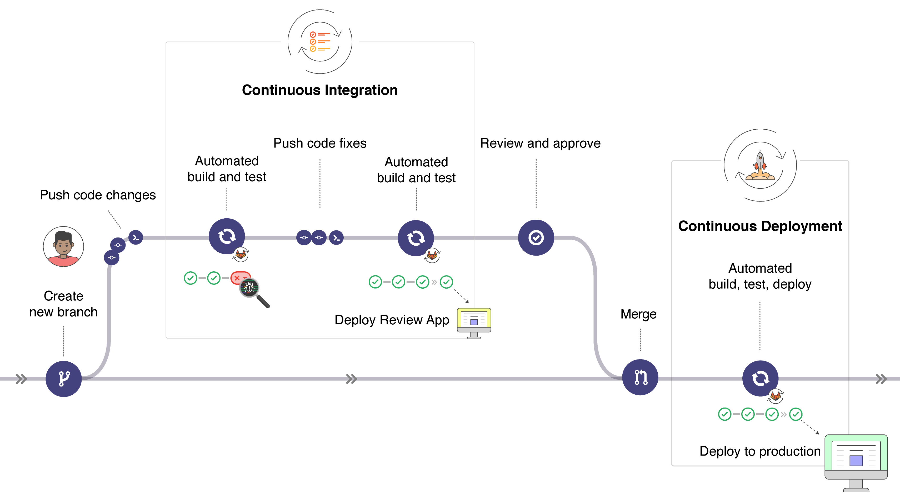

# CI/CD with Gitlab: self-study

## Table of contents


- [CI/CD with Gitlab: self-study](#ci-cd-with-gitlab--self-study)
  * [DevOps](#devops)
  * [CI/CD](#ci-cd)
    + [Continuous Integration](#continuous-integration)
    + [Continuous Delivery](#continuous-delivery)
    + [Continuous Deployment](#continuous-deployment)
  * [CI/CD with Gitlab](#ci-cd-with-gitlab)
    + [A CI/CD workflow example](#a-ci-cd-workflow-example)
    + [Activating a working CI](#activating-a-working-ci)
    + [A working example](#a-working-example)
      - [Application code](#application-code)
      - [Pipeline configuration file](#pipeline-configuration-file)
      - [Pushing changes to the repository](#pushing-changes-to-the-repository)
      - [Intentionally introducing an error](#intentionally-introducing-an-error)
  * [References](#references)

<small><i><a href='http://ecotrust-canada.github.io/markdown-toc/'>Table of contents generated with markdown-toc</a></i></small>


## DevOps
> "DevOps is a set of practices intended to reduce the time between committing a change to a system and the change being placed into normal production, while ensuring high quality" <sup>[1]</sup>


CI/CD (Continuous Integration / Continuous Deployment) goes hand in hand with DevOps.

## CI/CD

CI/CD methodologies automate tasks between code development and its deployment, e.g. building and testing.

At every iteration (small code changes) the pipeline runs and errors can be detected automatically.

### Continuous Integration
Continuous integration comprises a set of scripts that automatically build and test the code for every change pushed to the repository. This decreases the chances of introducing errors to the application.

### Continuous Delivery
Continuous delivery also deploys the application (after building and testing), but requires manual triggering for the deployment process.

### Continuous Deployment
Continuous Deployment is similar to Continuous Delivery, but the triggering of the deployment process is automatic, without the need of human intervention.

## CI/CD with Gitlab

To use Gitlab's CI/CD features a `.gitlab-ci.yml` must be placed in the Git repository's root path.

In this file the scripts to be run will be defined and grouped into *jobs* to form a *pipeline*.

This pipeline will be run by [Gitlab Runner](https://docs.gitlab.com/runner/), which is similar to a terminal.

The following example shows a minimalist example of `.gitlab-ci.yml` file:

```yml
before_script:
  - apt-get install rubygems ruby-dev -y

run-test:
  script:
    - ruby --version
```

The `before_script` part installs any required dependencies, and the `run-test` job runs a simple script.

The simple pipeline define by the file above will run at every push to an branch of the repository.

### A CI/CD workflow example

The following picture shows an example CI/CD flow:



The workflow above can be summarized as follows:

- A developer creates a feature branch and pushes some code changes;
- The CI automated scripts run and show an error;
- The developer pushes codes fixes and the CI automated scripts succeed;
- The developer can now create a merge request and the code is ready for being reviewed and approved;
- After the code is merged back to the master branch, the automated build, test and deploy scripts run and the code is deployed to production (Continuous Deployment);

All the steps can be visualized through the Gitlab UI.

### Activating a working CI

As mentioned above, the necessary steps to have a working CI are:
1. Adding a `.gitlab-ci.yml` to the repository's root path;
2. Configuring a _Runner_;

The `.gitlab-ci.yml` file is a YAML file that instructs the _Runner_ what to do.
By default it runs a pipeline with 3 stages: `build`, `test` and `deploy`, but it isn't necessary to use all 3 stages.
Each stage in the pipeline specifies jobs to be executed.

A complete reference for CI/CD pipeline configuration through the `.gitlab-ci.yml` file can found [here](https://docs.gitlab.com/ee/ci/yaml/README.html).

A _Runner_ can be a bare-metal machine, a VM, a _Docker_ container, etc. If no Runner is configured, the default [Gitlab Runner](https://docs.gitlab.com/runner/) will be used.

### A working example

#### Application code

The following picture shows the structure of a simple example of Spring Boot project with Gradle to be deployed to Heroku, making the use of the `.gitlab-ci.yml` file:


The main and testing Java classes are shown below:

```java
// ----- SimpleSpringBootProjectApplication.java -----

package com.example.SimpleSpringBootProject;

import org.springframework.boot.SpringApplication;
import org.springframework.boot.autoconfigure.SpringBootApplication;

@SpringBootApplication
public class SimpleSpringBootProjectApplication {

    public static void main(String[] args) {
        SpringApplication.run(SimpleSpringBootProjectApplication.class, args);
    }

}
```

```java
// ----- Sum.java -----

package com.example.SimpleSpringBootProject;

public class Sum {

    /**
     * Sums two integers and outputs the result.
     * @param i1 The first integer.
     * @param i2 The second integer.
     * @return   The result.
     */
    public int sum(int i1, int i2) {
        return i1 + i2;
    }

}
```

```java
// ----- Controller.java -----

package com.example.SimpleSpringBootProject;

import org.springframework.web.bind.annotation.GetMapping;
import org.springframework.web.bind.annotation.RequestParam;
import org.springframework.web.bind.annotation.RestController;

@RestController
public class Controller {

    @GetMapping("/sum")
    public String sum(@RequestParam int i1, @RequestParam int i2) {
        return String.format("%d + %d = %d", i1, i2, new Sum().sum(i1, i2));
    }

}
```

```java
// ----- SumTest.java -----

package com.example.SimpleSpringBootProject;

import org.junit.Assert;
import org.junit.Test;
import org.junit.runner.RunWith;
import org.springframework.boot.test.context.SpringBootTest;
import org.springframework.boot.web.server.LocalServerPort;
import org.springframework.test.context.junit4.SpringRunner;
import org.springframework.web.client.RestTemplate;

@RunWith(SpringRunner.class)
@SpringBootTest(webEnvironment = SpringBootTest.WebEnvironment.RANDOM_PORT)
public class SumTest {

    @LocalServerPort
    private int serverPort;

    @Test
    public void shouldSumIntegersCorrectly() {
        Assert.assertEquals(4, new Sum().sum(2, 2));
    }

    @Test
    public void sumEndpointShouldWorkCorrectly() {
        Assert.assertEquals(
            "3 + 4 = 7",
            new RestTemplate().getForObject(
                String.format("http://localhost:%d/sum?i1=%d&i2=%d", serverPort, 3, 4), String.class
            )
        );
    }

}
```

This is the Heroku `Procfile`, which instructs Heroku which command it should run to start our app:

```
web: java -jar build/libs/SimpleSpringBootProject-0.0.1-SNAPSHOT.jar
```

And this is a CI/CD [environment variable](https://gitlab.com/help/ci/variables/README#variables) created to store the Heroku API Key:


Environment variables can be accessed on Gitlab under *Settings* > *CI/CD*.

#### Pipeline configuration file

This is the example CI/CD pipeline configuration file (`.gitlab-ci.yml`), in which `sheltered-hollows-93882` is the name given by Heroku to our app and `$HEROKU_API_KEY` references the environment variable above:

```yaml
stages:                   # Not using the 'deploy' stage
  - build
  - test
  - deploy

# ----- BUILD -----
build_job:

  image : java:8-jdk     # Docker image to use in the job

  stage : build

  script:
    - ./gradlew assemble  # The build script

  artifacts:
    paths:
      - build/libs/*.jar  # Generated artifacts; will be available for download

  only:
    - master              # Run job for 'master' branch only

# ----- TEST -----    
test_job:

  image: java:8-jdk       # Docker image to use in the job
  
  stage: test
  
  script:
    - ./gradlew check     # The testing script

# ----- DEPLOY -----
deploy_job:

  image: ruby:2.5         # Docker image to use in the job
  
  stage: deploy
  
  script:
    - gem install dpl     # Install DPL deployment tool package
    - dpl --provider=heroku --app=sheltered-hollows-93882 --api-key=$HEROKU_API_KEY  # Variable

after_script:
  - echo "CI finished"    # Echo a string
```

The script above will download the appropriate Docker images to be used in the pipeline, which will execute the `build`, `test` and `deploy` stages on every new push to the repository.

The build job specifies the only branch the job should be run to (the _master_ branch), and also brings the path of the generated artifacts, which will be available for download on pipeline completion.

We can navigate to our app and see in the browser that the app was successfully built, tested and deployed after the code is pushed to the repository:


#### Pushing changes to the repository

If we push the following changes to the `Main.java` class... 


...the pipeline will be triggered, and the `build`, `test` and `deploy`stages will run:


The `build_job` outputs the following logs:


The `test_job` outputs the following ones:


And the `deploy_job` the following ones:


After the build job succeeds, the generated `.jar` artifact is ready to be downloaded:


#### Intentionally introducing an error

If we intentionally introduce the following assertion error...


...the `test` stage will fail...


... and output the following logs:


## References

[1] Bass, Len; Weber, Ingo; Zhu, Liming (2015). _DevOps: A Software Architect's Perspective_.

[2] [https://dev.to/ashokisaac/devops-in-3-sentences-17c4](https://dev.to/ashokisaac/devops-in-3-sentences-17c4)

[3] [https://docs.gitlab.com/ee/ci/introduction/index.html](https://docs.gitlab.com/ee/ci/introduction/index.html)
 
[4] [https://gist.github.com/daicham/5ac8461b8b49385244aa0977638c3420](https://gist.github.com/daicham/5ac8461b8b49385244aa0977638c3420)
