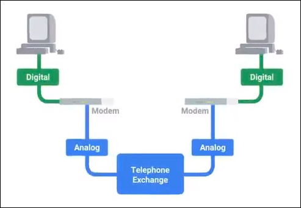
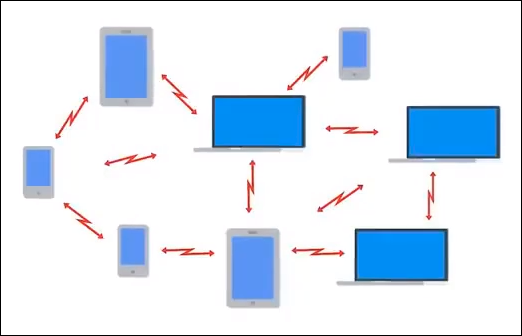

# Computer networking

## Main contents

- [Computer networking](#computer-networking)
  * [TCP/IP 5-layer model](#tcp-ip-5-layer-model)
  * [Network devices](#network-devices)
  * [Physical layer](#physical-layer-1)
  * [Data link layer](#data-link-layer-1)
  * [The Network Layer ](#the-network-layer-br-)
  * [The transport layer](#the-transport-layer)
  * [The application layer](#the-application-layer)
  * [Networking services](#networking-services)
  * [Connecting to the Internet](#connecting-to-the-internet)
  * [Troubleshooting](#troubleshooting)
  * [Cloud Computing](#cloud-computing)
  * [IPv6](#ipv6)
- [Optical Fiber](#optical-fiber)
  * [Advantages](#advantages)
  * [Disadvantages](#disadvantages)
  * [Network architectures](#network-architectures)
  * [Topologies](#topologies)
  * [AON vs PON Networks](#aon-vs-pon-networks)
  * [P2MP PON Network](#p2mp-pon-network)
  * [Active P2MP Networks vs PON P2MP Networks](#active-p2mp-networks-vs-pon-p2mp-networks)
- [Gigabit Passive Optical Network (GPON)](#gigabit-passive-optical-network--gpon-)
  * [Downstream/Upstream transmissions](#downstream-upstream-transmissions)
  * [GPON Transmission Convergence (GTC) Layer](#gpon-transmission-convergence--gtc--layer)
  * [GPON Techniques](#gpon-techniques)
  * [GPON Reference Standards and Protocols](#gpon-reference-standards-and-protocols)
- [References](#references)

## Table of contents
- [Computer networking](#computer-networking)
  * [TCP/IP 5-layer model](#tcp-ip-5-layer-model)
    + [Physical layer](#physical-layer)
    + [Data link layer](#data-link-layer)
    + [Network layer](#network-layer)
    + [Transport layer](#transport-layer)
    + [Application layer](#application-layer)
  * [Network devices](#network-devices)
    + [Hub](#hub)
    + [Switch](#switch)
    + [Routers](#routers)
  * [Physical layer](#physical-layer-1)
  * [Data link layer](#data-link-layer-1)
    + [Ethernet](#ethernet)
      - [Special MAC addresses](#special-mac-addresses)
      - [Ethernet frame](#ethernet-frame)
        * [Preamble](#preamble)
        * [Destination Address](#destination-address)
        * [Source Address](#source-address)
        * [Tag](#tag)
        * [Ether-type](#ether-type)
        * [Payload](#payload)
        * [Frame Check Sequence (FCS)](#frame-check-sequence--fcs-)
    + [Virtual LANs (VLANs) and Network Access Control (NAC)](#virtual-lans--vlans--and-network-access-control--nac-)
      - [VLAN](#vlan)
        * [How the tagging works](#how-the-tagging-works)
      - [Network Access Control (NAC)](#network-access-control--nac-)
        * [Extensible Access Protocol (EAP)](#extensible-access-protocol--eap-)
        * [Remote Authentication Dial In Service (RADIUS)](#remote-authentication-dial-in-service--radius-)
        * [802.1X](#8021x)
        * [MAC Authentication Bypass (MAB)](#mac-authentication-bypass--mab-)
  * [The Network Layer ](#the-network-layer-br-)
    + [IP datagram ](#ip-datagram-br-)
      - [IP header](#ip-header)
        * [Version](#version)
        * [Header Length](#header-length)
        * [Service Type](#service-type)
        * [Total Length](#total-length)
        * [Identification](#identification)
        * [Flag field](#flag-field)
        * [Fragmentation offset](#fragmentation-offset)
        * [Time to Live (TTL)](#time-to-live--ttl-)
        * [Protocol](#protocol)
        * [Header Checksum](#header-checksum)
        * [Options](#options)
        * [Padding](#padding)
    + [Encapsulation](#encapsulation)
    + [IP addresses](#ip-addresses)
    + [ARP (Address Resolution Protocol)](#arp--address-resolution-protocol-)
    + [Subnetting](#subnetting)
      - [Subnet mask](#subnet-mask)
    + [Routing](#routing)
      - [Routing Table](#routing-table)
      - [Routing Protocols](#routing-protocols)
        * [Interior Gateway Protocols](#interior-gateway-protocols)
          + [Distance-vector protocols](#distance-vector-protocols)
          + [Link state routing protocols](#link-state-routing-protocols)
        * [Exterior Gateway Protocols](#exterior-gateway-protocols)
      - [Non-routable address space](#non-routable-address-space)
  * [The transport layer](#the-transport-layer)
    + [Ports](#ports)
    + [TCP segment](#tcp-segment)
      - [Destination port](#destination-port)
      - [Source port](#source-port)
      - [Sequence number](#sequence-number)
      - [Acknowledgement number](#acknowledgement-number)
      - [Data offset field](#data-offset-field)
      - [Control flags](#control-flags)
      - [TCP window](#tcp-window)
      - [TCP checksum](#tcp-checksum)
      - [Urgent pointer field](#urgent-pointer-field)
      - [Options field](#options-field)
      - [Padding](#padding-1)
    + [TCP Control Flags and the Three-Way Handshake](#tcp-control-flags-and-the-three-way-handshake)
      - [TCP Flags](#tcp-flags)
        * [URG (urgent)](#urg--urgent-)
        * [ACK (acknowledged)](#ack--acknowledged-)
        * [PSH (push)](#psh--push-)
        * [RST (reset)](#rst--reset-)
        * [SYN (synchronize)](#syn--synchronize-)
        * [FIN (finish)](#fin--finish-)
    + [Sockets](#sockets)
      - [TCP Socket States](#tcp-socket-states)
        * [LISTEN](#listen)
        * [SYN_SENT](#syn-sent)
        * [SYN_RECEIVED](#syn-received)
        * [ESTABLISHED](#established)
        * [FIN_WAIT](#fin-wait)
        * [CLOSE_WAIT](#close-wait)
        * [CLOSED](#closed)
    + [Connectionless protocols](#connectionless-protocols)
    + [Firewall](#firewall)
  * [The application layer](#the-application-layer)
    + [The Open Systems Interconnection (OSI) Model](#the-open-systems-interconnection--osi--model)
      - [Session layer](#session-layer)
      - [Presentation layer](#presentation-layer)
  * [Networking services](#networking-services)
    + [Domain Name System (DNS)](#domain-name-system--dns-)
      - [Five primary types of DNS servers](#five-primary-types-of-dns-servers)
        * [1.  Caching servers](#1--caching-servers)
        * [2.  Recursive name servers](#2--recursive-name-servers)
        * [3.  Root name servers](#3--root-name-servers)
        * [4.  Top-level domain (TLD) name servers](#4--top-level-domain--tld--name-servers)
        * [5.  Authoritative name servers](#5--authoritative-name-servers)
    + [Dynamic Host Configuration Protocol (DHCP)](#dynamic-host-configuration-protocol--dhcp-)
      - [Dynamic allocation](#dynamic-allocation)
      - [Automatic allocation](#automatic-allocation)
      - [DHCP Handshake](#dhcp-handshake)
        * [DHCP Discover](#dhcp-discover)
        * [DHCP Offer](#dhcp-offer)
        * [DHCP Request](#dhcp-request)
        * [DHCP Acknowledge](#dhcp-acknowledge)
      - [DHCP Lease](#dhcp-lease)
        * [Adjusting the lease time](#adjusting-the-lease-time)
    + [Network Address Translation (NAT)](#network-address-translation--nat-)
    + [Virtual Private Networks (VPN)](#virtual-private-networks--vpn-)
    + [Proxy service](#proxy-service)
      - [Reverse proxy](#reverse-proxy)
  * [Connecting to the Internet](#connecting-to-the-internet)
    + [Dial-up connection](#dial-up-connection)
    + [Broadband](#broadband)
      - [Digital Subscriber Line (DSL)](#digital-subscriber-line--dsl-)
      - [Cable Broadband](#cable-broadband)
      - [Fiber Broadband](#fiber-broadband)
        * [ONT (Optical Network Terminator)](#ont--optical-network-terminator-)
    + [Wide Area Networks (WAN)](#wide-area-networks--wan-)
    + [Point-to-point VPN](#point-to-point-vpn)
    + [Wireless networks](#wireless-networks)
      - [IEEE 802.11 standards (Wi-Fi)](#ieee-80211-standards--wi-fi-)
      - [Wireless Access Point](#wireless-access-point)
      - [802.11 Frames](#80211-frames)
        * [Frame Control Field](#frame-control-field)
        * [Duration/ID](#duration-id)
        * [Address 1](#address-1)
        * [Address 2](#address-2)
        * [Address 3](#address-3)
        * [Address 4](#address-4)
        * [Sequence Control](#sequence-control)
        * [Data payload](#data-payload)
        * [Frame Check Sequence](#frame-check-sequence)
      - [Wireless Network Configurations](#wireless-network-configurations)
        * [Ad-hoc networks](#ad-hoc-networks)
        * [Wireless LANs (WLANs)](#wireless-lans--wlans-)
        * [Mesh networks](#mesh-networks)
      - [Wireless channels](#wireless-channels)
      - [Wireless security](#wireless-security)
        * [Wired Equivalent Privacy (WEP)](#wired-equivalent-privacy--wep-)
        * [Wi-Fi Protected Access (WPA)](#wi-fi-protected-access--wpa-)
        * [Wi-Fi Protected Access 2 (WPA2)](#wi-fi-protected-access-2--wpa2-)
        * [MAC filtering](#mac-filtering)
    + [Cellular networks](#cellular-networks)
  * [Troubleshooting](#troubleshooting)
    + [Internet Control Message Protocol (ICMP)](#internet-control-message-protocol--icmp-)
      - [ICMP Packet](#icmp-packet)
        * [Type](#type)
        * [Code](#code)
        * [Checksum](#checksum)
        * [Rest of Header](#rest-of-header)
        * [Data payload](#data-payload-1)
    + [Ping](#ping)
    + [Traceroute](#traceroute)
    + [Netcat](#netcat)
    + [Nslookup](#nslookup)
  * [Cloud Computing](#cloud-computing)
    + [Hardware virtualization](#hardware-virtualization)
  * [IPv6](#ipv6)
    + [Shortening an IPv6 address](#shortening-an-ipv6-address)
    + [The IPv6 header](#the-ipv6-header)
      - [Version](#version-1)
      - [Traffic class](#traffic-class)
      - [Flow label](#flow-label)
      - [Payload length](#payload-length)
      - [Next Header](#next-header)
      - [Hop Limit](#hop-limit)
      - [Source Address](#source-address-1)
      - [Destination Address](#destination-address-1)
    + [IPv6 and IPv4 Harmony](#ipv6-and-ipv4-harmony)
      - [IPv4 mapped address space](#ipv4-mapped-address-space)
      - [IPv6 tunnels](#ipv6-tunnels)
        * [IPv6 tunnel brokers](#ipv6-tunnel-brokers)
- [Optical Fiber](#optical-fiber)
  * [Advantages](#advantages)
  * [Disadvantages](#disadvantages)
  * [Network architectures](#network-architectures)
  * [Topologies](#topologies)
    + [Point-to-point (P2P)](#point-to-point--p2p-)
    + [Point-to-multipoint (P2MP)](#point-to-multipoint--p2mp-)
  * [AON vs PON Networks](#aon-vs-pon-networks)
    + [Active Optical Networks (AON)](#active-optical-networks--aon-)
    + [Passive Optical Network (PON)](#passive-optical-network--pon-)
  * [P2MP PON Network](#p2mp-pon-network)
    + [Optical Network Terminal (ONT)](#optical-network-terminal--ont-)
    + [Optical Line Terminal (OLT)](#optical-line-terminal--olt-)
    + [Splitter](#splitter)
    + [PON protocols](#pon-protocols)
  * [Active P2MP Networks vs PON P2MP Networks](#active-p2mp-networks-vs-pon-p2mp-networks)
- [Gigabit Passive Optical Network (GPON)](#gigabit-passive-optical-network--gpon-)
  * [Downstream/Upstream transmissions](#downstream-upstream-transmissions)
    + [Some definitions](#some-definitions)
      - [ONU ID](#onu-id)
      - [Allocation Identifier (Alloc-ID)](#allocation-identifier--alloc-id-)
      - [Transmission Container (T-CONT)](#transmission-container--t-cont-)
      - [GEM port ID](#gem-port-id)
  * [GPON Transmission Convergence (GTC) Layer](#gpon-transmission-convergence--gtc--layer)
    + [GTC frames](#gtc-frames)
      - [Downstream GPON Frame](#downstream-gpon-frame)
        * [Physical Control Block](#physical-control-block)
        * [Upstream BandWith map](#upstream-bandwith-map)
        * [GTC Payload](#gtc-payload)
      - [Upstream GPON Frame](#upstream-gpon-frame)
    + [GEM frames](#gem-frames)
      - [GEM Frame Header](#gem-frame-header)
        * [PLI](#pli)
        * [Port ID](#port-id)
        * [PTI](#pti)
        * [HEC (Header Error Check)](#hec--header-error-check-)
    + [Carrying Ethernet frames in the GEM frame payload](#carrying-ethernet-frames-in-the-gem-frame-payload)
  * [GPON Techniques](#gpon-techniques)
    + [GPON Ranging](#gpon-ranging)
    + [Dynamic bandwidth allocation (DBA)](#dynamic-bandwidth-allocation--dba-)
    + [Forward Error Correction (FEC)](#forward-error-correction--fec-)
    + [GPON Line Encryption](#gpon-line-encryption)
      - [Key exchange process](#key-exchange-process)
  * [GPON Reference Standards and Protocols](#gpon-reference-standards-and-protocols)
- [References](#references)

<small><i><a href='http://ecotrust-canada.github.io/markdown-toc/'>Table of contents generated with markdown-toc</a></i></small>

 

## TCP/IP 5-layer model

 

### Physical layer
Physical devices that interconnect computers (cabling, connectors, signals).
 

### Data link layer
Defines a way of interpreting the sent signals (most common protocol: *Ethernet*).
 

### Network layer
A.k.a *Internetwork*, allows different networks to communicate through router (most common protocol: *IP*).
 

### Transport layer
Sorts out which client and server programs are supposed to get the data (most common protocol: *TCP*).
 

### Application layer
Application specific (*HTTP*, *SMTP*…).

  
 

## Network devices

### Hub
Physical layer (layer 1) device that allows connections among many computers.

Each system has to determine if the incoming data was meant for them or to ignore it.
Data collisions happen.
 

### Switch

Data link (layer 2) device. Only sends the data to the system it is intended for. Reduces or even eliminates collisions.
 

### Routers
Forwards data between independent networks.
They are Network layer (layer 3) device that inspect IP data data to know where to send things.

Core Routers form the backbone of the Internet. They have to make decisions about the paths used to send data (*routing tables*).  

Routers share data using the Border Gateway Protocol (BGP) which lets them learn about the most optimal paths to forward traffic.
 

## Physical layer
Means of transporting bits between nodes.

 

## Data link layer
Abstracts the handling of bits, making it transparent to the other layers.
 

### Ethernet

CSMA/CD (Carrier-Sense Multiple Access w/ Collision Detection) handles collision detections and resending random delays;

MAC (Media Access Control) addresses identifies which node the transmission was meant for. Each node has a globally-unique MAC address:

  

#### Special MAC addresses

- **Unicast**: LSB of the first octet of the destination address is `0`
- **Multicast**: LSB of the first octet of the destination address is `1`
- **Broadcast**: MAC address is `FF:FF:FF:FF:FF:FF`

#### Ethernet frame

 

##### Preamble

-   **First 7 bytes**: alternating ones and zeros (may be used o synchronize clocks);    
-   **Last byte**: SFD (start frame delimiter);

##### Destination Address
The “to” MAC address.
 

##### Source Address
The “from” MAC address.
 

##### Tag
Can be a VLAN tag. Contents will only be delivered to the interface configured with this tag.
 

##### Ether-type
16 bits that describe the protocol of the contents of the frame.
 

##### Payload
Actual data. Contains all of the data from higher layers.
 

##### Frame Check Sequence (FCS)
A checksum for the entire frame.
 

### Virtual LANs (VLANs) and Network Access Control (NAC)

#### VLAN

Virtual LANs (VLANs) logically divide a network topology into isolated broadcast domains. This way, hosts can only broadcast hosts in the same VLAN.

Inter-VLAN traffic requires routing through a local gateway.

The layer 2 (Data Link) frames receive a *tag*, which is a VLAN ID representing the VLAN to where the tagged traffic belongs.

In order to tag traffic, ports are assigned a Port VLAN ID (PVID) and are classified in two types:
 - *Access ports*: connect hosts and have a single PVID;
 - *Trunk ports*: connect to other trunk ports of devices, such as switches as access points, and can receive many PVIDs;

##### How the tagging works
1. Hosts send untagged traffic upstream;
2. When the traffic reaches the access port, the access ports insert the VLAN tag into the frame header;
3. With the tag in place, *trunk ports* recognize which areas of the layer 2 network should carry the traffic;
4. As traffic goes downstream, *access ports* remove the tag and deliver untagged traffic to to destination host;

#### Network Access Control (NAC)

##### Extensible Access Protocol (EAP)
An authentication framework that supports multiple authentication methods. EAP typically runs directly over data link layers such as Point-to-Point Protocol (PPP) or IEEE 802, without requiring IP.

Rather than requiring the authenticator to be updated to support each new authentication method, EAP permits the use of a backend authentication server, which may implement some or all authentication methods.

##### Remote Authentication Dial In Service (RADIUS)
RADIUS is a protocol that provides *Authentication, Authorization and Accounting* (AAA).

If a user wants to use the network, *authentication* defines <u><i>who the user is</i></u>, *authorization* defines <u><i>how much access</i></u> this used should be given and *accounting* <u><i>tracks</i></u> when the user logs in and out and how for how long the user remains logged in.

It is a client/server protocol, in which a server (the RADIUS server) is accessed to authenticate and authorize users. This server also keeps track of user activities.

##### 802.1X

802.1X is an authentication mechanism that uses Extensible Authentication Protocol (EAP) to authenticate devices in the network.

It authenticates devices connected to the network and decides if these devices should be given network access, and the level of the access (guest access, corporate access, etc.).

Three devices participate in the authentication process. 
For example, when a host (*supplicant*) is plugged in to a switch (*authenticator*), the switch initiates the EAP authentication protocol.
Besides the supplicant and the authenticator, there’s a backend *authentication server* (traditionally RADIUS).

The host needs to be enabled for 802.1X. If it’s not, the switch can be configured to perform *MAC authentication bypass*, in which the MAC address of the connecting device is checked against a list of authorized MAC addresses so that it is given access or not.

##### MAC Authentication Bypass (MAB)

MAB provides controlled access to devices based on their MAC address. It allows non-802.1X-compliant end devices to be governed by controlled access by using a *pre-populated database*.

The goals of MAB are to provide network access control on a port basis, *based on a MAC address*.

The figure above shows a device generating traffic, the switch capturing the MAC address and forwarding this as the username and password to an Access Control Server. MAB allows end users to authenticate by having  a list of known MAC addresses.

The figure above shows MAB initiating after an 802.1x timeout, where EAPOL stands for *EAP Over LAN*. The RADIUS server is asked the MAC address should be allowed network access: the network access device takes the MAC address and hands it off to the authentication server as both the username and password; if the host/device passes with MAB credentials, the user can then be placed into the configured VLAN and can acquire an IP address.

> *“With MAB, only one host can be authenticated and locked down per port by default. Any new MAC address  attempting to pass traffic on a port is treated as a security violation.”*

## The Network Layer 

### IP datagram 

#### IP header

 

##### Version
Protocol version being used (e.g. IPv4).
 

##### Header Length
Declares how long the header is (commonly 20 bytes for IPv4).
 

##### Service Type
Can be used to specify details about QoS (*Quality of Service*) technologies.
 

##### Total Length
16-bit field that indicates the total length of the IP datagram (the maximum size of a single datagram is 0xFFFF, or 65535).
 

##### Identification
16-bit field used to group messages together. Useful when the information being transmitted is big and has to be split among many datagrams.
 

##### Flag field
Indicates if a datagram is allowed to be fragmented or has already been.
 

##### Fragmentation offset
Used by the receiving endpoint to put all the fragments together.
 

##### Time to Live (TTL)
8-bit field to indicate how many router hops the datagram can traverse before being thrown away. It is decremented at each hop. This can be used to avoid infinite loops caused by misconfiguration.
 

##### Protocol
Data about the Transport Layer protocol in use (TCP, UDP).
 

##### Header Checksum
A checksum of the entire header.
 

##### Options
An optional field used to set special characteristics for datagrams primarily used for testing purposes.
 

##### Padding
Padding zeros to ensure the header is the correct size.
 

### Encapsulation

Ethernet data encapsulation: *Ethernet payload* &harr; *IP datagram*

*IP payload* &harr; *TCP or UDP packet*

> “Each layer is needed for the one above it”.

### IP addresses

|IP class |                              |
|---------|------------------------------|
|A        |`network.host.host.host`      |
|B        |`network.network.host.host`   |
|C        |`network.network.network.host`|

|Class|Range  |Max Hosts   |First bits|
|-----|-------|------------|----------|
|A    |0-126  |16 million  |`0...`    |
|B    |128-191|64,000      |`10...`   |
|C    |192-224|254         |`110...`  |
|D    |224-239|N/A         |`1110...` |
|E    |240-255|N/A         |          |

### ARP (Address Resolution Protocol)

Used to discover the hardware address of a node with a certain IP.  

Address discovery to fill the *ARP table* (IP x MAC):

  

### Subnetting

A large network can be divided into smaller individual subnets, each of which having its own Gateway Router which server as the ingress and egress point.

`IP = network ID + subnet ID + host ID`

At the Internet level, Core Routers only care about the network ID.
 

#### Subnet mask

 

### Routing

Routers inspect the destination IP, find the fastest path to the destination by looking at its routing table, decrement the datagram’s TTL and recalculate the datagram checksum.
The IP datagram is then encapsulated into a new Ethernet frame. The source MAC address of the frame is updated.
 

#### Routing Table

The most basic routing table usually contains 4 columns:

-   Destination network (network ID and netmask);    
-   Next hop (next router’s IP);    
-   Total hops (how far away the destination is);    
-   Interface (which of the router’s interfaces to forward traffic to, depending on the destination address);

Routing tables can have millions of rows.
 

#### Routing Protocols

##### Interior Gateway Protocols

Used by routers to share info within a single autonomous system (a collection of networks controlled by a single network operator).
 

###### Distance-vector protocols
(Older standard) Sending of the routing table to every neighboring router. Routers only have info about their immediate neighbors.
 

###### Link state routing protocols   
Every router advertises the state of the link of each of its interfaces. The information about each router is propagated to every other router in the autonomous system.
 

##### Exterior Gateway Protocols
Used to communicate data between routers that represent the edges of autonomous systems. They are a key to how the Internet works.

The IANA (Internet Assigned Numbers Authority) is an organization responsible for managing IP address allocation and Autonomous System Numbers (ASN) allocation.

ASNs are also 32-bit numbers (e.g.: the ASN AS19604 belongs to IBM).
 

#### Non-routable address space
3 ranges of IPs core routers won’t try to route to. They are free to be used by anyone in internal networks. Can be used within autonomous systems, but not by external gateway protocols:
-   10.0.0.0/8    
-   172.16.0.0/12    
-   192.168.0.0/16  

## The transport layer
This layer has the ability to multiplex and demultiplex:

Multiplex and demultiplexing is handled through *ports*.
 

### Ports
16-bit numbers used to direct traffic to specific services running on a networked computer.

`IP:Port = socket number` (e.g. `10.1.1.100:80`)
 

### TCP segment
Just as an Ethernet frame encapsulates an IP datagram, and IP datagram encapsulates a TCP segment (the datagram’s payload is the TCP segment).

 

#### Destination port
The port of the service the traffic is intended for.
 

#### Source port
A high-numbered ephemeral port.
 

#### Sequence number
A 32-bit number to keep track of where the current TCP segment should be in a sequence of TCP segments.
 

#### Acknowledgement number
The number of the next expected segment.
 

#### Data offset field
A 4-bit number that communicates how long the TCP header for the current segment is.
 

#### Control flags
The 6 TCP control flags.
 

#### TCP window
Specifies the range of sequence numbers that might be sent before and acknowledgement is required.
 

#### TCP checksum
Just like the checksum fields at the IP and Ethernet levels.
 

#### Urgent pointer field
Used in conjunction with one of the TCP control flags to point out particular segments that might be more important than others (rarely used).
 

#### Options field
Also rarely used. It is sometimes used for more complicated flow control protocols.
 

#### Padding
A sequence of zeros to ensure that the data payload section begins at the expected location.
 

### TCP Control Flags and the Three-Way Handshake

#### TCP Flags

##### URG (urgent)
A value of `1` here indicates that the segment is considered urgent and that the urgent pointer field has more data about this.
 

##### ACK (acknowledged)
A value of `1` in this field means that the acknowledgement number field should be examined.
 

##### PSH (push)    
The transmitting device wants the receiving device to push currently-buffered data to the application on the receiving end ASAP.
 

##### RST (reset)
One of the sides in a TCP connection hasn’t been able to properly recover from a series of missing or malformed segments.
 

##### SYN (synchronize)
It’s used when first establishing a TCP connection and makes sure the receiving end knows to examine the sequence number field.
 

##### FIN (finish)
When this flag is set to `1`, it means the transmitting computer doesn’t have any more data to send and the connection can be closed.

  

After the Three-Way handshake, a TCP connection is established (*full-duplex*) and every segment sent in either direction should be responded to by a segment with the `ACK` flag set.

The Four-Way handshake takes place to finish the connection:  

 

### Sockets
A socket is the instantiation of an end-point in a potential TCP connection. Traffic can be sent to any port, but we are only going to get a response if a program has opened a socket on that port.
 

#### TCP Socket States

##### LISTEN
A TCP socket is ready and listening for incoming connections (server side).
 

##### SYN_SENT
A synchronization request has been sent, but the connection hasn’t been established yet (client side).
 

##### SYN_RECEIVED
A socket previously in a `LISTEN` state has received a synchronization request and sent a  `SYN/ACK` back (server side).
 

##### ESTABLISHED
The TCP connection is in working order and both sides are free to send each other data (both server and client sides).
 

##### FIN_WAIT
A `FIN` has been sent, but the corresponding `ACK` from the other end hasn’t been received yet.
 

##### CLOSE_WAIT
The connection has been closed at the TCP layer, but the application that opened the socket hasn’t released its hold on the socket yet.
 

##### CLOSED
The connection has fully terminated and no further communication is possible.

Socket states can vary from OS to OS.
 

### Connectionless protocols
Connectionless protocols (e.g. UDP - User Datagram Protocol) have less overhead. UDP doesn’t even support the concept of acknowledgement.
This is useful for messages that are super important. For example, if a few video frames are lost during streaming, the video is still pretty watchable.
 

### Firewall
A device/program that blocks traffic that meets certain criteria.  

 

## The application layer

The generic payload section of TCP segments corresponds to data applications want to send each other:
-   Contents of a web page;    
-   Streaming video contents of a Netflix app;    
-   Contents of a document a word processor is sending to a printer;

Example application layer protocols are *HTTP* and *FTP*.
 

### The Open Systems Interconnection (OSI) Model

 

#### Session layer
Responsible for facilitating the communication between actual applications and the Transport Layer.
It’s the part of the operating system that takes the application layer data and hands it off to the presentation layer.
 

#### Presentation layer
Responsible for making sure that the unencapsulated application layer data is able to be understood by the application in question.
It's the part of the operating system that might handle compression or encryption of data.

> There’s no encapsulation in these layers. Though.

 

## Networking services

### Domain Name System (DNS)

DNS is a global and highly distributed network service that resolves strings of letters into IP addresses (name resolution).  

A standard modern network configuration:
-   IP address;
-   Subnet mask;
-   Gateway;
-   DNS server;  

#### Five primary types of DNS servers

##### 1.  Caching servers
Generally provided by ISPs or local networks. Usually Store known domain name lookups for a certain amount of time.  

> **TTL**: a value, in seconds, that can be configured by the owner of a domain name for how long a name server is allowed to cache an entry before it should discard it and perform a full resolution again.

##### 2.  Recursive name servers
Perform full DNS resolution requests.
 

##### 3.  Root name servers
13 authorities that provide root name lookups as a service.
 

##### 4.  Top-level domain (TLD) name servers
In `www.google.com`, `.com` is the TLD.
 

##### 5.  Authoritative name servers
Responsible for the last 2 parts of any domain name (e.g. `google.com`).

DNS uses UDP.
It would take more than 40 packets for a fully recursive DNS request to be fulfilled with TCP.
 

### Dynamic Host Configuration Protocol (DHCP)
An application layer protocol that automates the configuration process of hosts on a network. It enables dynamic IP address assignment.
 

#### Dynamic allocation
A range of IP addresses is set aside for client devices and one of these IPs is issued to these devices when they request one.
 

#### Automatic allocation
The IP assignments are remembered and assigned to the same devices in the future whenever possible.

#### DHCP Handshake

 

##### DHCP Discover

The host has no IP address at this stage. It broadcasts a request (destination address `255.255.255.255` with destination UDP port `67`) so that the DHCP server receives it.
The UDP source port is set to `68`.

##### DHCP Offer

The DHCP server listening to the `67` port responds with a *DHCP Offer* containing the following information:

- The IP address the server is offering;
- The subnet mask;
- The *lease* duration (how long the client may use the IP address);
- The IP address of the DHCP server;
- The IP address of the default gateway router;
- IP addresses of DNS servers;

##### DHCP Request

The client responds to the server requesting the IP address that was offered;

##### DHCP Acknowledge

The server sends an acknowledgement packet, confirming the configuration provided to the client.

#### DHCP Lease

The DHCP lease time is the amount of time a device can use the received IP address.

The DHCP lease life cyvle follows a pattern, beginning with the initial lease, which is followed by the *normal operation period*, the *renewal period* and a *rebinding period* if the renewal fails.

For an example lease time of 8 days, we would have the following:

- At day 0 a *new lease* is requested;
- During *normal operation*, the client can use the address;
- During the *renewal period* (halfway the *lease time*) the client will try to renew the lease;
- If the renewal fails (e.g. due to an offilne DHCP server), it will try the extend the current lease (*rebinding* period) with any active DHCP server;
 
 If the renewal is successful during the *renewal period*, the life cycle starts over, and the lease is valid for another 8 days:

##### Adjusting the lease time

In a hypothetical case of a coffee bar that receives 400 visitors a day, each of which stays there for 30 to 60 minutes, if we have a DHCP Pool of 200 addresses (e.g. 192.168.0.10 &ndash; 192.168.0.210), a long lease time could lead to problems.

If we have a lease time of 24 hours, for example, we would have no free IP addresses after the first 200 guests.

A solution here would be lowering the lease time to 1 hour, for example, so that the IPs that are not in use anymore go back to the pool of available addresses.

### Network Address Translation (NAT)
NAT is a technology that allows a gateway, usually a router or firewall, to rewrite the source IP of an outgoing IP datagram while retaining the original IP in order to rewrite it into the response.

In the figure above, the IP of *computer 1* is hidden from *computer 2* (*IP masquerading*). The router changes the source IP *to its own IP*.
 

### Virtual Private Networks (VPN)
A technology that allows for the extension of a private or local network to hosts that might not be on that local network. VPN is a *tunneling* protocol.  

Most VPNs work by using the payload section of the transport layer to carry an encrypted payload that actually contains an entire second set of packets - the network, the transport and the application layers of the packet intended to traverse the remote network.
 

### Proxy service
A proxy is a server that acts on behalf of a client in order to access another service. Proxies sit between clients and other servers, providing some additional benefit:
-   Anonymity;    
-   Security;    
-   Content filtering;    
-   Increased performance;  

#### Reverse proxy
A service that might appear to be a single server to external clients, but actually represents many servers living behind it.
 

## Connecting to the Internet

### Dial-up connection

 

### Broadband

#### Digital Subscriber Line (DSL)
Voice calls and data transfer on the same line at the same time.
     

#### Cable Broadband
High speed internet access delivered across TV cables.
     

#### Fiber Broadband
Uses light instead of electrical signal modulation.
 

##### ONT (Optical Network Terminator)
Instead of modems, the demarcation point for fiber technologies is known as ONT. The ONT converts data from protocols the fiber network can understand to those that more traditional, twisted-pair copper networks can understand.
 

### Wide Area Networks (WAN)
They act like a single networks, but span across multiple physical locations.

 

### Point-to-point VPN
As companies outsource services such as email servers to the cloud, the high speeds of WANs are becoming less necessary. And site-to-site VPNs are a cheaper alternative.

VPN tunneling is handled by network devices at either side of the connection, so that users don’t have to establish their own connections:

 

### Wireless networks

#### IEEE 802.11 standards (Wi-Fi)
Specifications that define the operation at both physical and data link layers.

Most common frequency bands: 2.4GHz and 5GHz.
 

#### Wireless Access Point
A device that bridges the wireless and wired portions of a network.
 

#### 802.11 Frames

 

##### Frame Control Field
Describes how the frame itself should be processed, and includes things such as the version of the 802.11 protocols is being used.
 

##### Duration/ID
Specifies how long the total frame is.
 

##### Address 1
Source address field (the MAC address of the sending device).
 

##### Address 2
The intended destination on the network.
 

##### Address 3
Receiver address: the MAC address of the Access Point that should receive the frame.
 

##### Address 4
Transmitter address: the MAC address of whatever has transmitted the frame.
 

##### Sequence Control
A 16-bit long field that contains a sequence number to keep track of ordering the frames.
 

##### Data payload
Contains all the data of the protocols further up the stack.
 

##### Frame Check Sequence
A checksum for cyclical redundancy check (CRC).
 

#### Wireless Network Configurations

##### Ad-hoc networks
Nodes speak directly to each other.

 

##### Wireless LANs (WLANs)
One or more access points act as a bridge between the wireless and the wired network. Wireless devices communicate with the access point, which then forwards the traffic along to the gateway router and everything proceeds as normal.

 

##### Mesh networks
A kind of hybrid of ad-hoc and WLAN. They have increased performance and range.

 

#### Wireless channels
Individual, smaller sections of the overall frequency band used by a wireless network.

Channels help to solve the problem of collision domains.

 

#### Wireless security

##### Wired Equivalent Privacy (WEP)
An encryption technology that provides a very low level of privacy. It should only be seen as safe as sending unencrypted data over a wired connection.

Encryption keys are only 40 bits long.
 

##### Wi-Fi Protected Access (WPA)
Uses a 128-bit encryption key, which is much more difficult to crack.
 

##### Wi-Fi Protected Access 2 (WPA2)
Uses a 256-bit encryption key, which is even harder to crack.
 

##### MAC filtering
Access points are configured to only allow connections from a specific set of MAC addresses belonging to trusted devices.  

### Cellular networks
Uses radio wave frequencies that can travel long distances.

They are built around the concept of cells. Each cell is assigned a frequency range for use and neighboring cells use frequency bands that don’t overlap.

The cell towers can be thought of as access points.

 

## Troubleshooting

### Internet Control Message Protocol (ICMP)
Used to communicate issues such as a router that doesn’t know how to route to the destination, a port that is unreachable or a datagram TTL that has expired.

Is mainly used by a router or remote host to communicate why a transmission has failed back to the origin of the transmission.  

#### ICMP Packet

 

##### Type
8-bit field that specifies what type of message is being delivered (e.g.: “destination unreachable”, “time exceeded”).
 

##### Code
Indicates a more specific reason than just the type (e.g.: destination network unreachable, destination port unreachable).
 

##### Checksum
Works like every other checksum described so far.
 

##### Rest of Header
Optionally used by some of the specific types and codes to send more data.
 

##### Data payload
The payload for an ICMP packet exists entirely so that the recipient of the message knows which of the transmissions caused the error being reported. It contains the entire IP header and the first 8 bytes of the data payload section of the offending packet.
 

### Ping
A program that exists on operating systems that lets one send a special type of ICMP message called *Echo Request*.

If the destination is up and running it will send back an ICMP *Echo Reply* message.

 

### Traceroute
A utility that lets one discover the path between two nodes and gives information about each hop along the way.

> It manipulates the TTL field at the IP level.

The TTL field is decremented by `1` by every router that forwards the packet. When the TTL reaches `0`, the packet is discarded and an ICMP *Time Exceeded* message is sent back to the originating host.  

Traceroute uses the TTL by first setting it to `1` for the *first* packet, then `2` for the *second*, `3` for the *third* and so on. By doing so, Traceroute makes sure the very first packet will be discarded by the first router hop, resulting in an ICMP *Time Exceeded* message. The second packet will make it to the second router, the third to the third router and so on. This continues until the packet finally makes it all the way to its destination.

For each hop, Traceroute will send 3 identical packets.  

 

### Netcat
Sends application layer data to the listening service by trying to establish a connection to the given domain at the given port.

 

### Nslookup
A name resolution tool which is executed in the command line with the hostname following it.
The output displays what server was used to perform the request and the resolution result.

 

## Cloud Computing

A technological approach where computing resources are provisioned in a shareable way, so that lots of users get what the need, when they need it. It is a new model in computing where large clusters of machines let us use the total resources available in a better way.

A *public cloud* is a large cluster of machines run by another company, while a *private cloud* is used by a single large corporation and generally physically hosted on its own premises.
 

### Hardware virtualization
A core concept of how cloud computing technologies work. With virtualization, a single physical machine (the host) could run many individual virtual instances (guests).  

The *hypervisor* is a piece of software that runs and manages virtual machines, while also offering these guests a virtual operating platform that is indistinguishable from actual hardware.

  
 

## IPv6

While IPv4 addresses are 32-bit long, IPv6 addresses have 128 bits.

2128 = 340,282,366,920,938,463,463,374,607,431,768,211,456

An example IPv6 address: `2001:0DB8:0000:0000:0000:FF00:0012:3456`
 

### Shortening an IPv6 address
-   Any leading zeros from a group can be removed;    
-   Any number of consecutive groups composed of just zeros can be replaced with two colons;  

`2001:0DB8:0000:0000:0000:FF00:0012:3456` &rarr; `2001:DB8:0:0:0:FF00:12:3456` &rarr; `2001:DB8::FF00:12:3456`

`0000:0000:0000:0000:0000:0000:0000:0001` → `::1` (loopback address)
 

### The IPv6 header  

 

#### Version
4-bit field that defines what version of IP is in use.
 

#### Traffic class
8-bit field that defines the type of traffic contained within the IP datagram, and allows for different types of classes to receive different priorities.
 

#### Flow label
20-bit field used in conjunction with the traffic class field for routers to make decisions about the Quality of Service level for a specific datagram.
 

#### Payload length
16-bit field that defines how long the data payload section of the datagram is.
 

#### Next Header
A concept unique to IPv6. In IPv6, all the optional fields are abstracted away from the IPv6 header itself.
The next header field defines what kind of header is immediately after the current one.
These additional headers are optional. And thus not required for a complete IPv6 datagram.
Each of the additional optional headers contain a Next Header field, which allow for a chain of headers to be formed if there's is a lot of optional configuration.
 

#### Hop Limit
Analogous to the TTL field in IPv4.
 

#### Source Address
The source 128-bit address.
 

#### Destination Address
The destination 128-bit address.
 

### IPv6 and IPv4 Harmony

#### IPv4 mapped address space
The IPv6 specifications has set aside a number of addresses that can be directly correlated to an IPv4 address (any IP address that begin with 80 zeros and 16 ones).

`192.168.1.1` = `0:0:0:0:0:FFFF:D1AD:35A7`
 

#### IPv6 tunnels
Servers take incoming IPv6 traffic and encapsulate it within traditional IPv4 datagram.
 

##### IPv6 tunnel brokers
Companies that provide IPv6 tunneling endpoints so that additional equipment doesn’t need to be introduced into the network.
 

# Optical Fiber

## Advantages
 - Immune to external interference
 - 100% dielectric
 - High bandwith
 - Long distances

## Disadvantages
 - Optical cables are fragile
 - Low installation flexibility

## Network architectures
 - **FTTN**: Fiber to the Neighborhood
 - **FTTC**: Fiber to the Curb
 - **FTTB**: Fiber to the Building
 - **FTTH**: Fiber to the Home

<small>By Riick - Own work, CC BY-SA 3.0, https://commons.wikimedia.org/w/index.php?curid=1919753</small>

## Topologies

### Point-to-point (P2P)
A dedicated connection between two points. Example: a connection between two cities.

### Point-to-multipoint (P2MP)
Information leaves one point and reaches many points. Example: many home users.

## AON vs PON Networks

### Active Optical Networks (AON)
Networks the regenerates signals somehow. For example, when a switch receives a signal, it regenerates the signal and forwards it further.

The require electricity. An active optical system uses electrically powered switching equipment to manage signal distribution and direct signals to specific customers.

Due to obsolency, equipment replacements are very common in such networks.

### Passive Optical Network (PON)
Signals are not regenerated.

A passive optical network does not include electrically powered switching equipment and instead uses optical splitters to separate and collect optical signals as they move through the network.

They last longer. The end-point equipment may be changed over time, but the optical cabling can remain untouched.

## P2MP PON Network

### Optical Network Terminal (ONT)

It is an optical “modem” that connects to the termination point with an optical cable.

It is used at the end user’s premises to connect to the PON network on one side and interface with the user on the other side.

### Optical Line Terminal (OLT)

Is the endpoint hardware located in a central office of the PON network.

It controls the flow of information. OLTs convert the signals used by Fiber Optic Service (FiOS) to the frequency and framing use by the PON system.

It also coordinates the multiplexing between the ONTs.

### Splitter

Passive optical components that can split an incident light beam into two or more light beams, and vice versa.

In an optical network, the splitter is analogous to a switch in Ethernet connections.

### PON protocols

*Gigabit Passive Optical Network* (GPON) and *Ethernet Passive Optical Network* (EPON, GEPON) are protocols to manage P2MP optical networks.

In a P2MP optical network, ONTs talk to the OLT by using TDMA (*Time-Division Multiple Access*), i.e., ONTs do not speak simultaneously.

|                              |GPON                  |EPON                   |
|------------------------------|----------------------|-----------------------|
|**Regulated by**              |ITU-T                 |IEEE                   |
|**Downstream** (TX, OLT → ONT)|2.5 Gbps              |1.25 Gbps              |
|**Upstream** (RX, ONT → OLT)  |1.25 Gbps             |1.25 Gbps              |
|**Maximum ONTs per OLT port** |128                   |64                     |
|**Overhead** (wasted packages)|~8% of wasted packages|~20% of wasted packages|

## Active P2MP Networks vs PON P2MP Networks
Active P2MP networks may seem cheaper to implement, but rely on equipment that will need replacement due to obsolency over time.

PON networks last longer, require less maintenance and are kind “future proof”.

# Gigabit Passive Optical Network (GPON)

## Downstream/Upstream transmissions

The *Wavelength Division Multiplexing* (WDM) is adopted so that a single fiber carries data of different wavelengths at the same time.

In the downstream transmission, the backbone fiber coming from the OLT GPON port is split into N branch fibers by 1:N splitters. The data is transmitted to the branch fibers in *broadcast* mode, i.e. the branch fibers bear the same data as the backbone fiber.

When the broadcast data reaches the ONU, the ONU accepts the data that was intended for it and discards the rest.

> *“In the downstream direction, the traffic multiplexing functionality is centralized. The OLT multiplexes the GEM frames onto the transmission medium using GEM Port-ID as a key to identify the GEM frames that belong to different downstream logical connections. Each ONU filters the downstream GEM frames based on their GEM Port-IDs and processes only the GEM frames that belong to that ONU.“*

 

In the upstream direction, each ONU transmits data through the corresponding branch fibers. The data from ONUs is then converged by the optical splitters.

The upstream link uses *Time Division Multiple Access* (TDMA), i.e. each ONU has a timeslot scheduled by the OLT.

Even if an ONU doesn't have data to transmit, it must transmit a blank frame in the timeslot allocated to it by the OLT.

> *“In the upstream direction, the traffic multiplexing functionality is distributed. The OLT grants upstream transmission opportunities, or upstream bandwidth allocations, to the traffic-bearing entities within the subtending ONUs. The ONU's traffic-bearing entities that are recipients of the upstream bandwidth allocations are identified by their allocation IDs (Alloc-IDs). The bandwidth allocations to different Alloc-IDs are multiplexed in time as specified by the OLT in the bandwidth maps transmitted downstream. Within each bandwidth allocation, the ONU uses the GEM Port-ID as a multiplexing key to identify the GEM frames that belong to different upstream logical connections.”*

 

### Some definitions

#### ONU ID
An 8-bit ID the OLT assigns to the ONU during ONU’s activation. The OLT does so by using the *Physical Layer Operation, Administration and Maintenance* (PLOAM) messaging channel.

The ONU ID is unique across the PON and remains valid until the ONU is powered off.

#### Allocation Identifier (Alloc-ID)
A 12-bit number that the OLT assigns to an ONU to identify a traffic-bearing entity that is a *recipient of upstream bandwidth allocations* within that ONU. This traffic-bearing entity can be represented by a T-CONT.

#### Transmission Container (T-CONT)
A Transmission Container (T-CONT) is an ONU object representing a group of logical connections that appear as a single entity for the purpose of upstream bandwidth assignment on the PON.

The ONU creates all the supported T-CONT instances during ONU activation, and the OLT discovers the number of T-CONT instances supported by a given ONU.
 
> *“Dynamic Bandwidth Allocation functions on T-CONTs, which are upstream timeslots, and each is identified by a particular ALLOC_ID. An ONU must have atleast one T-CONT, but most have several T-CONTs, each with its own priority or traffic class, and each corresponds to a particular upstream timeslot on the PON.”*

 

|T-CONT Type|Description|
|:----------|:----------|
|**Type 1**|Fixed bandwith T-CONT, mainly use for services sensitive to delay and high priority like VOiP|
|**Types 2 and 3**|Guaranteed bandwidth T-CONTs, mainly used for video services and data services of higher priorities|
|**Type 4**|Best-effort T-CONT, mainly used for services such as Internet and services of low priority which do not require high bandwidth|
|**Type 5**|Mixed T-CONT, involving all bandwidth types and bearing all services|

Different T-CONT types allow for QoS control.

#### GEM port ID
A 12-bit number assigned by the OLT to individual logical connections.

## GPON Transmission Convergence (GTC) Layer
ITU-T recommendation G.984.3 describes the GTC layer, which is equivalent to the Data Link layer of the TCP/IP model. It specifies things such as the GPON frame format, the media access control protocol, OAM (Operation, Administration and Maintenance) processes and encryption.

### GTC frames

The *downstream* GTC frame consists of the *downstream Physical Control Block* (PCBd) and the GTC *payload* section.

The *upstream* GTC frame contains multiple *transmission bursts*. Each burst consists of the *upstream Physical Layer Overhead* (PLOu) section and one or more bandwidth allocation intervals associated with a specific Alloc ID.

#### Downstream GPON Frame
A downstream GPON frame has a duration of 125&micro;s and is 38,880 bytes long, which gives us the downstream rate of \~2.5 Gbps.

##### Physical Control Block
The OLT broadcasts the **PCBd** (Physical Control Block), and every ONU receives the entire PCBd. The ONUs then act upon the relevant information contained therein.

The **Psync** field indicates the beginning of the frame to the ONUs.

The **Ident** field contains an 8-KHz Superframe Counter field which is employed by the encryption system, and may also be used to provide low rate synchronous reference signals.

The **PLOAMd** (Physical Layer Operation, Administration and Maintenance, downstream) field handles functions such as OAM-related alarms or threshold-crossing alerts.

The **BIP** (Bit Interleaved Parity) field is used to estimate bit error rates.

The **Plend** (downstream Payload Length) field gives the length of the *UpStream BandWidth (US BW) map.* Plend is sent twice for redundancy.

##### Upstream BandWith map
The **Upstream BandWith map** is a map in which each entry represents a single bandwidth allocation to a particular T-CONT. The number of entries is given in the Plend field.

The **ALLOC_ID** (Allocation ID) field indicates the recipient of the bandwidth allocation, i.e. a particular T-CONT.

The **Flag** field allows the upstream transmission of Physical Layer Overhead blocks for a designated ONU.

The **Slot Start** and **Slot Stop** fields indicate the beginning and ending of the upstream transmission window.

The **CRC** field provides error detection and correction.

##### GTC Payload
The GTC payload field contains a series of *GPON Encapsulation Method* (**GEM**) frames.

As mentioned earlier, the downstream GEM frame stream is filtered at the ONU based upon the 12-bit Port ID field contained in the header of each GEM frame.

#### Upstream GPON Frame
An upstream GPON frame has a duration of 125&micro;s and is 19,440 bytes long, which gives us the upstream rate of ~1.25 Gbps.

Each upstream transmission burst contains an *upstream Physical Layer Overhead* (**PLOu**) section and one or more bandwidth **allocation intervals** associated with individual Alloc-IDs.

The bandwidth map *dictates the arrangement of the bursts* within the frame and the allocation intervals within each burst.

### GEM frames
In the downstream direction, GEM (GPON Encapsulation Method) frames are sent from the OLT to the ONUs using the GTC (GPON Transmission Convergence) frame payload section and, as mentioned earlier, the ONU filters the incoming frames based on the port ID.

For the upstream direction, the ONU buffers GEM frames and then sends them in bursts using the configured allocation time.

#### GEM Frame Header

##### PLI
Indicates the length of the data payload.

##### Port ID
Uniquely identifies the GEM port.

##### PTI
Indicates the payload type. Identifies the status and type of data being transmitted.

For example, indicates if an *Operation, Administration and Maintenance* (OAM) is being transmitted and whether the transmission is complete.

##### HEC (Header Error Check)
Ensures the *Forward Error Correction* (FEC) function and transmission quality.

### Carrying Ethernet frames in the GEM frame payload
The Ethernet frames are carried directly in the GEM frame payload.

The preamble and SFD bytes of the Ethernet frame are discarded prior to GEM encapsulation.

Each Ethernet is mapped to a single or multiple GEM frames (fragmenting).

> *“GTC is the core GPON layer, where media access is controlled for upstream service flows and ONUs are registered. Ethernet frame payloads are encapsulated into GEM frames and then packetized as GTC frames. These GTC frames are converted to binary codes for transmission based on interface parameters configured at the physical layer. The process in reversal on the receiving end. Specifically, they receive and decapsulate the data to obtain GTC frames, GEM frames, and then payloads.”*

## GPON Techniques

### GPON Ranging
*Round Trip Delays* (RTDs) between OLTs and ONUs vary depending on distance and environment. Collisions could occur when an ONU sends data in the TDMA (Time Division Multiple Access) mode:

This way, when an ONU registers with the OLT, the OLT determines the Round Trip Delay (RTD) and calculates the physical reach of the ONU. It then specifies a proper *Equalization Delay* (EqD) based on the physical reach.

The RTD and EqD synchronize the frames sent be all ONUs. This process of avoiding collisions is called *Ranging*.

### Dynamic bandwidth allocation (DBA)
It is a mechanism for upstream GPON traffic management.

DBA enables the OLT to monitor congestion on the PON network and adjust bandwidths dynamically, based on congestion, bandwidth usage and configurations.

With DBA, the upstream bandwidth usage is optimized, and users can be provided higher bandwidths for services with significant bandwidth bursts.

The Dynamic Bandwidth Allocation module on the OLT continuously collects reports, performs calculations and uses the *Bandwidth Map* field in the downstream frame to communicate the calculations to the ONUs.

ONUs then send data upstream in the timeslots allocated to them. Each ONU adjusts its upstream bandwidth according to its transmitted data traffic.

### Forward Error Correction (FEC)
Error detection codes such as parity check codes can be used to *detect* bit errors. On the other hand, error correction codes can be used to automatically *correct* errors.

FEC is a data coding technology that enables enables the RX end to check error bits. Redundant codes are added to the signal on the TX end, and then the RX end checks the signals for errors based on ECC (Error-Correcting Code).

The GPON FEC algorithm drps the error bit rate but also decreases the bandwidth throughput due to overhead. The throughput with FEC enabled is \~90% of that with FEC disabled.

FEC *does not require retransmission* and enables lines to tolerate louder noises.

### GPON Line Encryption
As the downstream data is broadcast to all ONUs, unauthorized ONUs can receive data of authorized ONUs.Migration to Ethernet-Based Broadband Aggregation

This security risk is eliminated with line encryption. GPON uses the *Advanced Encryption Standard 128* (AES128) algorithm to encrypt data packets.

The encryption algorithms used in GPON neither increase overhead nor decrease bandwidth usages.

#### Key exchange process

1. The OLT initiates a key exchange request to the ONU, which responds with a new key;
2. The OLT switches the encryption key to the received one and uses it to encrypt data;

## GPON Reference Standards and Protocols
|Standard Number|Description|
|:--------------|:----------|
|[ITU-T G.984.1](https://www.itu.int/rec/T-REC-G.984.1)|General Characteristics. This protocol mainly describes the basic features and major protection modes of GPON.|
|[ITU-T G.984.2](https://www.itu.int/rec/T-REC-G.984.2)|Physical Media Dependent (PMD) Layer Specification. This protocol mainly describes the PMD layer parameters, including physical parameters (such as the transmit optical power, receiver sensitivity, and overload optical power) of optical transceivers, and also defines optical budget of different levels, for example, the most common Class B+.|
|[ITU-T G.984.3](https://www.itu.int/rec/T-REC-G.984.3)|Transmission Convergence Layer Specification. This protocol mainly describes the TC layer specifications, including the upstream and downstream frame structures and GPON principle.|
|[ITU-T G.984.4](https://www.itu.int/rec/T-REC-G.984.4)|ONT Management And Control Interface Specification. This protocol mainly describes the GPON management and maintenance protocols, such as OAM, PLOAM, and OMCI.|
|[ITU-T G.984.5](https://www.itu.int/rec/T-REC-G.984.5)|Enhancement Band. This protocol mainly describes the GPON wavelength planning, including reserving bands for next-generation PON.|
|[ITU-T G.984.6](https://www.itu.int/rec/T-REC-G.984.6)|Reach Extension. This protocol mainly describes several long reach PON schemes for extending GPON transmission distance.|
|[ITU-T G.988](https://www.itu.int/rec/T-REC-G.988)|ONU management and control interface (OMCI) specification.|
|[TR-156](https://www.broadband-forum.org/download/TR-156_Issue-2.pdf)|Using GPON Access in the context of TR-101 (Migration to Ethernet-Based Broadband Aggregation).|

# References

[YouTube: Computer Networking Complete Course by *Grow with Google*](https://www.youtube.com/watch?v=QKfk7YFILws)

[YouTube: Curso de Fibra Óptica by *FiberSchool*](https://www.youtube.com/playlist?list=PLdSuBovgL_o4R4qZ8_jksO782tgv4EpXJ)

[How Fiber-to-the-home Broadband Works](https://computer.howstuffworks.com/fiber-to-the-home2.htm)

[Which One Will You Choose for FTTx? PON or AON?](http://www.fiber-optic-cable-sale.com/which-one-will-you-choose-for-fttx-pon-or-aon.html)

[Functions of ONT and OLT in GPON Network](http://www.fiber-optical-networking.com/functions-ont-olt-gpon-network.html)

[Do You Know About Fiber Optic Splitter?](http://www.fiber-optical-networking.com/do-you-know-about-fiber-optic-splitter.html)

[Catálogo de Produtos - Furukawa Electric](https://www.furukawalatam.com/pt-br/catalogo-de-produtos)

[Huawei GPON Special Topic 02](https://support.huawei.com/enterprise/en/doc/EDOC1000078313?section=j001&topicName=about-this-document)

[[Huawei GPON Technical Posts 06] How Does GPON Implement Upstream and Downstream Transmission?](https://forum.huawei.com/carrier/en/thread-445969-1-1.html)

[[Huawei GPON Technical Posts 07] Essence of the GPON-GEM port and T-CONT](https://support.huawei.com/huaweiconnect/carrier/en/thread-445979.html)

[ITU-T G.984.3 Gigabit-capable Passive Optical Networks
(G-PON): Transmission convergence layer
specification](https://www.itu.int/rec/dologin_pub.asp?lang=e&id=T-REC-G.984.3-200803-S!!PDF-E&type=items)

[GPON Fundamentals](https://sites.google.com/site/amitsciscozone/home/gpon/gpon-fundamentals)

[YouTube: Virtual LANs (VLANs) by *Ubiquiti Academy*](https://www.youtube.com/watch?v=dpoUjnfGbeo)

[YouTube:802.1X | Network Basics by *LookingPoint, Inc.*](https://www.youtube.com/watch?v=bwUB2C2i_H0)

[YouTube: Port Security and 802.1X - CompTIA Security+ SY0-401: 1.2 by *Professor Messer*](https://www.youtube.com/watch?v=G3XJH0xvS1o)

[YouTube: AAA framework and RADIUS by *Sunny Classroom*](https://www.youtube.com/watch?v=feHpDc1cLXM)

[Cisco MAC Authentication Bypass](https://docstore.mik.ua/univercd/cc/td/doc/solution/macauthb.pdf)

[RFC 3748 - Extensible Authentication Protocol (EAP)](https://tools.ietf.org/html/rfc3748)

[DHCP Fundamentals](https://ns1.com/resources/dhcp-protocol)

[DHCP Lease Time – What is it and How does it work?](https://lazyadmin.nl/home-network/dhcp-lease-time/)
