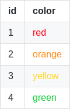

# Table of contents

- [PostgreSQL installation on Linux](#postgresql-installation-on-linux)
  * [Accessing PostgreSQL for the first time](#accessing-postgresql-for-the-first-time)
  * [Setting a password](#setting-a-password)
  * [Importing a sample database](#importing-a-sample-database)
- [PostgreSQL data types](#postgresql-data-types)
  * [Special data types](#special-data-types)
- [Constraints](#constraints)
  * [PRIMARY KEY](#primary-key)
  * [FOREIGN KEY](#foreign-key)
  * [CHECK](#check)
  * [UNIQUE](#unique)
  * [NOT NULL](#not-null)
- [Table management](#table-management)
  * [Table creation](#table-creation)
    + [CREATE](#create)
    + [SELECT INTO](#select-into)
    + [CREATE TABLE AS](#create-table-as)
    + [GENERATED AS IDENTITY](#generated-as-identity)
  * [Table changing](#table-changing)
    + [ALTER TABLE](#alter-table)
    + [DROP TABLE](#drop-table)
    + [TRUNCATE TABLE](#truncate-table)
  * [Temporary tables](#temporary-tables)
  * [Table copies](#table-copies)
- [Sequences](#sequences)
- [Structured Query Language (SQL)](#structured-query-language--sql-)
  * [SELECT](#select)
    + [FROM](#from)
      - [Specific columns](#specific-columns)
      - [All columns](#all-columns)
      - [Concatenation](#concatenation)
      - [Expressions](#expressions)
      - [Column alias](#column-alias)
      - [Expression alias](#expression-alias)
    + [ORDER BY](#order-by)
      - [ASC, DESC](#asc--desc)
      - [NULLS FIRST, NULLS LAST](#nulls-first--nulls-last)
    + [DISTINCT](#distinct)
      - [DISTINCT single column](#distinct-single-column)
      - [DISTINCT multiple columns](#distinct-multiple-columns)
      - [DISTINCT ON](#distinct-on)
    + [WHERE](#where)
      - [Simple filter clause](#simple-filter-clause)
      - [AND, OR](#and--or)
      - [IN](#in)
      - [LIKE](#like)
        * [PostgreSQL ILIKE](#postgresql-ilike)
        * [PostgreSQL operators](#postgresql-operators)
        * [Wildcards](#wildcards)
      - [BETWEEN](#between)
      - [Clause-building operators](#clause-building-operators)
    + [LIMIT](#limit)
      - [OFFSET](#offset)
      - [Top/bottom rows](#top-bottom-rows)
    + [FETCH](#fetch)
    + [GROUP BY](#group-by)
      - [Aggregate functions](#aggregate-functions)
      - [HAVING](#having)
    + [Combining result sets](#combining-result-sets)
      - [UNION](#union)
      - [INTERSECT](#intersect)
      - [EXCEPT](#except)
      - [GROUPING SETS](#grouping-sets)
      - [GROUPING](#grouping)
      - [CUBE](#cube)
      - [ROLLUP](#rollup)
    + [JOIN](#join)
      - [INNER JOIN](#inner-join)
        * [Table alias](#table-alias)
        * [USING](#using)
        * [INNER JOIN with 3 tables](#inner-join-with-3-tables)
      - [LEFT OUTER JOIN](#left-outer-join)
      - [LEFT OUTER JOIN - only left table rows](#left-outer-join---only-left-table-rows)
      - [RIGHT OUTER JOIN](#right-outer-join)
      - [RIGHT OUTER JOIN - only right table rows](#right-outer-join---only-right-table-rows)
      - [FULL OUTER JOIN](#full-outer-join)
      - [FULL OUTER JOIN - only rows unique to both tables](#full-outer-join---only-rows-unique-to-both-tables)
      - [Self join](#self-join)
      - [CROSS JOIN](#cross-join)
      - [NATURAL JOIN](#natural-join)
      - [Summary](#summary)
  * [Conditional expressions](#conditional-expressions)
    + [CASE](#case)
    + [COALESCE](#coalesce)
    + [NULLIF](#nullif)
  * [CAST](#cast)
  * [Subqueries](#subqueries)
    + [EXISTS](#exists)
    + [ANY](#any)
    + [ALL](#all)
  * [WITH](#with)
  * [INSERT](#insert)
  * [UPDATE](#update)
    + [UPDATE Join](#update-join)
    + [Upsert](#upsert)
  * [DELETE](#delete)
    + [DELETE USING](#delete-using)
  * [Transactions](#transactions)
  * [PostgreSQL CLI commands](#postgresql-cli-commands)
- [References](#references)

<small><i><a href='http://ecotrust-canada.github.io/markdown-toc/'>Table of contents generated with markdown-toc</a></i></small>


# PostgreSQL installation on Linux

```bash
sudo sh -c 'echo "deb http://apt.postgresql.org/pub/repos/apt $(lsb_release -cs)-pgdg main" > /etc/apt/sources.list.d/pgdg.list'
wget --quiet -O - https://www.postgresql.org/media/keys/ACCC4CF8.asc | sudo apt-key add -
sudo apt-get update
sudo apt-get install postgresql
```

## Accessing PostgreSQL for the first time

```
sudo apt-get install postgresql
sudo -i -u postgres
psql
```

## Setting a password

```
postgres=# \password
Enter new password:
Enter it again:
```

## Importing a sample database

The steps below can be followed to import an example database called `dvdvrental`:

```
curl -O https://sp.postgresqltutorial.com/wp-content/uploads/2019/05/dvdrental.zip
unzip dvdrental.zip
```

```
psql
postgres=# create database dvdrental;
postgres=# \q
```

```
pg_restore --dbname=dvdrental --verbose dvdrental.tar
```

The imported `dvd rental` represents the business process of a DVD rental store and has the following tables:


A summary and the data types can be found below:


# PostgreSQL data types

| Data type    | Description   | Examples                 |
|--------------|---------------|--------------------------|
| `BOOLEAN`    | True or False | `true` `false` `0` `1`|
| `CHAR(n)`    | *Fixed-length* (`n`), *space-padded* string | `'Example'` `'Test___'` `'A______'` |
| `VARCHAR(n)` | *Variable-length* (up to `n`), *unpadded* string | `'Example'` `'Test'` `'A'` |
| `TEXT`       | *Unlimited-length* string | `'Example'` `'Test'` `'A'` |
| `INTEGER` | 4 bytes: -2,1&times; 10<sup>9</sup> to 2,1&times; 10<sup>9</sup>| `1` `20` `300` |
| `BIGINT` | 8 bytes: -9,2 &times; 10<sup>18</sup> to 9,2 &times; 10<sup>18</sup>| `1` `20` `300` |
| `SMALLINT` | 2 bytes: -32,768 to 32,767| `1` `20` `300` |
| `SERIAL` | *Auto-incremented* int (1 to 2,1 &times; 10<sup>9</sup>)<br>Similar to `AUTOINCREMENT` in MySQL| `1` `2` `3` `4` |
| `BIGSERIAL` | *Auto-incremented* int (1 to to 9,2 &times; 10<sup>18</sup>) | `1` `2` `3` `4` |
| `SMALLSERIAL` | *Auto-incremented* int (1 to 32,767) | `1` `2` `3` `4` |
| `NUMERIC(p, s)` | A number with `p` digits, `s` being<br>decimal places. Typically used when<br> exactness is required (quantities,<br>monetary amounts) | `1234.567 (p = 7, s = 3)` |
| `DATE` | `yyyy-mm-dd` dates| `'1999-12-31'` `'2000-01-01'` | 
| `TIME` | `HH:MM:SS` time | `'12:00:00'` `'17:30:00'` | 
| `TIMESTAMP` | Both date and time | `'1999-12-31 12:30:00'` |
| `TIMESTAMPZ` | Both date and time, *timezone-aware* | `'1999-12-31 12:30:00-03'` |
| `INTERVAL` | Periods of time | `INTERVAL '2h 30m'` `INTERVAL '2 months ago'`
| `ARRAY` | Arrays of values. First index is `1`| `ARRAY ['abc', 'def']` `'{"abc","def"}'`|
| `JSON` | JSON objects | `'{ "name": "Joe" }'` |
| `UUID` | Universal unique identifiers ([RFC 4122](https://tools.ietf.org/html/rfc4122)) | `'4dab074f-ae35-4323-a5a8-2c37cadfa998'`|

## Special data types

| Data type    | Description   |
|--------------|---------------|
| box | a rectangular box |
| line |  a set of points |
| point | a geometric pair of numbers |
| lseg | a line segment |
| polygon | a closed geometric |
| inet | IPv4 address |
| macaddr | MAC address |


# Constraints

The constraints define "special columns":

## PRIMARY KEY

Unique, non-null identifier for a single row in a table.

## FOREIGN KEY
Column (or group of columns) that references the primary key of another table.

## CHECK

Used in table-creation time, provides a way of validating values before new rows are inserted.

## UNIQUE
Prevents repeated values from being added to the column.

## NOT NULL

Makes sure that no NULL values are added to the column.

Example table creation with constraints:

```sql
CRETE TABLE car (
    car_id  SERIAL       PRIMARY KEY,
    make_id INT,
    model   VARCHAR(255) NOT NULL,
    seats   SMALLINT     CHECK (seats <= 5),

    CONSTRAINT fk_make FOREIGN KEY(make_id) REFERENCES make(make_id)
);
```

<br>

More on table creation in the [next section](#create).

# Table management

## Table creation

### CREATE

Tables can be created with the `CREATE TABLE` commands:

```sql
CREATE TABLE [IF NOT EXISTS] table_name (
    column1 DATATYPE(length) column_constraint,
    column2 DATATYPE(length) column_constraint,
    column3 DATATYPE(length) column_constraint,
    table_constraints
)
```

<br>

An example:

```sql
CREATE TABLE account (
	user_id    SERIAL       PRIMARY KEY,
	username   VARCHAR(50)  UNIQUE NOT NULL,
	password   VARCHAR(50)  NOT NULL,
	email      VARCHAR(255) UNIQUE NOT NULL,
	created_on TIMESTAMP    NOT NULL,
	last_login TIMESTAMP
);

CREATE TABLE role (
	role_id    SERIAL       PRIMARY KEY,
	role_name  VARCHAR(255) UNIQUE NOT NULL
);

CREATE TABLE account_role (
	user_id    INT          NOT NULL,
	role_id    INT          NOT NULL,
	grant_date TIMESTAMP,

	PRIMARY KEY (user_id, role_id),
	FOREIGN KEY (user_id) REFERENCES account(user_id),
	FOREIGN KEY (role_id) REFERENCES role(role_id),
);
```
```
┌──────────────┐      ┌────────────────┐      ┌─────────────┐
│   account    │      │  account_role  │      │     role    │
├──────────────┤      ├────────────────┤      ├─────────────┤
│ * user_id    ├─────<│ * user_id      │>─────┤ * role_id   │
│   username   │      │ * role_id      │      │   role_name │
│   password   │      │   grant_date   │      └─────────────┘
│   email      │      └────────────────┘
│   created_on │
│   last_login │
└──────────────┘
```

### SELECT INTO

`SELECT INTO` creates a new table from the result set of a query:

``` postgres
SELECT                             columns
INTO [ TEMP | UNLOGGED ] [ TABLE ] new_table_name
FROM                               table_name
WHERE                              search_condition
```

Using the `film` table from the `dvdrental` database as an example:

```
┌────────────────────┐
│        film        │
├────────────────────┤
│ * film_id          │
│   title            │
│   description      │
│   release_year     │
│   language_id      │
│   rental_duration  │
│   rental_rate      │
│   length           │
│   replacement_cost │
│   rating           │
│   last_update      │
│   special_features │
│   fulltext         │
└────────────────────┘
```

<br>

```sql
SELECT     film_id, title, rental_rate
INTO TABLE film_r
FROM       film
WHERE      rating = 'R' AND rental_duration = 5
ORDER BY   title;
```
```sql
SELECT * FROM film_r
```
| film_id |        title        | rental_rate |
|---------|---------------------|-------------|
|      54 | Banger Pinocchio    |        0.99 |
|     115 | Campus Remember     |        2.99 |
|     138 | Chariots Conspiracy |        2.99 |
|     159 | Closer Bang         |        4.99 |
|     168 | Comancheros Enemy   |        0.99 |
| . . .   | . . .               | . . .       |

### CREATE TABLE AS

`CREATE TABLE AS` can also be used to create a table from the results of a query.

An equivalent to the previous example with [`SELECT INTO`](#select-into):

```sql
CREATE TABLE film_r AS
SELECT       film_id, title, rental_rate
FROM         film
WHERE        rating = 'R' AND rental_duration = 5
ORDER BY     title;
```

### GENERATED AS IDENTITY

`GENERATED AS IDENTITY` allows us to automatically assign a unique number to a column.

`GENERATED AS IDENTITY` is an SQL standard-conforming version of the `SERIAL` columns.

`GENERATED ALWAYS` instructs PostgreSQL to generate a value for the identity column. The values cannot be inserted nor updated:

```sql
CREATE TABLE color (
    color_id   INT          GENERATED ALWAYS AS IDENTITY
    color_name VARCHAR(255) NOT NULL
)
```

## Table changing

### ALTER TABLE

Examples of changing actions:

```sql
ALTER TABLE table_name
RENAME TO   new_table_name;
```
```sql
ALTER TABLE table_name
ADD COLUMN  column_name column_constraint;
```
```sql
ALTER TABLE table_name
DROP COLUMN column_name;
```
```sql
ALTER TABLE   table_name
RENAME COLUMN column_name TO new_column_name;
```
```sql
ALTER TABLE  table_name
ALTER COLUMN column_name
[ SET DEFAULT default_value | DROP DEFAULT ];
```
```sql
ALTER TABLE  table_name
ALTER COLUMN column_name
[ SET NOT NULL | DROP NOT NULL ];
```
```sql
ALTER TABLE table_name
ADD CHECK   validaton_expression;
```
```sql
ALTER TABLE    table_name
ADD CONSTRAINT constraint_name constraint_definition;
```

<br>

An example:

```sql
CREATE TABLE links (
	link_id SERIAL        PRIMARY KEY,
	title   VARCHAR(512)  NOT NULL,
	url     VARCHAR(1024) NOT NULL
);
```
| link_id | title | url |
|---------|-------|-----|
|         |       |     |

<br>

```sql
ALTER TABLE links 
ADD COLUMN  active BOOLEAN;
```
| link_id | title | url | active |
|---------|-------|-----|--------|
|         |       |     |        |

<br>

```sql
ALTER TABLE links 
DROP COLUMN active;
```
| link_id | title | url |
|---------|-------|-----|
|         |       |     |

<br>

```sql
ALTER TABLE   links 
RENAME COLUMN title TO link_title;
```
| link_id | link_title | url |
|---------|------------|-----|
|         |            |     |

<br>

```sql
ALTER TABLE links 
ADD COLUMN  target VARCHAR(10);
```
| link_id | link_title | url | target |
|---------|------------|-----|--------|
|         |            |     |        |


<br>

```sql
ALTER TABLE  links 
ALTER COLUMN target
SET DEFAULT  '_blank';

INSERT INTO links (link_title, url)
VALUES            ('Google', 'http://www.google.com');
```
| link_id | link_title | url                   | target |
|---------|------------|-----------------------|--------|
|       1 | Google     | http://www.google.com | _blank |

<br>

```sql
ALTER TABLE links 
ADD CHECK   (target IN ('_self', '_blank'));

INSERT INTO links (link_title  , url                        , target     )
VALUES            ('Microsoft' , 'http://www.microsoft.com' , '_whatever');
```
```html
ERROR: new row for relation "links" violates check constraint "links_target_check"
Detail: Failing row contains (2, Microsoft, http://www.microsoft.com, _whatever).
```


<br>

```sql
ALTER TABLE    links 
ADD CONSTRAINT unique_url UNIQUE ( url );

INSERT INTO links ( link_title ,  url                    )
VALUES            ( 'Google'   , 'http://www.google.com' );
```
```html
ERROR: duplicate key value violates unique constraint "unique_url"
Detail: Key (url)=(http://www.google.com) already exists.
```

<br>

```sql
ALTER TABLE IF EXISTS links 
RENAME TO             urls;

SELECT *
FROM   urls;
```
| link_id | link_title | url                   | target |
|---------|------------|-----------------------|--------|
|       1 | Google     | http://www.google.com | _blank |


<hr>

A second example:

```sql
CREATE TABLE customer (
	id            SERIAL  PRIMARY KEY,
	customer_name VARCHAR NOT NULL
);
```
| id | customer_name |
|----|---------------|
|    |               |

<br>

```sql
ALTER TABLE customer 
ADD COLUMN  phone    VARCHAR,
ADD COLUMN  fax      VARCHAR,
ADD COLUMN  email    VARCHAR;
```
| id | customer_name | phone | fax | email |
|----|---------------|-------|-----|-------|
|    |               |       |     |       |

<br>

```sql
INSERT INTO customer ( customer_name )
VALUES               ( 'Apple'       ),
                     ( 'Samsung'     ),
                     ( 'Sony'        );
```
| id | customer_name | phone  | fax    | email  |
|----|---------------|--------|--------|--------|
|  1 | Apple         | [null] | [null] | [null] |
|  2 | Samsung       | [null] | [null] | [null] |
|  3 | Sony          | [null] | [null] | [null] |

<br>

```sql
ALTER TABLE customer
ADD COLUMN  contact_name VARCHAR NOT NULL;
```
```html
ERROR: column "contact_name" contains null values
```

<br>

```sql
ALTER TABLE customer
ADD COLUMN  contact_name VARCHAR;

UPDATE customer 
SET    contact_name = 'John'
WHERE  id = 1;

UPDATE customer 
SET    contact_name = 'Sarah'
WHERE  id = 2;

UPDATE customer 
SET    contact_name = 'Bob'
WHERE  id = 3;

ALTER TABLE  customer 
ALTER COLUMN contact_name SET NOT NULL;
```
| id | customer_name | phone  | fax    | email  | contact_name |
|----|---------------|--------|--------|--------|--------------|
|  1 | Apple         | [null] | [null] | [null] | John         |
|  2 | Samsung       | [null] | [null] | [null] | Sarah        |
|  3 | Sony          | [null] | [null] | [null] | Bob          |


<hr>

A third example:

```sql
CREATE TABLE assets (
    id            SERIAL  PRIMARY KEY,
    name          TEXT    NOT NULL,
    asset_no      VARCHAR NOT NULL,
    description   TEXT,
    location      TEXT,
    acquired_date DATE    NOT NULL
);

INSERT INTO assets( name     , asset_no , location      , acquired_date )
VALUES            ( 'Server' , '10001'  , 'Server room' , '2017-01-01'  ),
                  ( 'UPS'    , '10002'  , 'Server room' , '2017-01-01'  );
```
```
┌──────────────────────────┐
│          asset           │
├──────────────────────────┤
│ * id:            INT4    │
│   name:          TEXT    │
│   asset_no:      VARCHAR │
│   description:   TEXT    │
│   location:      TEXT    │
│   acquired_date: DATE    │
└──────────────────────────┘
```

<br>


```sql
ALTER TABLE  assets
ALTER COLUMN name        TYPE VARCHAR(255),
ALTER COLUMN location    TYPE VARCHAR(255),
ALTER COLUMN description TYPE VARCHAR(255);
```
```
┌──────────────────────────┐
│          asset           │
├──────────────────────────┤
│ * id:            INT4    │
│   name:          VARCHAR │
│   asset_no:      VARCHAR │
│   description:   VARCHAR │
│   location:      VARCHAR │
│   acquired_date: DATE    │
└──────────────────────────┘
```

<br>


```sql
ALTER TABLE  assets 
ALTER COLUMN asset_no TYPE INT;
```
```html
ERROR: column "asset_no" cannot be cast automatically to type integer
Hint: You might need to specify "USING asset_no::integer".
```

<br>


```sql
ALTER TABLE  assets
ALTER COLUMN asset_no TYPE INT 
USING        asset_no::integer;
```
```
┌──────────────────────────┐
│          asset           │
├──────────────────────────┤
│ * id:            INT4    │
│   name:          VARCHAR │
│   asset_no:      INT4    │
│   description:   VARCHAR │
│   location:      VARCHAR │
│   acquired_date: DATE    │
└──────────────────────────┘
```

### DROP TABLE

An example:

```sql
CREATE TABLE publisher (
    publisher_id SERIAL  PRIMARY KEY,
    name         VARCHAR NOT NULL
);

CREATE TABLE category (
    category_id SERIAL  PRIMARY KEY,
    name        VARCHAR NOT NULL
);

CREATE TABLE book (
    book_id        SERIAL   PRIMARY KEY,
    title          VARCHAR  NOT NULL,
    isbn           VARCHAR  NOT NULL,
    published_date DATE     NOT NULL,
    description    VARCHAR,
    category_id    INT      NOT NULL,
    publisher_id   INT      NOT NULL,

    FOREIGN KEY (publisher_id) REFERENCES publisher (publisher_id),
    FOREIGN KEY (category_id)  REFERENCES category (category_id)
);
```
```
                       ┌───────────────────┐
                       │       book        │
┌────────────────┐     ├───────────────────┤    ┌───────────────┐
│   publisher    │     │  * book_id        │    │   category    │
├────────────────┤     │    title          │    ├───────────────┤
│ * publisher_id ├────<│    isbn           │>───┤ * category_id │
│   name         │     │    published_date │    │   name        │
└────────────────┘     │    description    │    └───────────────┘
                       │    category_id    │
                       │    publisher_id   │
                       └───────────────────┘
```

<br>

```sql
DROP TABLE category;
```
```html
ERROR: cannot drop table category because other objects depend on it
Detail: constraint book_category_id_fkey on table book depends on table category
Hint: Use DROP ... CASCADE to drop the dependent objects too.
```

<br>

```sql
DROP TABLE category CASCADE;
```
```
                       ┌───────────────────┐
                       │       book        │
┌────────────────┐     ├───────────────────┤
│   publisher    │     │  * book_id        │
├────────────────┤     │    title          │
│ * publisher_id ├────<│    isbn           │
│   name         │     │    published_date │
└────────────────┘     │    description    │
                       │    category_id    │
                       │    publisher_id   │
                       └───────────────────┘
```

<br>

```sql
DROP TABLE abc;
```
```html
ERROR: table "abc" does not exist
```

<br>

```sql
DROP TABLE IF EXISTS abc;
```
```html
NOTICE:  table "abc" does not exist, skipping
```

### TRUNCATE TABLE

To remove all the data from a big table, we could the `DELETE` statement followed by a `VACUMM` operation to reclaim the storage occupied by the removed data.

However, the `TRUNCATE TABLE` is <u>*more efficient*</u>, as it *erases the table without scanning it*. It also *reclaims the store right away*, making the `VACUMM` operation unnecessary.

## Temporary tables

We can create *temporary tables* that are *visible only to the session* that creates it. These tables are *automatically dropped* when the session ends.

Temprary tables can share the same name with a permanent table, but it is not recommended:

```sql
CREATE TABLE customer (
	id   INT          GENERATED ALWAYS AS IDENTITY,
	name VARCHAR(255) NOT NULL
);

INSERT INTO customer ( name    )
VALUES               ( 'Bob'   ), 
                     ( 'John'  ),
                     ( 'Sarah' );
                     
SELECT *
FROM customer;
```
| id | name  |
|----|-------|
|  1 | Bob   |
|  2 | John  |
|  3 | Sarah |

<br>

```sql
CREATE TEMP TABLE customer (
	temp_id INT
);

SELECT *
FROM   customer;
```
| temp_id |
|---------|
|         |

<br>

```sql
DROP TABLE customer;

SELECT *
FROM customer;
```
| id | name  |
|----|-------|
|  1 | Bob   |
|  2 | John  |
|  3 | Sarah |

## Table copies

An example:

```sql
CREATE TABLE car (
	id    SERIAL        PRIMARY KEY,
	make  VARCHAR(255),
	model VARCHAR(255)
);

INSERT INTO car ( make            , model    )
VALUES          ( 'BMW'           , 'M5'     )
                ( 'Porsche'       , '911'    ),
                ( 'Mercedes-Benz' , 'AMG GT' );
   
SELECT *
FROM car;
```
| id |     make      | model  |
|----|---------------|--------|
|  1 | BMW           | M5     |
|  2 | Porsche       | 911    |
|  3 | Mercedes-Benz | AMG GT |

<br>

```sql
CREATE TABLE car_backup
AS TABLE     car;

SELECT *
FROM   car_backup;
```
| id |     make      | model  |
|----|---------------|--------|
|  1 | BMW           | M5     |
|  2 | Porsche       | 911    |
|  3 | Mercedes-Benz | AMG GT |

<br>

```sql
CREATE TABLE car_backup_2
AS TABLE     car

WITH NO DATA;

SELECT *
FROM   car_backup_2;
```
| id |     make      | model  |
|----|---------------|--------|
|    |               |        |

<br>

```sql
CREATE TABLE porsche AS
SELECT *
FROM   car
WHERE  make = 'Porsche';

SELECT *
FROM porsche;
```
| id |     make      | model  |
|----|---------------|--------|
|  2 | Porsche       | 911    |


<br>

```sql
```
| | |

<br>

```sql
```
| | |

<br>


# Sequences

A sequence is an ordered list of integers, such as `{1,2,3,4,5}` and `{5,4,3,2,1}`.

Sequences can be created in PostgreSQL with the `CREATE SEQUENCE` command:

```sql
CREATE SEQUENCE [ IF NOT EXISTS ] sequence_name
[ AS { SMALLINT | INT | BIGINT } ]
[ INCREMENT [ BY ] increment_value ]
[ MINVALUE min_number | NO MINVALUE ]
[ MAXVALUE max_number | NO MAXVALUE ]
[ START [ WITH ] first_number ]
[ CACHE number_of_preallocated_numbers ]
[ [ NO ] CYCLE ]
[ OWNED BY { table_name.column_name | NONE } ]
```

<br>

Example:

```sql
CREATE SEQUENCE mysequence
INCREMENT 5
MAXVALUE 15
CYCLE;
```

<br>

```sql
SELECT nextval('mysequence');
```
| nextval |
|---------|
|       1 |

<br>

```sql
SELECT nextval('mysequence');
```
| nextval |
|---------|
|       6 |

<br>

```sql
SELECT nextval('mysequence');
```
| nextval |
|---------|
|      11 |
<br>

```sql
SELECT nextval('mysequence');
```
| nextval |
|---------|
|       1 |

<br>

If a sequence is associated with (`OWNED BY`) a table column, it will be dropped (deleted) as soon as the column or table is dropped.


# Structured Query Language (SQL)

## SELECT

### FROM

```sql
SELECT columns
FROM   table
```
<br>

Order of evaluation:

```
╭──────────╮         ╭──────────╮
│   FROM   │  ────>  │  SELECT  │
╰──────────╯         ╰──────────╯
```

#### Specific columns

```sql
SELECT first_name
FROM customer;
```
| first_name |
|------------|
| Jared      |
| Mary       |
| Patricia   |
| Linda      |
| Barbara    |
| . . .      |

<br>

```sql
SELECT first_name, last_name
FROM customer;
```
| first_name | last_name |
|------------|-----------|
| Jared      | Ely       |
| Mary       | Smith     |
| Patricia   | Johnson   |
| Linda      | Williams  |
| Barbara    | Jones     |
|  . . .     | . . .     |

<br>

#### All columns

```sql
SELECT * FROM customer;
```
| customer_id | store_id | first_name | last_name |                email                | . . . |
|-------------|----------|------------|-----------|-------------------------------------|-------|
|         524 |        1 | Jared      | Ely       | jared.ely@sakilacustomer.org        | . . . |
|           1 |        1 | Mary       | Smith     | mary.smith@sakilacustomer.org       | . . . |
|           2 |        1 | Patricia   | Johnson   | patricia.johnson@sakilacustomer.org | . . . |
|           3 |        1 | Linda      | Williams  | linda.williams@sakilacustomer.org   | . . . |
|           4 |        2 | Barbara    | Jones     | barbara.jones@sakilacustomer.org    | . . . |
|. . .|. . .|. . .|. . .|. . .|. . .|

The use of `*` in the `SELECT` statement is discouraged due to the possible impacts on performance, as well as to avoid fetching unnecessary data.

*It is a good practice to name the columns.*

<br>

#### Concatenation

```sql
SELECT first_name || ', ' || last_name, email
FROM customer;
```
|     ?column?      |                email                |
|-------------------|-------------------------------------|
| Ely, Jared        | jared.ely@sakilacustomer.org        |
| Smith, Mary       | mary.smith@sakilacustomer.org       |
| Johnson, Patricia | patricia.johnson@sakilacustomer.org |
| Williams, Linda   | linda.williams@sakilacustomer.org   |
| Jones, Barbara    | barbara.jones@sakilacustomer.org    |
|. . .|. . .|

<br>

#### Expressions

```sql
SELECT 2 * 3;
```
| ?column? |
|----------|
|    6     |

<br>

#### Column alias

```sql
SELECT first_name, last_name AS surname
FROM customer;
```
| first_name |  surname  |
|------------|-----------|
| Jared      | Ely       |
| Mary       | Smith     |
| Patricia   | Johnson   |
| Linda      | Williams  |
| Barbara    | Jones     |
|  . . .     | . . .     |

<br>

#### Expression alias

```sql
SELECT first_name || ' ' || last_name AS full_name
FROM customer;
```

|    full_name     |
|------------------|
| Jared Ely        |
| Mary Smith       |
| Patricia Johnson |
| Linda Williams   |
| Barbara Jones    |
| . . . |

<br>

```sql
SELECT first_name || ' ' || last_name AS "Full name"
FROM customer;
```

|    Full name     |
|------------------|
| Jared Ely        |
| Mary Smith       |
| Patricia Johnson |
| Linda Williams   |
| Barbara Jones    |
| . . . |

<br>


### ORDER BY

```sql
SELECT   columns
FROM     table
ORDER BY sort_expression
```

<br>

Order of evaluation:

```
╭──────────╮         ╭──────────╮         ╭──────────╮
│   FROM   │  ────>  │  SELECT  │  ────>  │ ORDER BY │
╰──────────╯         ╰──────────╯         ╰──────────╯
```

<br>

```sql
SELECT first_name, last_name AS full_name
FROM customer
ORDER BY first_name ASC;
```
| first_name | last_name |
|------------|-----------|
| Aaron      | Selby     |
| Adam       | Gooch     |
| Adrian     | Clary     |
| Agnes      | Bishop    |
| Alan       | Kahn      |
|. . .|. . .|

<br>

#### ASC, DESC

```sql
SELECT first_name, last_name AS full_name
FROM customer
ORDER BY first_name ASC, last_name DESC;
```
| first_name  | last_name    |
|-------------|-----------   |
| . . .       | . . .        |
| Kay         | Caldwell     |
| Keith       | Rico         |
| ***Kelly*** | ***Torres*** |
| ***Kelly*** | ***Knott***  |
| Ken         | Prewitt      |
| . . .       | . . .        |


<br>

```sql
SELECT first_name, LENGTH(first_name) AS len
FROM customer
ORDER BY len;
```
| first_name |  len   |
|------------|--------|
| Jo         |      2 |
| Sam        |      3 |
| Roy        |      3 |
| Eva        |      3 |
| Don        |      3 |
| . . .      | . . .  |

<br>

#### NULLS FIRST, NULLS LAST

```sql
SELECT number
FROM some_table
ORDER BY number NULLS FIRST;
```
| number |
|--------|
| [null] |
|   1    |
|   2    |
|   3    |

<br>

### DISTINCT

```sql
SELECT DISTINCT column
FROM            table
```

<br>

The following examples take the example `colors` table below into consideration:


<br>

#### DISTINCT single column

```sql
SELECT DISTINCT background
FROM colors
ORDER BY background;
```


<br>

#### DISTINCT multiple columns

Select the distinct `background, foreground` combinations:

```sql
SELECT DISTINCT background, foreground
FROM colors
ORDER BY background, foreground;
```


<br>

#### DISTINCT ON

```sql
SELECT DISTINCT ON (background) background, foreground
FROM colors;
```


<br>

```sql
SELECT DISTINCT ON (background) background, foreground
FROM colors
ORDER BY background, foreground;
```


<br>

In the example above the rows are put into groups unique by `background`, each group was sorted by `background, foreground`, and then the *first row* of each group was kept:


<br>

It is a good practice to use `ORDER BY` with `DISTINCT ON (expression)` to make this order of results predictable.

<br>

```sql
SELECT DISTINCT ON (foreground) background, foreground
FROM colors;
```


<br>

### WHERE

```sql
SELECT   columns
FROM     table
WHERE    condition
ORDER BY sort_expression
```

<br>

Order of evaluation:

```
╭──────────╮         ╭──────────╮         ╭──────────╮         ╭──────────╮
│   FROM   │  ────>  │  WHERE   │  ────>  │  SELECT  │  ────>  │ ORDER BY │
╰──────────╯         ╰──────────╯         ╰──────────╯         ╰──────────╯
```

The following examples refer to the `dvd rental` database once again:

#### Simple filter clause

```sql
SELECT last_name, first_name
FROM customer
WHERE first_name = 'Jamie';
```
| last_name | first_name  |
|-----------|-------------|
| Rice      | Jamie       |
| Waugh     | Jamie       |

<br>

#### AND, OR

```sql
SELECT last_name, first_name
FROM customer
WHERE first_name = 'Jamie' AND last_name = 'Rice';
```
| last_name | first_name  |
|-----------|-------------|
| Rice      | Jamie       |

<br>

```sql
SELECT first_name, last_name
FROM customer
WHERE last_name = 'Rodriguez' OR first_name = 'Adam';
```
| first_name  | last_name |
|-------------|-----------|
| Laura       | Rodriguez |
| Adam        | Gooch     |

<br>

#### IN

```sql
SELECT first_name, last_name
FROM customer
WHERE first_name IN ('Ann', 'Anne', 'Annie');
```
| first_name  | last_name |
|-------------|-----------|
| Ann         | Evans     |
| Anne        | Powell    |
| Annie       | Russell   |

<br>

PostgreSQL executes the `IN` operator *faster* than the equivalent query with `OR` operators.

```sql
SELECT first_name, last_name
FROM customer
WHERE first_name NOT IN ('Ann', 'Anne', 'Annie');
```
| first_name  | last_name |
|-------------|-----------|
| Jared       | Ely       |
| Mary        | Smith     |
| Patricia    | Johnson   |
| Linda       | Williams  |
| Barbara     | Jones     |
| . . .       | . . .     |

<br>

```sql
SELECT customer_id, first_name, last_name
FROM customer
WHERE customer_id IN (
	SELECT customer_id
	FROM rental
	WHERE CAST (return_date AS DATE) = '2005-05-27'
)
ORDER BY customer_id;
```
| customer_id | first_name | last_name  |
|-------------|------------|------------|
|          37 | Pamela     | Baker      |
|          47 | Frances    | Parker     |
|          48 | Ann        | Evans      |
|          65 | Rose       | Howard     |
|          73 | Beverly    | Brooks     |
| . . .       | . . .      | . . .      |

<br>

#### LIKE

```sql
SELECT first_name, last_name
FROM customer
WHERE first_name LIKE 'Ann%';
```
| first_name  | last_name |
|-------------|-----------|
| Anna        | Hill      |
| Ann         | Evans     |
| Anne        | Powell    |
| Annie       | Russell   |
| Annette     | Olson     |

<br>

##### PostgreSQL ILIKE

```sql
SELECT first_name, last_name
FROM customer
WHERE first_name ILIKE 'aNN%';
```
| first_name  | last_name |
|-------------|-----------|
| Anna        | Hill      |
| Ann         | Evans     |
| Anne        | Powell    |
| Annie       | Russell   |
| Annette     | Olson     |

<br>

##### PostgreSQL operators

```sql
SELECT first_name, last_name
FROM customer
WHERE first_name ~~ 'Ann%';
```
| first_name  | last_name |
|-------------|-----------|
| Anna        | Hill      |
| Ann         | Evans     |
| Anne        | Powell    |
| Annie       | Russell   |
| Annette     | Olson     |

<br>

| Operator   | Equivalent      |
|------------|-----------------|
| **`~~`**   | **`LIKE`**      |
| **`~~*`**  | **`ILIKE`**     |
| **`!~~`**  | **`NOT LIKE`**  |
| **`!~~*`** | **`NOT ILIKE`** |

<br>

```sql
SELECT first_name, last_name
FROM customer
WHERE first_name LIKE 'Ann%' AND first_name != 'Anne';
```
| first_name  | last_name |
|-------------|-----------|
| Anna        | Hill      |
| Ann         | Evans     |
| Annie       | Russell   |
| Annette     | Olson     |

<br>

In the example above, `Ann%` is equivalent to the *`Ann`* followed by *`zero or more chars`*.

##### Wildcards

| Expression                 | Value   |
|----------------------------|---------|
| `'abcd'` **LIKE** `'abcd'` | `true`  |
| `'abcd'` **LIKE** `'ab%'`  | `true`  |
| `'abcd'` **LIKE** `'_bc_'` | `true`  |
| `'abcd'` **LIKE** `'_b%'`  | `true`  |
| `'abcd'` **LIKE** `'a_'`   | `false` |

<br>

#### BETWEEN

```sql
SELECT first_name, LENGTH(first_name) AS name_length
FROM customer
WHERE first_name LIKE 'A%' AND LENGTH(first_name) BETWEEN 3 AND 5
ORDER BY name_length;
```
| first_name  | name_length |
|-------------|-------------|
| Amy         |           3 |
| Ann         |           3 |
| Ana         |           3 |
| Andy        |           4 |
| Anna        |           4 |
| . . .       | . . .       |

<br>

```sql
SELECT customer_id, payment_id, amount, payment_date
FROM payment
WHERE payment_date NOT BETWEEN '2007-02-07' AND '2007-02-15'
```
| customer_id | payment_id | amount |    payment_date     |
|-------------|------------|--------|---------------------|
|         341 |      17503 |   7.99 | 2007-02-15 22:25:46 |
|         341 |      17504 |   1.99 | 2007-02-16 17:23:14 |
|         341 |      17505 |   7.99 | 2007-02-16 22:41:45 |
|         341 |      17506 |   2.99 | 2007-02-19 19:39:56 |
|         341 |      17507 |   7.99 | 2007-02-20 17:31:48 |
| . . .       | . . .      | . . .  | . . .               |

<br>

#### Clause-building operators

| Operator             | Description                        |
|----------------------|------------------------------------|
| **`=`**              | Equal                              |
| **`>`**              | Greater than                       |
| **`<`**              | Less than                          |
| **`>=`**             | Greater than or equal              |
| **`<=`**             | Less than or equal                 |
| **`<>`** or **`!=`** | Not equal                          |
| **`AND`**            | Logical `AND`                      |
| **`OR`**             | Logical `OR`                       |
| **`IN`**             | `true` if value is in a list       |
| **`BETWEEN`**        | `true` if value is between a range |
| **`LIKE`**           | `true` if value matches a pattern  |
| **`IS NULL`**        | `true` if value is `NULL`          |
| **`NOT`**            | Logical `NOT`                      |

<br>

### LIMIT

```sql
SELECT   columns
FROM     table
ORDER BY sort_expression
LIMIT    row_count
```

<br>

```sql
SELECT film_id, title, release_year
FROM film
ORDER BY film_id
LIMIT 5;
```
| film_id |      title       | release_year  |
|---------|------------------|---------------|
|       1 | Academy Dinosaur |          2006 |
|       2 | Ace Goldfinger   |          2006 |
|       3 | Adaptation Holes |          2006 |
|       4 | Affair Prejudice |          2006 |
|       5 | African Egg      |          2006 |

<br>

We should always use `LIMIT` together with `ORDER BY`, as *tables store rows in an unspecified order*.

<br>

#### OFFSET

```sql
SELECT film_id, title, release_year
FROM film
ORDER BY film_id
LIMIT 5 OFFSET 3;
```
| film_id |      title       | release_year  |
|---------|------------------|---------------|
|       4 | Affair Prejudice |          2006 |
|       5 | African Egg      |          2006 |
|       6 | Agent Truman     |          2006 |
|       7 | Airplane Sierra  |          2006 |
|       8 | Airport Pollock  |          2006 |

<br>

#### Top/bottom rows

```sql
SELECT film_id, title, rental_rate
FROM film
ORDER BY rental_rate DESC
LIMIT 10;
```
| film_id |        title        | rental_rate |
|---------|---------------------|-------------|
|      13 | Ali Forever         |        4.99 |
|      20 | Amelie Hellfighters |        4.99 |
|       7 | Airplane Sierra     |        4.99 |
|      10 | Aladdin Calendar    |        4.99 |
|       2 | Ace Goldfinger      |        4.99 |
|       8 | Airport Pollock     |        4.99 |
|      98 | Bright Encounters   |        4.99 |
|     133 | Chamber Italian     |        4.99 |
|     384 | Grosse Wonderful    |        4.99 |
|      21 | American Circus     |        4.99 |

<br>

### FETCH

Altough [LIMIT](#limit) is used by PostgreSQL, MySQL, H2, etc., it is not a SQL standard.

The `FETCH` clase is equivalent and conforms to SQL standards:

```sql
SELECT      columns
FROM        table
ORDER BY    sort_expression
OFFSET      row_count ROWS
FETCH FIRST row_count ROWS ONLY;
```

<br>
<br>

```sql
SELECT film_id, title
FROM film
ORDER BY title
OFFSET 3 ROWS
FETCH FIRST 5 ROWS ONLY;
```
| film_id |      title       |
|---------|------------------|
|       4 | Affair Prejudice |
|       5 | African Egg      |
|       6 | Agent Truman     |
|       7 | Airplane Sierra  |
|       8 | Airport Pollock  |

<br>

Again, `FETCH` should always be used together with `ORDER BY`, as *rows are stored in an unpredictable order*.

<br>

### GROUP BY

```sql
SELECT   columns
FROM     table
GROUP BY columns
```

<br>

Order of evaluation:

```
  ┌──────────┐
  │   FROM   │
  └──────────┘
       ↓
  ┌──────────┐
  │  WHERE   │
  └──────────┘
       ↓
  ╔══════════╗
  ║ GROUP BY ║
  ╚══════════╝
       ↓
  ┌──────────┐
  │  HAVING  │
  └──────────┘
       ↓
  ┌──────────┐
  │  SELECT  │
  └──────────┘
       ↓
  ┌──────────┐
  │ DISTINCT │
  └──────────┘
       ↓
  ┌──────────┐
  │ ORDER BY │
  └──────────┘
       ↓
  ┌──────────┐
  │  LIMIT   │
  └──────────┘
```

<br>

```sql
SELECT customer_id
FROM payment
GROUP BY customer_id
```
| customer_id |
|-------------|
|         184 |
|          87 |
|         477 |
|         273 |
|         550 |
|. . .        |

<br>

The qeury above works like the `DISINCT` clause, as it removes any duplicate `customer_id`s.

#### Aggregate functions

```sql
SELECT customer_id, SUM(amount)
FROM payment
GROUP BY customer_id;
```
| customer_id |  sum   |
|-------------|--------|
|         184 |  80.80 |
|          87 | 137.72 |
|         477 | 106.79 |
|         273 | 130.72 |
|         550 | 151.69 |
|. . .        |. . .   |

<br>

```sql
SELECT customer_id, SUM(amount)
FROM payment
GROUP BY customer_id
ORDER BY SUM(amount) DESC;
```
| customer_id |  sum   |
|-------------|--------|
|         148 | 211.55 |
|         526 | 208.58 |
|         178 | 194.61 |
|         137 | 191.62 |
|         144 | 189.60 |
|. . .        |. . .   |


<br>

```sql
SELECT
	first_name || ' ' || last_name AS full_name,
	SUM(amount) AS total_spent

FROM payment INNER JOIN customer
USING (customer_id)

GROUP BY full_name

ORDER BY total_spent DESC;
```
|   full_name    | total_spent |
|----------------|-------------|
| Eleanor Hunt   |      211.55 |
| Karl Seal      |      208.58 |
| Marion Snyder  |      194.61 |
| Rhonda Kennedy |      191.62 |
| Clara Shaw     |      189.60 |
|. . .           |. . .        |

<br>

For info on *joins* see the [JOIN](#join) section.

<br>

```sql
SELECT staff_id, COUNT(payment_id)
FROM payment
GROUP BY staff_id
```
| staff_id | count |
|----------|-------|
|        1 |  7292 |
|        2 |  7304 |

<br>

```sql
SELECT customer_id, staff_id, SUM(amount) AS total_spent
FROM payment
GROUP BY staff_id, customer_id
ORDER BY customer_id;
```
| customer_id | staff_id | total_spent |
|-------------|----------|-------------|
|           1 |        2 |       53.85 |
|           1 |        1 |       60.85 |
|           2 |        2 |       67.88 |
|           2 |        1 |       55.86 |
|           3 |        1 |       59.88 |
|           3 |        2 |       70.88 |
|           4 |        2 |       31.90 |
|           4 |        1 |       49.88 |
| . . .       | . . .    | . . .       |

<br>

In the query above, `total_spent` is calculated for every <u>*`(customer_id, staff_id)`</u>* pair.

<br>

```sql
SELECT DATE(payment_date), sum(amount)
FROM payment
GROUP BY DATE(payment_date)
ORDER BY DATE(payment_date);
```
|    date    |   sum   |
|------------|---------|
| 2007-02-14 |  116.73 |
| 2007-02-15 | 1188.92 |
| 2007-02-16 | 1154.18 |
| 2007-02-17 | 1188.17 |
| 2007-02-18 | 1275.98 |
| . . .      | . . .   |

#### HAVING

```sql
SELECT   columns
FROM     table
GROUP BY columns
HAVING   conditions
```

<br>

Order of evaluation:

```
  ┌──────────┐
  │   FROM   │
  └──────────┘
       ↓
  ┌──────────┐
  │  WHERE   │
  └──────────┘
       ↓
  ┌──────────┐
  │ GROUP BY │
  └──────────┘
       ↓
  ╔══════════╗
  ║  HAVING  ║
  ╚══════════╝
       ↓
  ┌──────────┐
  │  SELECT  │
  └──────────┘
       ↓
  ┌──────────┐
  │ DISTINCT │
  └──────────┘
       ↓
  ┌──────────┐
  │ ORDER BY │
  └──────────┘
       ↓
  ┌──────────┐
  │  LIMIT   │
  └──────────┘
```

<br>

While [`WHERE`](#where) allows us to filter *<u>rows</u>*, `HAVING` allows us to filter *<u>groups of rows</u>*:

```sql
SELECT customer_id, SUM(amount)
FROM payment
GROUP BY customer_id
HAVING SUM(amount) >= 200;
```
| customer_id |  sum   |
|-------------|--------|
|         526 | 208.58 |
|         148 | 211.55 |

<br>

The query above calculates the total amount each customer has spent and ignores the amounts smaller than $200.

<br>

```sql
SELECT store_id, count(customer_id)
FROM customer
GROUP BY store_id
HAVING count(customer_id) > 300;
```

<br>

The query above selects the store with more than 300 customers.

### Combining result sets

#### UNION

Taking the two tables below as an example:

```
               top_rated_films                            most_popular_films
┌──────────────────────────┬────────────────┐    ┌────────────────────┬──────────────┐
│          title           │  release_year  │    │       title        │ release_year │
├──────────────────────────┼────────────────┤    ├────────────────────┼──────────────┤
│ The Shawshank Redemption │           1994 │    │ An American Pickle │         2020 │
│ The Godfather            │           1972 │    │ The Godfather      │         1972 │
│ "12 Angry Men"           │           1957 │    │ Greyhound          │         2020 │
└──────────────────────────┴────────────────┘    └────────────────────┴──────────────┘
```

<br>

We can combine the results of both tables, if the *<u>number and order</u>* of the columns are the same and the *<u>data types</u>* are compatible:


```sql
SELECT *
FROM top_rated_films

UNION

SELECT *
FROM most_popular_films;
```
|          title           | release_year |
|--------------------------|--------------|
| An American Pickle       |         2020 |
| Greyhound                |         2020 |
| The Shawshank Redemption |         1994 |
| The Godfather            |         1972 |
| 12 Angry Men             |         1957 |

<br>

To keep duplicates:

```sql
SELECT *
FROM top_rated_films

UNION ALL

SELECT *
FROM most_popular_films;
```
|          title           | release_year |
|--------------------------|--------------|
| The Shawshank Redemption |         1994 |
| The Godfather            |         1972 |
| 12 Angry Men             |         1957 |
| An American Pickle       |         2020 |
| The Godfather            |         1972 |
| Greyhound                |         2020 |

<br>

```sql
SELECT *
FROM top_rated_films

UNION ALL

SELECT *
FROM most_popular_films

ORDER BY title;
```
|          title           | release_year |
|--------------------------|--------------|
| 12 Angry Men             |         1957 |
| An American Pickle       |         2020 |
| Greyhound                |         2020 |
| The Godfather            |         1972 |
| The Godfather            |         1972 |
| The Shawshank Redemption |         1994 |

<br>

#### INTERSECT

Taking the `top_rated_films` and `most_popular_films` tables as an example once again:

```
               top_rated_films                            most_popular_films
┌──────────────────────────┬────────────────┐    ┌────────────────────┬──────────────┐
│          title           │  release_year  │    │       title        │ release_year │
├──────────────────────────┼────────────────┤    ├────────────────────┼──────────────┤
│ The Shawshank Redemption │           1994 │    │ An American Pickle │         2020 │
│ The Godfather            │           1972 │    │ The Godfather      │         1972 │
│ "12 Angry Men"           │           1957 │    │ Greyhound          │         2020 │
└──────────────────────────┴────────────────┘    └────────────────────┴──────────────┘
```

<br>

We can once combine the results of [`SELECT`](#select) statements (if the *<u>number and order</u>* of the columns are the same and the *<u>data types</u>* are compatible) and *keep only the rows available in both* result sets:


```sql
SELECT *
FROM top_rated_films

INTERSECT

SELECT *
FROM most_popular_films;
```
|          title           | release_year |
|--------------------------|--------------|
| The Godfather            |         1972 |

#### EXCEPT

Just as the previous [`UNION`](#union) and [`INTERSECT`](#intersect) clauses, we can also use `EXCEPT` to combine [`SELECT`](#select) statements if the *<u>number and order</u>* of the columns are the same and the *<u>data types</u>* are compatible.

`EXCEPT` keeps only distinct rows that are present in the first query and not present in the second one.

Using the same film tables once again:

```
               top_rated_films                            most_popular_films
┌──────────────────────────┬────────────────┐    ┌────────────────────┬──────────────┐
│          title           │  release_year  │    │       title        │ release_year │
├──────────────────────────┼────────────────┤    ├────────────────────┼──────────────┤
│ The Shawshank Redemption │           1994 │    │ An American Pickle │         2020 │
│ The Godfather            │           1972 │    │ The Godfather      │         1972 │
│ "12 Angry Men"           │           1957 │    │ Greyhound          │         2020 │
└──────────────────────────┴────────────────┘    └────────────────────┴──────────────┘
```

<br>

We can combine them using `EXCEPT`:


```sql
SELECT *
FROM top_rated_films

EXCEPT

SELECT *
FROM most_popular_films

ORDER BY title;
```
|          title           | release_year |
|--------------------------|--------------|
| 12 Angry Men             |         1957 |
| The Shawshank Redemption |         1994 |

<br>

#### GROUPING SETS

For this section we will take the following `sales` table as ane example:

| brand | segment | quantity |
|-------|---------|----------|
| ABC   | Premium |      100 |
| ABC   | Basic   |      200 |
| XYZ   | Premium |      100 |
| XYZ   | Basic   |      300 |


<br>

The queries shown below correspond to:

 - Products sold by `brand, segment` combinations;
 - Products sold by `brand`;
 - Products sold by `segment`;
 - Number of products sold;

```sql
-- Products sold by (brand, segment) combinations

SELECT brand, segment, SUM(quantity)
FROM sales
GROUP BY brand, segment;
```
| brand | segment | sum |
|-------|---------|-----|
| XYZ   | Basic   | 300 |
| ABC   | Premium | 100 |
| ABC   | Basic   | 200 |
| XYZ   | Premium | 100 |

<br>

```sql
-- Products sold by brand

SELECT brand, SUM(quantity)
FROM sales
GROUP BY brand;
```
| brand | sum |
|-------|-----|
| ABC   | 300 |
| XYZ   | 400 |


<br>

```sql
-- Products sold by segment

SELECT segment, SUM(quantity)
FROM sales
GROUP BY segment;
```
| segment | sum |
|---------|-----|
| Basic   | 500 |
| Premium | 200 |

<br>

```sql
-- Number of products sold
SELECT SUM(quantity)
FROM sales;
```
| sum |
|-----|
| 700 |

<br>

We could combine the four result sets above by using `UNION ALL` clauses:

```sql
SELECT brand, segment, SUM(quantity)
FROM sales
GROUP BY brand, segment

UNION ALL

SELECT brand, NULL, SUM(quantity)
FROM sales
GROUP BY brand

UNION ALL

SELECT NULL, segment, SUM(quantity)
FROM sales
GROUP BY segment

UNION ALL

SELECT NULL, NULL, SUM(quantity)
FROM sales
```
| brand  | segment | sum |
|--------|---------|-----|
| XYZ    | Basic   | 300 |
| ABC    | Premium | 100 |
| ABC    | Basic   | 200 |
| XYZ    | Premium | 100 |
| ABC    | [null]  | 300 |
| XYZ    | [null]  | 400 |
| [null] | Basic   | 500 |
| [null] | Premium | 200 |
| [null] | [null]  | 700 |

<br>

The query shown above is quite big. It could be rewritten with `GROUPING SETS`, which is more readable and has an optimized execution performance:

```sql
SELECT brand, segment, SUM(quantity)
FROM sales
GROUP BY GROUPING SETS ((brand, segment), (brand), (segment), ());
```
| brand  | segment | sum |
|--------|---------|-----|
| [null] | [null]  | 700 |
| XYZ    | Basic   | 300 |
| ABC    | Premium | 100 |
| ABC    | Basic   | 200 |
| XYZ    | Premium | 100 |
| ABC    | [null]  | 300 |
| XYZ    | [null]  | 400 |
| [null] | Basic   | 500 |
| [null] | Premium | 200 |

#### GROUPING

Taking the `sales` table as an example once again:

| brand | segment | quantity |
|-------|---------|----------|
| ABC   | Premium |      100 |
| ABC   | Basic   |      200 |
| XYZ   | Premium |      100 |
| XYZ   | Basic   |      300 |

<br>

```sql
SELECT
	GROUPING(brand) AS grp_brand,
	GROUPING(segment) AS grp_segment,
	brand,
	segment,
	SUM(quantity)
FROM sales
GROUP BY GROUPING SETS ((brand), (segment), ())
ORDER BY brand, segment;
```
| grp_brand | grp_segment | brand  | segment | sum |
|-----------|-------------|--------|---------|-----|
|         0 |           1 | ABC    | [null]  | 300 |
|         0 |           1 | XYZ    | [null]  | 400 |
|         1 |           0 | [null] | Basic   | 500 |
|         1 |           0 | [null] | Premium | 200 |
|         1 |           1 | [null] | [null]  | 700 |

<br>

We can see from the example above that `GROUPING` is a function that returns:

 - `0` if the argument is a member of the current grouping set;
 - `1` otherwise;

<br>

We could add a `HAVING` clause to the query to find the *subtotal* of each brand:

```sql
SELECT
	GROUPING(brand) AS grp_brand,
	GROUPING(segment) AS grp_segment,
	brand,
	segment,
	SUM(quantity)
FROM sales
GROUP BY GROUPING SETS ((brand), (segment), ())
HAVING GROUPING(brand) = 0
ORDER BY brand, segment;
```
| grp_brand | grp_segment | brand  | segment | sum |
|-----------|-------------|--------|---------|-----|
|         0 |           1 | ABC    | [null]  | 300 |
|         0 |           1 | XYZ    | [null]  | 400 |

#### CUBE

`CUBE` generates *all possible [GROUPING SETS](#grouping-sets)* for the specified columns.

The following statements are equivalent:

```sql
CUBE(a, b, c)

GROUPING SETS ((a, b, c), (a, b), (a, c), (b, c), (a), (b), (c), ())
```

<br>

The examples in this section will use the `sales` table below as example once again:

| brand | segment | quantity |
|-------|---------|----------|
| ABC   | Premium |      100 |
| ABC   | Basic   |      200 |
| XYZ   | Premium |      100 |
| XYZ   | Basic   |      300 |

<br>

```sql
SELECT brand, segment, SUM (quantity)
FROM sales
GROUP BY CUBE (brand, segment)
ORDER BY brand, segment;
```
| brand  | segment | sum |
|--------|---------|-----|
| ABC    | Basic   | 200 |
| ABC    | Premium | 100 |
| ABC    | [null]  | 300 |
| XYZ    | Basic   | 300 |
| XYZ    | Premium | 100 |
| XYZ    | [null]  | 400 |
| [null] | Basic   | 500 |
| [null] | Premium | 200 |
| [null] | [null]  | 700 |

We can identify the groups generate by `CUBE` in the results above: `(brand, segment)`, `(brand)`, `(segment)`, `()`.

<br>

```sql
SELECT brand, segment, SUM (quantity)
FROM sales
GROUP BY brand, CUBE (segment)
ORDER BY brand, segment;
```
| brand  | segment | sum |
|--------|---------|-----|
| ABC    | Basic   | 200 |
| ABC    | Premium | 100 |
| ABC    | [null]  | 300 |
| XYZ    | Basic   | 300 |
| XYZ    | Premium | 100 |
| XYZ    | [null]  | 400 |

The query above shows a *partial* `CUBE`.

For each `brand` (`ABC`, `XYZ`) we cann see all the possible values of `segment` (`Basic`, `Premium`, `null`).

#### ROLLUP

`ROLLUP` is similar to [`CUBE`](#cube), as it also generates [`GROUPING SETS`](#grouping-sets).

However, `ROLLUP` does not generate all possible [`GROUPING SETS`](#grouping-sets), but *<u>assumes a hierarchy</u>* among the specified columns:

```sql
CUBE(a, b, c)  →  (a, b, c)                 ROLLUP(a, b, c)  →  (a, b, c)
                  (a, b)                                        (a, b)
                  (a, c)                                        (a)
                  (b, c)                                        ()
                  (a)
                  (b)
                  (c)
                  ()
```

<br>

This way, `ROLLUP` can be used to *generate subtotals and grand totals* for reports.

It can also be used to *calculate aggregations by year, month and date*.

<br>

Using the `sales` table once again:

| brand | segment | quantity |
|-------|---------|----------|
| ABC   | Premium |      100 |
| ABC   | Basic   |      200 |
| XYZ   | Premium |      100 |
| XYZ   | Basic   |      300 |

<br>

```sql
SELECT brand, segment, SUM (quantity)
FROM sales
GROUP BY ROLLUP (brand, segment)
ORDER BY brand, segment;
```
| brand  | segment | sum |
|--------|---------|-----|
| ABC    | Basic   | 200 |
| ABC    | Premium | 100 |
| ABC    | [null]  | 300 |
| XYZ    | Basic   | 300 |
| XYZ    | Premium | 100 |
| XYZ    | [null]  | 400 |
| [null] | [null]  | 700 |

In the example above the hirearchy is `brand > segment`.

The 3<sup>rd</sup> row brings the total sales of brand `ABC`.

The 6<sup>th</sup> row brings the total sales of brand `XYZ`.

The 9<sup>th</sup> row brings the *grand total* for all brands.

<br>

Comparing with [`CUBE`](#cube):

```sql
SELECT                                      SELECT
    brand,                                      brand,
    segment,                                    segment,
    SUM (quantity)                              SUM (quantity)

FROM sales                                  FROM sales

GROUP BY ROLLUP (brand, segment)            GROUP BY CUBE (brand, segment)

ORDER BY brand, segment;                    ORDER BY brand, segment;


┌────────┬─────────┬─────┐                  ┌────────┬─────────┬─────┐
│ brand  │ segment │ sum │                  │ brand  │ segment │ sum │
├────────┼─────────┼─────┤                  ├────────┼─────────┼─────┤
│ ABC    │ Basic   │ 200 │                  │ ABC    │ Basic   │ 200 │
│ ABC    │ Premium │ 100 │                  │ ABC    │ Premium │ 100 │
│ ABC    │ [null]  │ 300 │                  │ ABC    │ [null]  │ 300 │
│ XYZ    │ Basic   │ 300 │                  │ XYZ    │ Basic   │ 300 │
│ XYZ    │ Premium │ 100 │                  │ XYZ    │ Premium │ 100 │
│ XYZ    │ [null]  │ 400 │                  │ XYZ    │ [null]  │ 400 │
│ [null] │ [null]  │ 700 │                  │ [null] │ Basic   │ 500 │
└────────┴─────────┴─────┘                  │ [null] │ Premium │ 200 │
                                            │ [null] │ [null]  │ 700 │
                                            └────────┴─────────┴─────┘
```

<br>

Taking the `rental` table from the `dvd rental` database as an example:

```
┌────────────────┐
│     rental     │
├────────────────┤
│ * rental_id    │
│   rental_rate  │
│   inventory_id │
│   customer_id  │
│   return_date  │
│   staff_id     │
│   last_update  │
└────────────────┘
```

<br>

```sql
SELECT
	EXTRACT (YEAR  FROM rental_date) AS y,
	EXTRACT (MONTH FROM rental_date) AS m,
	EXTRACT (DAY   FROM rental_date) AS d,
	COUNT (rental_id)

FROM rental

GROUP BY ROLLUP (
	EXTRACT (YEAR  FROM rental_date),
	EXTRACT (MONTH FROM rental_date),
	EXTRACT (DAY   FROM rental_date)
)

ORDER BY (
	EXTRACT (YEAR  FROM rental_date),
	EXTRACT (MONTH FROM rental_date),
	EXTRACT (DAY   FROM rental_date)
);
```
|   y   |     m |     d  | count |
|-------|-------|--------|-------|
| 2005  |     5 |    24  |     8 |
| 2005  |     5 |    25  |   137 |
| 2005  |     5 |    26  |   174 |
| 2005  |     5 |    27  |   166 |
| 2005  |     5 |    28  |   196 |
| 2005  |     5 |    29  |   154 |
| 2005  |     5 |    30  |   158 |
| 2005  |     5 |    31  |   163 |
| 2005  |     5 | [null] |  1156 |
| 2005  |     6 |    14  |    16 |
| 2005  |     6 |    15  |   348 |
| . . . | . . . | . . .  | . . . |

### JOIN

Joins are used to *combine tables* based on *common columns*.

The common columns are usually the *primary key* of the *first* table and a *foreign key* in the *second* table.

The join examples below are based on the following `color_a` and `color_b` tables:


<br>

#### INNER JOIN

<div>
                                     &nbsp;&nbsp;&nbsp;&nbsp;
      &nbsp;&nbsp;&nbsp;&nbsp;
    
</div>

<br>

```sql
SELECT *
FROM color_a INNER JOIN color_b
ON color_a.color = color_b.color;
```


<br>
<br>

```sql
SELECT *
FROM color_b INNER JOIN color_a
ON color_a.color = color_b.color;
```


<br>

##### Table alias

```sql
SELECT A.color
FROM color_a A INNER JOIN color_b B
ON A.color = B.color
ORDER BY A.color;
```


<br>

##### USING

```sql
SELECT color
FROM color_a INNER JOIN color_b
USING(color);
```


<br>

##### INNER JOIN with 3 tables

The `dvd rental` brings the following table relationships:

```
┌───────────────┐                                  ┌───────────────┐
│     staff     │                                  │   customer    │
├───────────────┤        ┌────────────────┐        ├───────────────┤
│ * staff_id    │        │    payment     │        │ * customer_id │
│   first_name  │        ├────────────────┤        │   store_id    │
│   last_name   │        │ * payment_id   │        │   first_name  │
│   address_id  │        │   customer_id  │        │   last_name   │
│   email       ├───────<│   staff_id     │>───────┤   email       │
│   store_id    │        │   rental_id    │        │   address_id  │
│   active      │        │   amount       │        │   activebool  │
│   username    │        │   payment_date │        │   create_date │
│   password    │        └────────────────┘        │   last_update │
│   last_update │                                  │   active      │
│   picture     │                                  └───────────────┘
└───────────────┘
```

<br>

 - Each `customer` makes zero or more `payment`s
 - Each `payment` is made by only one `customer`

 <br>

 - Each `staff` member handles zero or more `payment`s
 - Each `payment` is handled by one `staff` member

<br>

If we want to list all `payment`s, with the corresponding `customer` and `staff` member, we can *join 3 tables*:

```sql
SELECT
	payment.payment_id,
	customer.first_name || ' ' || customer.last_name AS customer_name,
	staff.first_name    || ' ' || staff.last_name    AS staff_member
FROM
	customer
	INNER JOIN payment ON customer.customer_id = payment.customer_id
	INNER JOIN staff   ON payment.staff_id     = staff.staff_id;
```
| payment_id | customer_name  | staff_member |
|------------|----------------|--------------|
|      17503 | Peter Menard   | Jon Stephens |
|      17504 | Peter Menard   | Mike Hillyer |
|      17505 | Peter Menard   | Mike Hillyer |
|      17506 | Peter Menard   | Jon Stephens |
|      17507 | Peter Menard   | Jon Stephens |
|      17508 | Peter Menard   | Mike Hillyer |
|      17509 | Harold Martino | Jon Stephens |
|      17510 | Harold Martino | Mike Hillyer |
|      17511 | Harold Martino | Mike Hillyer |
|      17512 | Douglas Graf   | Jon Stephens |
|      17513 | Douglas Graf   | Mike Hillyer |
| . . .      | . . .          | . . .        |

<br>

#### LEFT OUTER JOIN

<div>
                                    &nbsp;&nbsp;&nbsp;&nbsp;
      &nbsp;&nbsp;&nbsp;&nbsp;
    
</div>

<br>

```sql
SELECT *
FROM color_a LEFT JOIN color_b
ON color_a.color = color_b.color;
```


<br>

#### LEFT OUTER JOIN - only left table rows

<div>
                                              &nbsp;&nbsp;&nbsp;&nbsp;
      &nbsp;&nbsp;&nbsp;&nbsp;
    
</div>

<br>

```sql
SELECT *
FROM color_a LEFT JOIN color_b
ON color_a.color = color_b.color
WHERE color_b.id IS NULL;
```


<br>

#### RIGHT OUTER JOIN

<div>
                                     &nbsp;&nbsp;&nbsp;&nbsp;
      &nbsp;&nbsp;&nbsp;&nbsp;
    
</div>

<br>

```sql
SELECT *
FROM color_a RIGHT JOIN color_b
ON color_a.color = color_b.color;
```


<br>

#### RIGHT OUTER JOIN - only right table rows

<div>
                                                &nbsp;&nbsp;&nbsp;&nbsp;
      &nbsp;&nbsp;&nbsp;&nbsp;
    
</div>

<br>

```sql
SELECT *
FROM color_a RIGHT JOIN color_b
ON color_a.color = color_b.color
WHERE color_a.id IS NULL;
```


<br>

#### FULL OUTER JOIN

<div>
                                    &nbsp;&nbsp;&nbsp;&nbsp;
      &nbsp;&nbsp;&nbsp;&nbsp;
    
</div>

<br>

```sql
SELECT *
FROM color_a FULL JOIN color_b
ON color_a.color = color_b.color;
```


<br>

#### FULL OUTER JOIN - only rows unique to both tables

<div>
                                           &nbsp;&nbsp;&nbsp;&nbsp;
      &nbsp;&nbsp;&nbsp;&nbsp;
    
</div>

<br>

```sql
SELECT *
FROM color_a FULL JOIN color_b
ON color_a.color = color_b.color
WHERE color_a.id IS NULL OR color_b.id IS NULL;
```


<br>

The following example tables show employees and departments. Each department can have *zero or more employees*, and each employee belongs to *zero or one* department:

| department_id | department_name |
|---------------|-----------------|
|             1 | Sales           |
|             2 | Marketing       |
|             3 | HR              |
|             4 | IT              |
|             5 | Production      |

| employee_id |  employee_name  | department_id |
|-------------|-----------------|---------------|
|           1 | Bette Nicholson | 1             |
|           2 | Christian Gable | 1             |
|           3 | Joe Swank       | 2             |
|           4 | Fred Costner    | 3             |
|           5 | Sandra Kilmer   | 4             |
|           6 | Julia Mcqueen   | *[null]*      |

<br clear="all">

To have an overview of the `employee` &harr; `department` relationships we can use the following query:

```sql
SELECT employee_name, department_name
FROM employees e FULL JOIN departments d
ON d.department_id = e.department_id;
```
|  employee_name  | department_name |
|-----------------|-----------------|
| Bette Nicholson | Sales           |
| Christian Gable | Sales           |
| Joe Swank       | Marketing       |
| Fred Costner    | HR              |
| Sandra Kilmer   | IT              |
| Julia Mcqueen   | *[null]*        |
| *[null]*        | Production      |

<br>

To find the department that doen not have any employees we can use the following query:

```sql
SELECT employee_name, department_name
FROM employees e FULL JOIN departments d
ON d.department_id = e.department_id
WHERE employee_name IS NULL;
```
|  employee_name  | department_name |
|-----------------|-----------------|
| *[null]*        | Production      |

<br>

And to find the employee that does not belong to any department:

```sql
SELECT employee_name, department_name
FROM employees e FULL JOIN departments d
ON d.department_id = e.department_id
WHERE department_name IS NULL;
```
|  employee_name  | department_name |
|-----------------|-----------------|
| Julia Mcqueen   | *[null]*        |

#### Self join

```sql
SELECT a1.color AS "Color 1", a2.color AS "Color 2"
FROM color_a a1 INNER JOIN color_a a2
ON a1.color = a2.color;
```


<br>

Self joins can be used to <u>*query hierarchical data*</u>, for example.

Supposing the following employee hierarchy in an organization:

```
                              ┌───────┐
                              │ Windy │
                              │ Hays  │
                              └───┬───┘
                  ┌───────────────┴─────────────────┐
              ┌───┴────┐                     ┌──────┴──────┐
              │ Hassan │                     │     Ava     │
              │ Conner │                     │ Christensen │
              └───┬────┘                     └──────┬──────┘
    ┌─────────────┼────────────┐             ┌──────┴──────┐
┌───┴────┐    ┌───┴────┐    ┌──┴───┐     ┌───┴────┐    ┌───┴────┐
│ Salley │    │ Kelsie │    │ Tory │     │  Sau   │    │  Anna  │
│ Lester │    │  Hays  │    │ Goff │     │ Norman │    │ Reeves │
└────────┘    └────────┘    └──────┘     └────────┘    └────────┘
```

We could have the following `employee` table:

| employee_id | first_name |  last_name  | manager_id |
|-------------|------------|-------------|------------|
|           1 | Windy      | Hays        |     [null] |
|           2 | Ava        | Christensen |          1 |
|           3 | Hassan     | Conner      |          1 |
|           4 | Anna       | Reeves      |          2 |
|           5 | Sau        | Norman      |          2 |
|           6 | Kelsie     | Hays        |          3 |
|           7 | Tory       | Goff        |          3 |
|           8 | Salley     | Lester      |          3 |

In this table, the `manager_id` column references the `employee_id` column.

It brings the id of the manager the employee reports too.

Windy Hays is the top manager and reports to nobody.

<br>

The following *self join* query shows who reports to whom:

```sql
SELECT   e.first_name || ' ' || e.last_name AS employee,
	     m.first_name || ' ' || m.last_name AS manager

FROM     employee e INNER JOIN employee m
ON       e.manager_id = m.employee_id

ORDER BY manager;
```

|    employee     |     manager     |
|-----------------|-----------------|
| Sau Norman      | Ava Christensen |
| Anna Reeves     | Ava Christensen |
| Salley Lester   | Hassan Conner   |
| Kelsie Hays     | Hassan Conner   |
| Tory Goff       | Hassan Conner   |
| Ava Christensen | Windy Hays      |
| Hassan Conner   | Windy Hays      |

<br>

To show the top manager, we can use `LEFT JOIN` instead of `INNER JOIN`:

```sql
SELECT   e.first_name || ' ' || e.last_name AS employee,
	     m.first_name || ' ' || m.last_name AS manager

FROM     employee e LEFT JOIN employee m
ON       e.manager_id = m.employee_id

ORDER BY manager;
```
|    employee     |     manager     |
|-----------------|-----------------|
| Sau Norman      | Ava Christensen |
| Anna Reeves     | Ava Christensen |
| Salley Lester   | Hassan Conner   |
| Kelsie Hays     | Hassan Conner   |
| Tory Goff       | Hassan Conner   |
| Ava Christensen | Windy Hays      |
| Hassan Conner   | Windy Hays      |
| Windy Hays      | [null]          |

<br>

Self joins can be also used to <u>*compare rows with the same table*</u>.

Taking the `film` table from the `dvd rental` database as an example:

```
┌──────────────────────┐
│         film         │
├──────────────────────┤
│ * film_id            │
│   title              │
│   description        │
│   release_year       │
│   language_id        │
│   rental_duration    │
│   rental_rate        │
│   lenght             │
│   replacement_cost   │
│   rating             │
│   last_update        │
│   special_features   │
│   fulltext           │
└──────────────────────┘
```

We can use the following query to find pairs of films that have the same length:

```sql
SELECT f1.title, f2.title, f1.length
FROM film f1 INNER JOIN film f2
ON f1.film_id != f2.film_id AND f1.length = f2.length;
```
|      title       |         title          | legnth |
|------------------|------------------------|--------|
| Chamber Italian  | Resurrection Silverado |    117 |
| Chamber Italian  | Magic Mallrats         |    117 |
| Chamber Italian  | Graffiti Love          |    117 |
| Chamber Italian  | Affair Prejudice       |    117 |
| Grosse Wonderful | Hurricane Affair       |     49 |
| Grosse Wonderful | Hook Chariots          |     49 |
| Grosse Wonderful | Heavenly Gun           |     49 |
| Grosse Wonderful | Doors President        |     49 |
| Airport Pollock  | Sense Greek            |     54 |
| Airport Pollock  | October Submarine      |     54 |
| . . .            | . . .                  | . . .  |


#### CROSS JOIN

Taking the `T1` and `T2` tables below as an example:

```
   T1           T2
┌───────┐    ┌───────┐
│ label │    │ score │
├───────┤    ├───────┤
│ A     │    │     1 │
│ B     │    │     2 │
└───────┘    │     3 │
             └───────┘
```

We can use the `CROSS JOIN` to produce the *cartesian product* of two or more tables, as shown in the illustration below:


The SQL query is as simple as:

```sql
SELECT *
FROM T1 CROSS JOIN T2;
```
| label | score |
|-------|-------|
| A     |     1 |
| B     |     1 |
| A     |     2 |
| B     |     2 |
| A     |     3 |
| B     |     3 |

<br>

The following queries are equivalent:

```sql
SELECT *
FROM T1 CROSS JOIN T2;
```
```sql
SELECT *
FROM T1, T2;
```
```sql
SELECT *
FROM T1 INNER JOIN T2
ON true;
```
<br>

#### NATURAL JOIN

Let's take the following `categories` and `products` tables below as an example:

```
          categories                                  products
┌─────────────┬───────────────┐    ┌────────────┬─────────────────┬─────────────┐
│ category_id │ category_name │    │ product_id │  product_name   │ category_id │
├─────────────┼───────────────┤    ├────────────┼─────────────────┼─────────────┤
│           1 │ Smart Phone   │    │          1 │ iPhone          │           1 │
│           2 │ Laptop        │    │          2 │ Samsung Galaxy  │           1 │
│           3 │ Tablet        │    │          3 │ HP Elite        │           2 │
└─────────────┴───────────────┘    │          4 │ Lenovo Thinkpad │           2 │
                                   │          5 │ iPad            │           3 │
                                   │          6 │ Kindle Fire     │           3 │
                                   └────────────┴─────────────────┴─────────────┘
```

`category_id` if the primary key in `categories` and a foreign key in `products`. This way, every product belongs to one category.

We can then join the tables *without specifying the join clause* with `NATURAL JOIN`.

`NATURAL JOIN` uses the *implicit join clause based on the common column* (`category_id`):

```sql
SELECT *
FROM products NATURAL JOIN categories;
```
| category_id | product_id |  product_name   | category_name |
|-------------|------------|-----------------|---------------|
|           1 |          1 | iPhone          | Smart Phone   |
|           1 |          2 | Samsung Galaxy  | Smart Phone   |
|           2 |          3 | HP Elite        | Laptop        |
|           2 |          4 | Lenovo Thinkpad | Laptop        |
|           3 |          5 | iPad            | Tablet        |
|           3 |          6 | Kindle Fire     | Tablet        |

<br>

The query below is equivalent to this one with `INNER JOIN`:

```sql
SELECT *
FROM products INNER JOIN categories
USING (category_id);
```

<br>

If we want `NATURAL JOIN` to perform joins other than the `INNER JOIN`, we use the optional `[INNER|LEFT|JOIN]` specifications as shown below:

```sql
SELECT *
FROM products NATURAL [INNER|LEFT|RIGHT] JOIN categories;
```

<br>

*`NATURAL JOIN` should be avoided whnever possible*, as it <u>*may produce unexpected results*</u> (e.g. if tables have more than one common column).

#### Summary

|                                              |                                                                                                                                                                    |
|----------------------------------------------|--------------------------------------------------------------------------------------------------------------------------------------------------------------------|
| &emsp;             | <tt>**SELECT** *</tt> <br> <tt>**FROM** a **INNER JOIN** b</tt> <br> <tt>**ON** a.key = b.key;</tt>                                                                |
| &emsp;              | <tt>**SELECT** *</tt> <br> <tt>**FROM** a **LEFT JOIN** b</tt> <br> <tt>**ON** a.key = b.key;</tt>                                                                 |
| &emsp;    | <tt>**SELECT** *</tt> <br> <tt>**FROM** a **LEFT JOIN** b</tt> <br> <tt>**ON** a.key = b.key</tt> <br> <tt>**WHERE** b.key **IS NULL**;</tt>                       |
| &emsp;             | <tt>**SELECT** *</tt> <br> <tt>**FROM** a **RIGHT JOIN** b</tt> <br> <tt>**ON** a.key = b.key;</tt>                                                                |
| &emsp;  | <tt>**SELECT** *</tt> <br> <tt>**FROM** a **RIGHT JOIN** b</tt> <br> <tt>**ON** a.key = b.key</tt> <br> <tt>**WHERE** a.key **IS NULL**;</tt>                      |
| &emsp;              | <tt>**SELECT** *</tt> <br> <tt>**FROM** a **FULL JOIN** b</tt> <br> <tt>**ON** a.key = b.key;</tt>                                                                 |
| &emsp;       | <tt>**SELECT** *</tt> <br> <tt>**FROM** a **FULL JOIN** b</tt> <br> <tt>**ON** a.key = b.key</tt>  <br> <tt>**WHERE** a.key **IS NULL OR** b.key **IS NULL**;</tt> |
|                | <tt>**SELECT** *</tt> <br> <tt>**FROM** a **CROSS JOIN** b;</tt>                                                                                                   |

## Conditional expressions

### CASE

An example:

```sql
CREATE TABLE car (
	id      INT          GENERATED ALWAYS AS IDENTITY,
	make    VARCHAR(255) NOT NULL,
	model   VARCHAR(255) NOT NULL,
	mileage INT          DEFAULT 0
);

INSERT INTO car ( make         , model    , mileage )
VALUES          ( 'Volkswagen' , 'Golf'   , 20000   ),
                ( 'Volkswagen' , 'Jetta'  , 150000  ),
                ( 'Volkswagen' , 'Tiguan' , 0       ),
                ( 'Audi'       , 'A4'     , 250000  ),
                ( 'Audi'       , 'RS3'    , 0       ),
                ( 'Lamborghini', 'Urus'   , 5000    );
                
SELECT * FROM car;
```
| id |    make     | model  | mileage |
|----|-------------|--------|---------|
|  1 | Volkswagen  | Golf   |   20000 |
|  2 | Volkswagen  | Jetta  |  150000 |
|  3 | Volkswagen  | Tiguan |       0 |
|  4 | Audi        | A4     |  250000 |
|  5 | Audi        | RS3    |       0 |
|  6 | Lamborghini | Urus   |    5000 |

<br>

```sql
SELECT
	make,
	model,
	CASE make
		WHEN 'Volkswagen'  THEN 'Base'
		WHEN 'Audi'        THEN 'Premium'
		WHEN 'Lamborghini' THEN 'Exotic'
	    ELSE                    'Unkonwn'
    END category
FROM car;
```
|    make     | model  | category |
|-------------|--------|----------|
| Volkswagen  | Golf   | Base     |
| Volkswagen  | Jetta  | Base     |
| Volkswagen  | Tiguan | Base     |
| Lamborghini | Urus   | Exotic   |
| Audi        | A4     | Premium  |
| Audi        | RS3    | Premium  |

<br>

```sql
SELECT
	make,
	model,
	mileage,
	CASE
		WHEN mileage < 100                       THEN 'New'
		WHEN mileage >= 100 AND mileage < 100000 THEN 'Used'
		WHEN mileage >= 100000                   THEN 'Very used'
  END car_condition
FROM car
ORDER BY car_condition;
```
|    make     | model  | mileage | car_condition |
|-------------|--------|---------|---------------|
| Volkswagen  | Tiguan |       0 | New           |
| Audi        | RS3    |       0 | New           |
| Volkswagen  | Golf   |   20000 | Used          |
| Lamborghini | Urus   |    5000 | Used          |
| Volkswagen  | Jetta  |  150000 | Very used     |
| Audi        | A4     |  250000 | Very used     |

<br>

```sql
SELECT
	SUM (
		CASE
			WHEN make = 'Volkswagen' THEN 1
			ELSE                          0
		END
	) AS "Base",
	SUM (
		CASE
			WHEN make = 'Audi' THEN 1
			ELSE                    0
		END
	) AS "Premium",
	SUM (
		CASE
			WHEN make = 'Lamborghini' THEN 1
			ELSE                           0
		END
	) AS "Exotic"
FROM car;
```
| Base | Premium | Exotic |
|------|---------|--------|
|    3 |       2 |      1 |

### COALESCE

Examples:

```sql
SELECT COALESCE (NULL, 'A', 'B', 'C') AS first_non_null;
```
| first_non_null |
|----------------|
| A              |

<br>

```sql
SELECT COALESCE (1, 2, 3) AS first_non_null;
```
| first_non_null |
|----------------|
|              1 |

<br>

```sql
SELECT COALESCE (NULL, NULL) AS first_non_null;
```
| first_non_null |
|----------------|
| [null]         |

<br>

Taking the following table `items` as an example:

| id | product | price | discount |
|----|---------|-------|----------|
|  1 | A       |  1000 |       10 |
|  2 | B       |  1500 |       20 |
|  3 | C       |   800 |        5 |
|  4 | D       |   500 |   [null] |

```sql
SELECT
    product,
    price,
    discount,
    (price - COALESCE(discount, 0)) AS net_price

FROM items;
```
| product | price | discount | net_price |
|---------|-------|----------|-----------|
| A       |  1000 |       10 |       990 |
| B       |  1500 |       20 |      1480 |
| C       |   800 |        5 |       795 |
| D       |   500 |   [null] |       500 |

<br>

The foolowing query is equivalent to the preivous one:

```sql
SELECT
    product,
    price,
    discount,
    (
        price - CASE
                    WHEN discount IS NULL THEN 0
                    ELSE                       discount
                END
    ) AS net_price    
FROM items;
```

<br>

Both query are the same in terms of performance, but the former is more readable.

### NULLIF

Examples:

```sql
-- Return NULL if values are the same

SELECT NULLIF ('abc', 'abc') AS equal_values;
```
| equal_values |
|--------------|
| [null]       |

<br>

```sql
-- Return first value if values are different

SELECT NULLIF (1, 0) AS first_different;
```
| first_different |
|-----------------|
|               1 |

<br>

```sql
CREATE TABLE phone (
	id         SERIAL       PRIMARY KEY,
	make       VARCHAR(30)  NOT NULL,
	model      VARCHAR(255) NOT NULL,
	sim_card_1 VARCHAR(30)  DEFAULT '',
	sim_card_2 VARCHAR(30)  DEFAULT ''
);

INSERT INTO phone ( make       , model       , sim_card_1 , sim_card_2 )
VALUES            ( 'Motorola' , 'Edge'      , 'Verizon'  , 'AT&T'     ),
                  ( 'Motorola' , 'Razr 5G'   , 'T-Mobile' , 'Verizon'  );
                  
INSERT INTO phone ( make       , model       ,              sim_card_2 )
VALUES            ( 'Samsung'  , 'Galaxy S21',              'Verizon'  );

SELECT * FROM phone;
```
| id |   make   |   model    | sim_card_1 | sim_card_2 |
|----|----------|------------|------------|------------|
|  1 | Motorola | Edge       | Verizon    | AT&T       |
|  2 | Motorola | Razr 5G    | T-Mobile   | Verizon    |
|  3 | Samsung  | Galaxy S21 |            | Verizon    |

<br>

```sql
SELECT
    make,
    model,
    COALESCE (
        NULLIF (sim_card_1, ''), sim_card_2
    )
    AS first_available_sim

FROM phone;
```
|   make   |   model    | first_available_sim |
|----------|------------|---------------------|
| Motorola | Edge       | Verizon             |
| Motorola | Razr 5G    | T-Mobile            |
| Samsung  | Galaxy S21 | Verizon             |

## CAST

Example:

```sql
CREATE TABLE product (
	id           SERIAL       PRIMARY KEY,
	product_name VARCHAR(255) NOT NULL UNIQUE,
	price        INT          DEFAULT 0,
	discount     VARCHAR(2)   DEFAULT '0'
);

INSERT INTO product ( product_name , price , discount)
VALUES              ( 'Smartphone' , 500   , '5'     ),
                    ( 'Tablet'     , 400   , '10'    ),
                    ( 'Laptop'     , 1000  , '0'     );
                    
SELECT *
FROM product;
```
| id | product_name | price | discount |
|----|--------------|-------|----------|
|  1 | Smartphone   |   500 | 5        |
|  2 | Tablet       |   400 | 10       |
|  3 | Laptop       |  1000 | 0        |

<br>

```sql
SELECT
	product_name,
	price,
	discount,
	price * (1 - discount/100) AS net_price

FROM product;
```
```html
ERROR: operator does not exist: character varying / integer
Hint: No operator matches the given name and argument type(s).
You might need to add explicit type casts.
```

<br>

```sql
SELECT
	product_name,
	price,
	discount,
	price * (1 - CAST(discount AS FLOAT) / 100) AS net_price

FROM product;
```
| product_name | price | discount | net_price |
|--------------|-------|----------|-----------|
| Smartphone   |   500 |        5 |       475 |
| Tablet       |   400 |       10 |       360 |
| Laptop       |  1000 |        0 |      1000 |


<br>

```sql
SELECT
	product_name,
	price,
	discount,
	price * (1 - discount::FLOAT / 100) AS net_price

FROM product;
```
| product_name | price | discount | net_price |
|--------------|-------|----------|-----------|
| Smartphone   |   500 |        5 |       475 |
| Tablet       |   400 |       10 |       360 |
| Laptop       |  1000 |        0 |      1000 |

## Subqueries

Taking the `film`, `inventory` and `rental` tables from the `dvdrental` database as an example:

```
┌────────────────────┐  ┌────────────────┐  ┌────────────────┐
│        film        │  │   inventory    │  │     rental     │
├────────────────────┤  ├────────────────┤  ├────────────────┤
│ * film_id          │  │ * inventory_id │  │ * rental_id    │
│   title            │  │   film_id      │  │   rental_date  │
│   description      │  │   store_id     │  │   inventory_id │
│   release_year     │  │   last_update  │  │   customer_id  │
│   language_id      │  └────────────────┘  │   return_date  │
│   rental_duration  │                      │   staff_id     │
│   rental_rate      │                      │   last_update  │
│   length           │                      └────────────────┘
│   replacement_cost │
│   rating           │
│   last_update      │
│   special_features │
│   fulltext         │
└────────────────────┘
```

<br>

```sql
-- Films with rental_rate above average

SELECT film_id, title, rental_rate
FROM film
WHERE rental_rate > (
	SELECT AVG(rental_rate)
	FROM film
)
```
| film_id |       title       | rental_rate |
|---------|-------------------|-------------|
|     133 | Chamber Italian   |        4.99 |
|     384 | Grosse Wonderful  |        4.99 |
|       8 | Airport Pollock   |        4.99 |
|      98 | Bright Encounters |        4.99 |
|       2 | Ace Goldfinger    |        4.99 |
|       3 | Adaptation Holes  |        2.99 |
|       4 | Affair Prejudice  |        2.99 |
| . . .   | . . .             | . . .       |


<br>

```sql
-- Films returned between 2005-05-29 and 2005-05-30
SELECT film_id, title
FROM film
WHERE film_id IN (
	SELECT inventory.film_id
	FROM rental INNER JOIN inventory
	ON inventory.inventory_id = rental.inventory_id
	WHERE return_date BETWEEN '2005-05-29' AND '2005-05-30'
);
```
| film_id |       title       |
|---------|-------------------|
|     307 | Fellowship Autumn |
|     255 | Driving Polish    |
|     388 | Gunfight Moon     |
|     130 | Celebrity Horn    |
|     563 | Massacre Usual    |
| . . .   | . . .             |

<br>

### EXISTS

`EXISTS (subquery)` tests `subquery` for existence of rows:

 - `subquery` returns *any row*: `EXISTS` returns `true`;

 - `subquery` returns *no rows*: `EXISTS` returns `false`;

 - `subquery` returns *`NULL`*: `EXISTS` returns `true`;


As `EXISTS` only cares about the number of returned rows and not their contents, we can use this common convention:

```sql
EXISTS (
    SELECT 1
    FROM   table
    WHERE  condition
)
```

<br>

An example using the `customer` and `payment` tables fom `dvdrental` database:

```
┌────────────────┐  ┌─────────────────┐
│   payment      │  │   customer      │
├────────────────┤  ├─────────────────┤
│ * payment_id   │  │ * customer_id   │
│   customer_id  │  │   store_id      │
│   staff_id     │  │   first_name    │
│   rental_id    │  │   last_name     │
│   amount       │  │   email         │
│   payment_date │  │   address_id    │
└────────────────┘  │   activebool    │
                    │   create_date   │
                    │   last_update   │
                    │   active        │
                    └─────────────────┘
```

```sql
-- Customers that have one or more payments

SELECT first_name, last_name
FROM customer
WHERE EXISTS (
    SELECT 1
    FROM payment
    WHERE payment.customer_id = customer.customer_id
)
```

### ANY

`ANY` compares a value to the values returned by a subquery.

An example using the `film`, `category` and `film_category` tables from the `dvdrental` database:

```
┌───────────────┐  ┌───────────────┐  ┌────────────────────┐
│   category    │  │ film_category │  │        film        │
├───────────────┤  ├───────────────┤  ├────────────────────┤
│ * category_id │  │ * film_id     │  │ * film_id          │
│   name        │  │   category_id │  │   title            │
│   last_update │  │   last_update │  │   description      │
└───────────────┘  └───────────────┘  │   release_year     │
                                      │   language_id      │
                                      │   rental_duration  │
                                      │   rental_rate      │
                                      │   length           │
                                      │   replacement_cost │
                                      │   rating           │
                                      │   last_update      │
                                      │   special_features │
                                      │   fulltext         │
                                      └────────────────────┘
```

<br>

```sql
-- Action or drama films

SELECT title, category_id
FROM film INNER JOIN film_category
USING (film_id)
WHERE category_id = ANY (
	SELECT category_id
	FROM category
	WHERE name = 'Action' OR name = 'Drama'
)
```
|       title        | category_id |
|--------------------|-------------|
| Amadeus Holy       |           1 |
| American Circus    |           1 |
| Antitrust Tomatoes |           1 |
| Apollo Teen        |           7 |
| Ark Ridgemont      |           1 |
| . . .              | . . .       |

<br>

The query above fetches all movies whose genre is `Action` or `Drama`, and is equivalent to the following query with `IN`:

```sql
SELECT title, category_id
FROM film INNER JOIN film_category
USING (film_id)
WHERE category_id IN (
	SELECT category_id
	FROM category
	WHERE name = 'Action' OR name = 'Drama'
)
```

<br>

However, the following queries are *not* equivalent:

```sql
-- Genre != 'Action' AND Genre != 'Drama'          -- Genre != 'Action' OR Genre != 'Drama'

SELECT title, category_id                          SELECT title, category_id
FROM film INNER JOIN film_category                 FROM film INNER JOIN film_category
USING (film_id)                                    USING (film_id)
WHERE category_id NOT IN (                         WHERE category_id != ANY (
	SELECT category_id                                 SELECT category_id
	FROM category                                      FROM category
	WHERE name = 'Action' OR name = 'Drama'            WHERE name = 'Action' OR name = 'Drama'
)                                                  )
```

 - The first query above (`NOT IN`) *excludes action and drama*;

 - The second one (`!= ANY`) *selects all movies*;

<br>

On the other hand, the queries below *are* equivalent:

```sql
-- Genre != 'Action'                               -- Genre != 'Action'

SELECT title, category_id                          SELECT title, category_id
FROM film INNER JOIN film_category                 FROM film INNER JOIN film_category
USING (film_id)                                    USING (film_id)
WHERE category_id NOT IN (                         WHERE category_id != ANY (
	SELECT category_id                                 SELECT category_id
	FROM category                                      FROM category
	WHERE name = 'Action'                              WHERE name = 'Action'
)                                                  )
```

### ALL

An example using the `film` table from the `dvdrental` database:

```
┌────────────────────┐
│        film        │
├────────────────────┤
│ * film_id          │
│   title            │
│   description      │
│   release_year     │
│   language_id      │
│   rental_duration  │
│   rental_rate      │
│   length           │
│   replacement_cost │
│   rating           │
│   last_update      │
│   special_features │
│   fulltext         │
└────────────────────┘
```

<br>

```sql
-- Films with lenghts bigger than all averages

SELECT film_id, title, length
FROM film
WHERE length > ALL (
	SELECT AVG (length) 
	FROM film
	GROUP BY rating
)
```
| film_id |      title      | length |
|---------|-----------------|--------|
|       5 | African Egg     |    130 |
|       6 | Agent Truman    |    169 |
|      11 | Alamo Videotape |    126 |
|      12 | Alaska Phantom  |    136 |
|      13 | Ali Forever     |    150 |
| . . .   | . . .           | . . .  |


## WITH

*Common Table Expressions (CTEs)* can simplify complex queries by producing *temporary result sets* that can be referenced within another SQL statement.

Taking the `film` table from the `dvdrental` database as an example once again:

```
┌────────────────────┐
│        film        │
├────────────────────┤
│ * film_id          │
│   title            │
│   description      │
│   release_year     │
│   language_id      │
│   rental_duration  │
│   rental_rate      │
│   length           │
│   replacement_cost │
│   rating           │
│   last_update      │
│   special_features │
│   fulltext         │
└────────────────────┘
```

<br>

The following query can be used to classify all movies by length:

```sql
SELECT 
	film_id,
	title,
	(
	    CASE 
	        WHEN length < 30 THEN 'Short'
		    WHEN length < 90 THEN 'Medium'
		    ELSE 'Long'
        END
    ) length 

FROM film
```
| film_id |       title       | length |
|---------|-------------------|--------|
|     133 | Chamber Italian   | Long   |
|     384 | Grosse Wonderful  | Medium |
|       8 | Airport Pollock   | Medium |
|      98 | Bright Encounters | Medium |
|       1 | Academy Dinosaur  | Medium |
| . . .   | . . .             | . . .  |

<br>

We can then reuse the produced result set:

```sql
WITH length_classification AS (
	SELECT 
		film_id,
		title,
		(
		    CASE 
		        WHEN length < 30 THEN 'Short'
			    WHEN length < 90 THEN 'Medium'
			    ELSE 'Long'
	        END
	    ) length

	FROM film
)
SELECT film_id, title, length 
FROM length_classification
WHERE length = 'Long'
ORDER BY title;
```
| film_id |      title       | length |
|---------|------------------|--------|
|       4 | Affair Prejudice | Long   |
|       5 | African Egg      | Long   |
|       6 | Agent Truman     | Long   |
|       9 | Alabama Devil    | Long   |
|      11 | Alamo Videotape  | Long   |
| . . .   | . . .            | . . .  |

<br>

See more about `CASE` in [`CASE`](#case) section.

## INSERT

`INSERT` inserts new rows into a table:

Taking the following `links` table as an example:

| id |          url           |  name  | description | last_update |
|----|------------------------|--------|-------------|-------------|
|  1 | https://www.google.com | Google | [null]      | [null]      |

<br>

```sql
INSERT INTO links (url, name)
VALUES ('https://www.microsoft.com', 'Microsoft');
```
| id |            url            |   name    | description | last_update |
|----|---------------------------|-----------|-------------|-------------|
|  1 | https://www.google.com    | Google    | [null]      | [null]      |
|  2 | https://www.microsoft.com | Microsoft | [null]      | [null]      |

<br>

```sql
INSERT INTO links (url, name, last_update)
VALUES ('https://www.oreilly.com', 'O''Reilly Media', '2021-01-01'),
       ('https://www.amazon.com', 'Amazon', '2021-01-02');
```
| id |            url            |   name         | description | last_update |
|----|---------------------------|----------------|-------------|-------------|
|  1 | https://www.google.com    | Google         | [null]      | [null]      |
|  2 | https://www.microsoft.com | Microsoft      | [null]      | [null]      |
|  3 | https://www.oreilly.com   | O'Reilly Media | [null]      | 2021-01-01  |
|  4 | https://www.amazon.com    | Amazon         | [null]      | 2021-01-02  |

<br>

```sql
INSERT INTO links (url, name, last_update)
VALUES ('https://www.apple.com', 'Apple', '2021-01-03')
RETURNING id, name;
```
| id |            url            |   name         | description | last_update |
|----|---------------------------|----------------|-------------|-------------|
|  1 | https://www.google.com    | Google         | [null]      | [null]      |
|  2 | https://www.microsoft.com | Microsoft      | [null]      | [null]      |
|  3 | https://www.oreilly.com   | O'Reilly Media | [null]      | 2021-01-01  |
|  4 | https://www.amazon.com    | Amazon         | [null]      | 2021-01-02  |
|  5 | https://www.apple.com     | Apple          | [null]      | 2021-01-03  |

<br>

Return value:
| id | name  |
|----|-------|
|  5 | Apple |

## UPDATE

Taking the `links` table as an example once again:

| id |            url            |   name         | description | last_update |
|----|---------------------------|----------------|-------------|-------------|
|  1 | https://www.google.com    | Google         | [null]      | [null]      |
|  2 | https://www.microsoft.com | Microsoft      | [null]      | [null]      |
|  3 | https://www.oreilly.com   | O'Reilly Media | [null]      | 2021-01-01  |
|  4 | https://www.amazon.com    | Amazon         | [null]      | 2021-01-02  |
|  5 | https://www.apple.com     | Apple          | [null]      | 2021-01-03  |

<br>

```sql
UPDATE links 
SET url = 'apple.com'
WHERE name = 'Apple';
```
| id |            url            |   name         | description | last_update |
|----|---------------------------|----------------|-------------|-------------|
|  1 | https://www.google.com    | Google         | [null]      | [null]      |
|  2 | https://www.microsoft.com | Microsoft      | [null]      | [null]      |
|  3 | https://www.oreilly.com   | O'Reilly Media | [null]      | 2021-01-01  |
|  4 | https://www.amazon.com    | Amazon         | [null]      | 2021-01-02  |
|  5 | apple.com                 | Apple          | [null]      | 2021-01-03  |

<br>

```sql
UPDATE links 
SET last_update = NULL
WHERE last_update IS NOT NULL 
RETURNING *;
```
| id |            url            |   name         | description | last_update |
|----|---------------------------|----------------|-------------|-------------|
|  1 | https://www.google.com    | Google         | [null]      | [null]      |
|  2 | https://www.microsoft.com | Microsoft      | [null]      | [null]      |
|  3 | https://www.oreilly.com   | O'Reilly Media | [null]      | [null]      |
|  4 | https://www.amazon.com    | Amazon         | [null]      | [null]      |
|  5 | apple.com                 | Apple          | [null]      | [null]      |

<br>

Return value:
| id |            url            |   name         | description | last_update |
|----|---------------------------|----------------|-------------|-------------|
|  3 | https://www.oreilly.com   | O'Reilly Media | [null]      | [null]      |
|  4 | https://www.amazon.com    | Amazon         | [null]      | [null]      |
|  5 | apple.com                 | Apple          | [null]      | [null]      |

### UPDATE Join

Taking the following `segment` and `car_on_sale` tables as an example:


| id | segment | discount |
|----|---------|----------|
|  1 | Compact |     0.05 |
|  2 | SUV     |     0.06 |
|  3 | Sports  |     0.10 |

| id |         name          | price  | net_price | segment_id |
|----|-----------------------|--------|-----------|------------|
|  1 | VW Polo               |  20000 | [null]    |          1 |
|  2 | Nissan Leaf           |  35000 | [null]    |          1 |
|  3 | BMW X5                |  65000 | [null]    |          2 |
|  4 | Mercedes-Benz GLE     |  60000 | [null]    |          2 |
|  5 | Ferrari 488 Spider    | 300000 | [null]    |          3 |
|  6 | Lamborghini Aventador | 400000 | [null]    |          3 |

<br>

```sql
UPDATE car_on_sale 
SET net_price = price * (1 - discount)
FROM segment 
WHERE car_on_sale.segment_id = segment.id;
```
| id |         name          | price  | net_price | segment_id |
|----|-----------------------|--------|-----------|------------|
|  1 | VW Polo               |  20000 |     19000 |          1 |
|  2 | Nissan Leaf           |  35000 |     33250 |          1 |
|  3 | BMW X5                |  65000 |     61100 |          2 |
|  4 | Mercedes-Benz GLE     |  60000 |     56400 |          2 |
|  5 | Ferrari 488 Spider    | 300000 |    270000 |          3 |
|  6 | Lamborghini Aventador | 400000 |    360000 |          3 |

### Upsert

We can instruct PostgreSQL on what to do if a row to be inserted already exists in the database.

`Upsert = Update + Insert` (If already exists, update. Else, insert)

Taking the following `customers` table with *uniqueness constraint* on column `name` as an example:

| customer_id |   name    |         email         | active |
|-------------|-----------|-----------------------|--------|
|           1 | IBM       | contact@ibm.com       | true   |
|           2 | Microsoft | contact@microsoft.com | true   |
|           3 | Intel     | contact@intel.com     | true   |

<br>

```sql
INSERT INTO customers (name, email)
VALUES ('Apple', 'contact@apple.com');
```
| customer_id |   name    |         email         | active |
|-------------|-----------|-----------------------|--------|
|           1 | IBM       | contact@ibm.com       | true   |
|           2 | Microsoft | contact@microsoft.com | true   |
|           3 | Intel     | contact@intel.com     | true   |
|           3 | Apple     | contact@apple.com     | true   |

<br>

```sql
INSERT INTO customers (name, email)
VALUES ('Apple', 'contact@apple.com')
ON CONFLICT (name)
DO NOTHING;
```
| customer_id |   name    |         email         | active |
|-------------|-----------|-----------------------|--------|
|           1 | IBM       | contact@ibm.com       | true   |
|           2 | Microsoft | contact@microsoft.com | true   |
|           3 | Intel     | contact@intel.com     | true   |
|           3 | Apple     | contact@apple.com     | true   |

<br>

```sql
INSERT INTO customers (name, email)
VALUES ('Apple', 'hotline@apple.com')
ON CONFLICT (name)
DO NOTHING
DO UPDATE SET email = EXCLUDED.email;
```
| customer_id |   name    |         email         | active |
|-------------|-----------|-----------------------|--------|
|           1 | IBM       | contact@ibm.com       | true   |
|           2 | Microsoft | contact@microsoft.com | true   |
|           3 | Intel     | contact@intel.com     | true   |
|           3 | Apple     | hotline@apple.com     | true   |

## DELETE

Taking the `segment` and `car_on_sale` tables from the previous section as an example:


| id | segment | discount |
|----|---------|----------|
|  1 | Compact |     0.05 |
|  2 | SUV     |     0.06 |
|  3 | Sports  |     0.10 |

| id |         name          | price  | net_price | segment_id |
|----|-----------------------|--------|-----------|------------|
|  1 | VW Polo               |  20000 |     19000 |          1 |
|  2 | Nissan Leaf           |  35000 |     33250 |          1 |
|  3 | BMW X5                |  65000 |     61100 |          2 |
|  4 | Mercedes-Benz GLE     |  60000 |     56400 |          2 |
|  5 | Ferrari 488 Spider    | 300000 |    270000 |          3 |
|  6 | Lamborghini Aventador | 400000 |    360000 |          3 |

<br>

```sql
DELETE FROM car_on_sale 
WHERE name LIKE 'BMW%';
```
| id |         name          | price  | net_price | segment_id |
|----|-----------------------|--------|-----------|------------|
|  1 | VW Polo               |  20000 |     19000 |          1 |
|  2 | Nissan Leaf           |  35000 |     33250 |          1 |
|  4 | Mercedes-Benz GLE     |  60000 |     56400 |          2 |
|  5 | Ferrari 488 Spider    | 300000 |    270000 |          3 |
|  6 | Lamborghini Aventador | 400000 |    360000 |          3 |

<br>

```sql
DELETE FROM car_on_sale 
WHERE id = 6
RETURNING name;
```
| id |         name          | price  | net_price | segment_id |
|----|-----------------------|--------|-----------|------------|
|  1 | VW Polo               |  20000 |     19000 |          1 |
|  2 | Nissan Leaf           |  35000 |     33250 |          1 |
|  4 | Mercedes-Benz GLE     |  60000 |     56400 |          2 |
|  5 | Ferrari 488 Spider    | 300000 |    270000 |          3 |

<br>
Return value:

|         name          |
|-----------------------|
| Lamborghini Aventador |

### DELETE USING

Taking the following `contact` and `blacklist` tables as an example:

| contact_id | first_name | last_name |     phone      |
|------------|------------|-----------|----------------|
|          1 | John       | Doe       | (408)-523-9874 |
|          2 | Jane       | Doe       | (408)-511-9876 |
|          3 | Lily       | Bush      | (408)-124-9221 |

|     phone      |
|----------------|
| (408)-523-9874 |
| (408)-511-9876 |

<br>

```sql
DELETE FROM contacts 
USING blacklist
WHERE contacts.phone = blacklist.phone;
```
| contact_id | first_name | last_name |     phone      |
|------------|------------|-----------|----------------|
|          3 | Lily       | Bush      | (408)-124-9221 |

<br>

The previous SQL statement works for PostgreSQL but is *not a part of the SQL standard*.

The following statement is an SQL-standard equivalent:

```sql
DELETE FROM contacts 
WHERE phone IN (
    SELECT phone
    FROM blacklist
);
```

## Transactions

Database transactions are *<u>single units of work</u>* that consist of one or more operations.

Transactions are <u>*atomic*</u>: the operations are completed in a <u>*all-or-nothing*</u> fashion.

Transactions can be *rolled back*.

<br>

Example:

```sql
CREATE TABLE account (
	id            SERIAL        PRIMARY KEY,
	account_owner VARCHAR(255)  NOT NULL UNIQUE,
	balance       DECIMAL(15,2)
);

INSERT INTO account ( account_owner    , balance )
VALUES              ( 'Hilary Hahn'    , 10000   ),
                    ( 'Itzhak Perlman' , 10000   ),
                    ( 'Sarah Chang'    , 20000   );
                    
SELECT *
FROM account;
```
| id | account_owner  | balance  |
|----|----------------|----------|
|  1 | Hilary Hahn    |    10000 |
|  2 | Itzhak Perlman |    10000 |
|  3 | Sarah Chang    |    20000 |

<br>

```sql
-- Transfer $1,000 from Hilary to Itzhak

BEGIN;

UPDATE account
SET    balance = balance - 1000
WHERE  id = 1;

UPDATE account
SET    balance = balance + 1000
WHERE  id = 2;

COMMIT;
```
```sql
SELECT   *
FROM     account
ORDER BY id;
```
| id | account_owner  | balance  |
|----|----------------|----------|
|  1 | Hilary Hahn    |     9000 |
|  2 | Itzhak Perlman |    11000 |
|  3 | Sarah Chang    |    20000 |

## PostgreSQL CLI commands

| Command | Action |
| ---- | ---- |
| `\c <database>` | Connect to a database |
| `\password`     | Set user password     |
| `\q`      | Quit |

# References

 - [PostgreSQL Tutorial](https://www.postgresqltutorial.com/)
 - [Geeky Tidbits: SELECT DISTINCT ON in PostgreSQL](https://www.geekytidbits.com/postgres-distinct-on/)