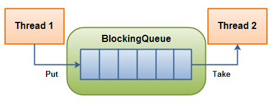

# BlockingQueue

## Table of Contents

- [Introduction](#introduction)
- [Method Summary](#method-summary)
- [A Simple Example](#a-simple-example)
  * [Producer Class](#producer-class)
  * [Consumer Class](#consumer-class)
  * [Main Execution and Resulting Logs](#main-execution-and-resulting-logs)
- [Typical Producer-Consumer Scenario](#typical-producer-consumer-scenario)
  * [Producer Class](#producer-class-1)
  * [Consumer Class](#consumer-class-1)
  * [Main Execution and Resulting Logs](#main-execution-and-resulting-logs-1)
- [References](#references)

<small><i><a href='http://ecotrust-canada.github.io/markdown-toc/'>Table of contents generated with markdown-toc</a></i></small>

## Introduction

The [BlockingQueue](https://docs.oracle.com/javase/8/docs/api/java/util/concurrent/BlockingQueue.html) is a thread-safe queue that supports operations that wait for the queue to become non-empty when retrieving an element, and wait for space to become available in the queue when storing an element.

It can be used with an object-producing thread, which produces objects to be comsumed by another thread:



## Method Summary

The methods defined by the `BlockingQueue<E>` interface are summarized below. `E` represents the type of the elements held in the queue.

```java
boolean add(E e)                                 // Inserts the specified element into this queue if
                                                 // it is possible to do so immediately without 
                                                 // violating capacity restrictions, returning true
                                                 // upon success and throwing an IllegalStateException
                                                 // if no space is currently available.
                       
boolean offer(E e)                               // Inserts the specified element into this queue if
                                                 // it is possible to do so immediately without
                                                 // violating capacity restrictions, returning true
                                                 // upon success and false if no space is currently
                                                 // available.

boolean offer(E e, long timeout, TimeUnit unit)  // Inserts the specified element into this queue,
                                                 // waiting up to the specified wait time if necessary
                                                 // for space to become available.
            
void put(E e)                                    // Inserts the specified element into this queue,
                                                 // waiting if necessary for space to become
                                                 // available.
```

```java           
boolean remove(Object o)                         // Removes a single instance of the specified element
                                                 // from this queue, if it is present.
            
E poll(long timeout, TimeUnit unit)              // Retrieves and removes the head of this queue,
                                                 // waiting up to the specified wait time if necessary
                                                 // for an element to become available.
            
E take()                                         // Retrieves and removes the head of this queue,
                                                 // waiting if necessary until an element becomes
                                                 // available.
```

Bulk `Colletion` methods such as `addAll`, `containsAll` ane `removeAll` can also be used, but they are *not guaranteed to execute atomically*.

`BlockingQueue`s do not bring methods such as `close` or `shutdown`.
A common tactic to achieve this is by using *end-of-stream* or *poison* objects, which are inserted in the queue by producers and interpreted accordingly by consumers.

## A Simple Example

### Producer Class

The code below shows a class that implements `Runnable`. The `run()` method produces 3 numbers and adds them to the queue:

```java
import java.util.concurrent.BlockingQueue;

public class Producer implements Runnable {

    private BlockingQueue<Integer> queue;

    public Producer(BlockingQueue<Integer> queue) {
        this.queue = queue;
    }

    @Override
    public void run() {
        try {
            for (int i = 1; i <=3; i++) {
                queue.put(i);
                System.out.println("[PRODUCER] Number " + i + " added to the queue");
                Thread.sleep(1000);
            }
        }
        catch (InterruptedException e) {
            e.printStackTrace();
        }
    }

}
```

### Consumer Class

The code below also shows a class that implements `Runnable`. The `run()` method consumes the 3 numbers from the queue by using the `take()` method:

```java
import java.util.concurrent.BlockingQueue;

public class Consumer implements Runnable {

    private BlockingQueue<Integer> queue;

    public Consumer(BlockingQueue<Integer> queue) {
        this.queue = queue;
    }

    @Override
    public void run() {
        try {
            System.out.println("[CONSUMER] Number " + queue.take() + " removed from the queue");
            System.out.println("[CONSUMER] Number " + queue.take() + " removed from the queue");
            System.out.println("[CONSUMER] Number " + queue.take() + " removed from the queue");
        }
        catch (InterruptedException e) {
            e.printStackTrace();
        }
    }

}
```

### Main Execution and Resulting Logs

The following class starts the producer and the consumer threads, and the execution logs are shown below the code:

```java
import java.util.concurrent.ArrayBlockingQueue;
import java.util.concurrent.BlockingQueue;

public class Main {

    public static void main(String[] args) {
        BlockingQueue<Integer> queue = new ArrayBlockingQueue<>(1024);

        Producer producer = new Producer(queue);
        Consumer consumer = new Consumer(queue);

        new Thread(producer).start();
        new Thread(consumer).start();
    }

}
```

```
[PRODUCER] Number 1 added to the queue
[CONSUMER] Number 1 removed from the queue
[PRODUCER] Number 2 added to the queue
[CONSUMER] Number 2 removed from the queue
[PRODUCER] Number 3 added to the queue
[CONSUMER] Number 3 removed from the queue
```

## Typical Producer-Consumer Scenario

### Producer Class

The code below shows a class that implements `Runnable`. The `run()` method adds numbers to the queue indefinitely:

```java
import java.util.Random;
import java.util.concurrent.BlockingQueue;

public class Producer implements Runnable {

    private final BlockingQueue<Integer> queue;

    public Producer(BlockingQueue<Integer> queue) {
        this.queue = queue;
    }

    @Override
    public void run() {
        try {
            while (true)  queue.put(produce());
        }
        catch (InterruptedException e) {
            e.printStackTrace();
        }
    }

    int produce() throws InterruptedException {
        int numberToReturn = new Random().nextInt(255);  // Generate a random int <= 255
        Thread.sleep(1000);                              // Simulate some work being done

        System.out.println("[PRODUCER] Generated " + numberToReturn);

        return numberToReturn;
    }

}

```

### Consumer Class

The code below also shows a class that implements `Runnable`. The `run()` method consumes numbers from the queue indefinitely:

```java
import java.util.concurrent.BlockingQueue;

public class Consumer implements Runnable {

    private BlockingQueue<Integer> queue;

    public Consumer(BlockingQueue<Integer> queue) {
        this.queue = queue;
    }

    @Override
    public void run() {
        try {
            while (true)  consume(queue.take());
        }
        catch (InterruptedException e) {
            e.printStackTrace();
        }
    }

    private void consume(Integer number) throws InterruptedException {
        System.out.println("[CONSUMER] Consumed " + number);
        Thread.sleep(1000);  // Simulate some work being done
    }

}
```

### Main Execution and Resulting Logs

The following class starts the producer and the consumer threads, and the execution logs are shown below the code:

```java
import java.util.concurrent.BlockingQueue;
import java.util.concurrent.LinkedBlockingQueue;

public class Main {

    public static void main(String[] args) throws InterruptedException {
        BlockingQueue<Integer> queue = new LinkedBlockingQueue<>();

        new Thread(new Producer(queue)).start();

        // Wait some time so that the queue gets filled with some numbers
        Thread.sleep(5 * 1000);

        // Spawn two consumer threads
        new Thread(new Consumer(queue)).start();
        new Thread(new Consumer(queue)).start();
    }

}
```

```
[PRODUCER] Generated 23
[PRODUCER] Generated 126
[PRODUCER] Generated 34
[PRODUCER] Generated 210
[CONSUMER] Consumed 23
[CONSUMER] Consumed 126
[PRODUCER] Generated 150
[CONSUMER] Consumed 34
[CONSUMER] Consumed 210
[PRODUCER] Generated 47
[CONSUMER] Consumed 150
[CONSUMER] Consumed 47
[PRODUCER] Generated 4
[CONSUMER] Consumed 4
[PRODUCER] Generated 236
[CONSUMER] Consumed 236
[PRODUCER] Generated 227
[CONSUMER] Consumed 227
[PRODUCER] Generated 134
[CONSUMER] Consumed 134
 ... 
```

## Poison pills

The code below shows the use of special messages &ndash; the poison pills &ndash; to inform the consumer threads that no more items will be added to the queue.

Once a consumer thread receives a poison pill it can stop monitoring the queue.

The number of poison pills the producer adds to the queue must match the numer of consumers:

### Producer Class

```java
import java.util.Random;
import java.util.concurrent.BlockingQueue;

public class Producer implements Runnable {

    // A special number to indicate that no more numbers will be produced
    private static final int POISON_PILL = -1;

    private final BlockingQueue<Integer> queue;

    // The number of poison messages that need to be added to the queue
    private final int numberOfConsumers;

    public Producer(BlockingQueue<Integer> queue, int numberOfConsumers) {
        this.queue             = queue;
        this.numberOfConsumers = numberOfConsumers;
    }

    @Override
    public void run() {
        try {
            for (int i = 0; i < 5; i++)
                queue.put(produce());

            for (int i = 0; i < numberOfConsumers; i++) {
                queue.put(POISON_PILL);
                System.out.println("[PRODUCER] Added poison pill");
            }
        }
        catch (InterruptedException e) {
            e.printStackTrace();
        }
    }

    int produce() throws InterruptedException {
        int numberToReturn = new Random().nextInt(255);  // Generate a random int <= 255
        Thread.sleep(1000);                              // Simulate some work being done

        System.out.println("[PRODUCER] Generated " + numberToReturn);

        return numberToReturn;
    }

}
```

### Consumer Class

```java
import java.util.concurrent.BlockingQueue;

public class Consumer implements Runnable {

    // A special number to indicate that no more numbers will be produced
    private static final int POISON_PILL = -1;

    private BlockingQueue<Integer> queue;

    public Consumer(BlockingQueue<Integer> queue) {
        this.queue = queue;
    }

    @Override
    public void run() {
        try {
            while (true) {
                int numberFromQueue = queue.take();

                if (numberFromQueue == POISON_PILL) {
                    System.out.println("[CONSUMER] Poison pill received. Interrupting.");
                    return;
                }
                else  consume(numberFromQueue);
            }
        }
        catch (InterruptedException e) {
            e.printStackTrace();
        }
    }

    private void consume(Integer number) throws InterruptedException {
        System.out.println("[CONSUMER] Consumed " + number);
        Thread.sleep(1000);  // Simulate some work being done
    }

}
```

### Main Execution and Resulting Logs

```java
import java.util.concurrent.BlockingQueue;
import java.util.concurrent.LinkedBlockingQueue;

public class Main {

    public static void main(String[] args) throws InterruptedException {
        BlockingQueue<Integer> queue = new LinkedBlockingQueue<>();
        int numberOfConsumers        = 2;

        new Thread(new Producer(queue, numberOfConsumers)).start();

        // Wait some time so that the queue gets filled with some numbers
        Thread.sleep(5 * 1000);

        // Spawn consumer threads
        for (int i = 0; i < numberOfConsumers; i++)
            new Thread(new Consumer(queue)).start();
    }

}
```

```
[PRODUCER] Generated 60
[PRODUCER] Generated 225
[PRODUCER] Generated 230
[PRODUCER] Generated 233
[CONSUMER] Consumed 60
[CONSUMER] Consumed 225
[PRODUCER] Generated 246
[PRODUCER] Added poison pill
[PRODUCER] Added poison pill
[CONSUMER] Consumed 230
[CONSUMER] Consumed 233
[CONSUMER] Consumed 246
[CONSUMER] Poison pill received. Interrupting.
[CONSUMER] Poison pill received. Interrupting.
```

## References
- [docs.oracle.com: Interface BlockingQueue\<E\>](https://docs.oracle.com/javase/8/docs/api/java/util/concurrent/BlockingQueue.html)
- [Jenkov.com: Java Blocking Queue](http://tutorials.jenkov.com/java-util-concurrent/blockingqueue.html)
- [Baeldung: Guide to java.util.concurrent.BlockingQueue](https://www.baeldung.com/java-blocking-queue)
