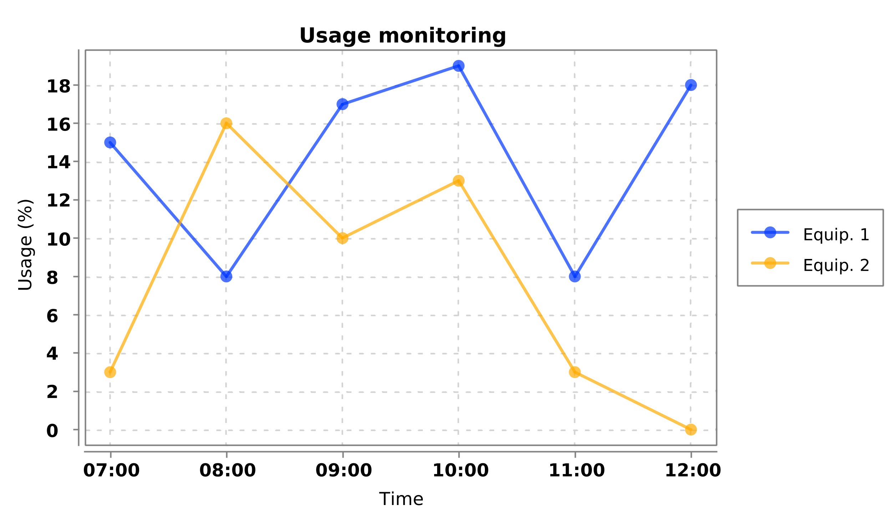

#### XChart Java Library Demonstration

This document demonstrates the usage of the open-source (Apache 2.0) [XChart](https://knowm.org/open-source/xchart/) charting library.

##### Gradle dependency
```groovy
compile group: 'org.knowm.xchart', name: 'xchart', version: '3.5.4'
```

##### Example code
```java
import org.knowm.xchart.*;
import org.knowm.xchart.BitmapEncoder.BitmapFormat;
import org.knowm.xchart.style.markers.SeriesMarkers;

import java.awt.*;
import java.text.SimpleDateFormat;
import java.util.ArrayList;
import java.util.Date;
import java.util.List;
import java.util.Random;

public class XChartsTest {

    private static final int SERIES_SIZE         = 6;
    private static final Random RANDOM           = new Random();
    private static final SimpleDateFormat FORMAT = new SimpleDateFormat("HH:mm");

    public static void main(String[] args) throws Exception {
        // X Data
        List<Date> xData = new ArrayList<>();

        // Y series
        List<Integer> yData1 = new ArrayList<>();
        List<Integer> yData2 = new ArrayList<>();

        // Populate series
        for (int i = 0; i < SERIES_SIZE; i++) {
            xData.add(FORMAT.parse(i + 7 + ":00"));
            yData1.add(i, RANDOM.nextInt(20));
            yData2.add(i, RANDOM.nextInt(20));
        }

        // Chart object
        XYChart chart = new XYChartBuilder().width(600)
                                            .height(350)
                                            .title("Usage monitoring")
                                            .xAxisTitle("Time")
                                            .yAxisTitle("Usage (%)")
                                            .build();

        // Chart styling
        chart.getStyler().setChartBackgroundColor(Color.WHITE);
        chart.getStyler().setAxisTitleFont(new Font(Font.SANS_SERIF, Font.PLAIN, 12));

        // Series 1
        XYSeries series1 = chart.addSeries("Equip. 1", xData, yData1);
        series1.setMarker(SeriesMarkers.CIRCLE);

        // Series 2
        XYSeries series2 = chart.addSeries("Equip. 2", xData, yData2);
        series2.setMarker(SeriesMarkers.CIRCLE);

        // Save chart as PNG, 300 DPI
        BitmapEncoder.saveBitmapWithDPI(chart, "./Chart", BitmapFormat.PNG, 300);

        // Display chart
        new SwingWrapper<XYChart>(chart).displayChart();
    }

}
```

##### Output file of the code above


##### References

- [XChart Example Code](https://knowm.org/open-source/xchart/xchart-example-code/)
- [XChart Javadocs](https://knowm.org/javadocs/xchart/index.html)
