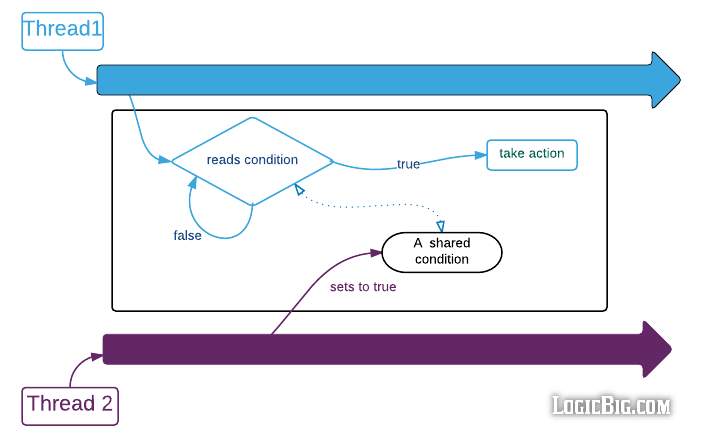

# Synchronization methods of the Object class

Java 5 has introduced APIs that make multiple threads and shared resources handling easier.

However, the [Object](https://docs.oracle.com/javase/8/docs/api/java/lang/Object.html) class brings three methods that allow threads to communicate about the locking status of a shared resource &ndash; `wait()`, `notify()` and `notifyAll()`.

The following snippets show the basic usage of the `wait()` and `notify()` methods:

```java
synchronized(lockObject) {
    while(!condition) {
        lockObject.wait();
    }
    // Take action
}
```

```java
synchronized(lockObject) {
    // Establish the condition
    lockObject.notify();
    // Any additional code if needed
}
```

Both code blocks above are *synchronized on the same monitor object* `lockObject`. This way, they can't execute simultaneously.

When the first code checks for an unmet condition, it calls the `wait()` method. The `wait()` method *releases the intrinsic lock*, allowing the second block (which is also synchronized on `lockObject`) to execute.

After establishing the condition the first block was checking for, the second block `notifies` the first block, telling the waiting thread to wake up.

The `wait()` method *reacquires the lock* before returning.

As the condition is now met, the first block leaves the `while` loop and continues the execution.

Although the `notify()` method tells a waiting thread to wake up, is *does not release the lock* until the synchronized block is completed.
This means that if the second code block still takes 10 seconds to complete the synchronized block after calling `notify()`, the waiting thread that is now awake will still have to wait 10 seconds to reacquire the lock and then return.

The `notify()` method wakes up a single thread that called `wait()` on the same lock object.
On the other hand, the `notifyAll()` method notifies all threads that called `wait()` on the lock object.

The process described above can be illustrated as follows:



The following example demonstrates the use of these syncrhonization methods.

## A Simple Example

The code below shows two threads reading/writing to the same object:

```java
public class SimpleDemonstration {

    private static String message;

    public static void main(String[] args) {
        Thread thread1 = new Thread( () -> { System.out.println(message); } );
        Thread thread2 = new Thread( () -> { message = "An example message"; } );

        thread1.start();
        thread2.start();
    }

}
```

In this code, `message` may or may not be populated by `thread2` before being printed by `thread1`.

The following execution logs show this unpredictability:

```
user@pc:~$ java -jar SimpleDemonstration.jar 
An example message
user@pc:~$ java -jar SimpleDemonstration.jar 
null
user@pc:~$ java -jar SimpleDemonstration.jar 
null
user@pc:~$ java -jar SimpleDemonstration.jar 
null
user@pc:~$ java -jar SimpleDemonstration.jar 
An example message
user@pc:~$ java -jar SimpleDemonstration.jar 
null
user@pc:~$ java -jar SimpleDemonstration.jar 
null
user@pc:~$ java -jar SimpleDemonstration.jar 
null
user@pc:~$ java -jar SimpleDemonstration.jar 
An example message
```

The following code uses the `wait()` and `notify()` methods to make sure that the `message` string is always written to before being read:

```java
public class SimpleDemonstration {

    private static String message;

    public static void main(String[] args) {
        Object lock    = new Object();

        Thread thread1 = new Thread(() -> {
            synchronized (lock) {          // Synchronized on the 'lock' object
                while (message == null) {  // While condition not met, wait
                    try { lock.wait(); }
                    catch (InterruptedException e) { e.printStackTrace(); }

                    System.out.println(message);  // Print after waiting
                }
            }
        });

        Thread thread2 = new Thread(() -> {
            synchronized (lock) {                // Synchronized on the 'lock' object
                message = "An example message";  // message != null
                lock.notify();                   // Notify waiting thread
            }
        });

        thread1.start();
        thread2.start();
    }

}
```

Following are the logs of successive executions of the `SimpleDemonstration` class:

```
user@pc:~$ java -jar SimpleDemonstration.jar 
An example message
user@pc:~$ java -jar SimpleDemonstration.jar 
An example message
user@pc:~$ java -jar SimpleDemonstration.jar 
An example message
user@pc:~$ java -jar SimpleDemonstration.jar 
An example message
user@pc:~$ java -jar SimpleDemonstration.jar 
An example message
```


## A Producer Consumer Problem

The following code shows an example of producer-consumer problem.

The `Producer` class produces numbers and adds them to a shared queue.

The `Consumer` class consumer the numbers from the queue.

```java
import java.util.List;

public class Producer implements Runnable {

    private final List<Integer> sharedQueue;  // The lock object
    private final int           maxCapacity;

    private int lastGeneratedNumber = 0;

    // ----- Receiving the shared queue in the constructor -----
    public Producer(List<Integer> sharedQueue, int maxCapacity) {
        this.sharedQueue = sharedQueue;
        this.maxCapacity = maxCapacity;
    }

    @Override
    public void run() {
        for (int i = 0; i < 10; i++)
            try {
                produce();
            }
            catch (InterruptedException e) {
                e.printStackTrace();
            }
    }

    private void produce() throws InterruptedException {
        synchronized (sharedQueue) {
            // ----- While condition not met, wait -----
            while (sharedQueue.size() == maxCapacity) {
                System.out.println(
                    String.format(
                        "Queue is currently full (%d elements); %s is waiting",
                        sharedQueue.size(), Thread.currentThread().getName()
                    )
                );
                sharedQueue.wait();
            }

            // ----- Produce number -----
            Thread.sleep(1000);                      // Simulate some work being done
            sharedQueue.add(++lastGeneratedNumber);  // Add number to the shared queue

            System.out.println("Number produced: " + lastGeneratedNumber);
            System.out.flush();

            // ----- Notify all waiting consumers that a new number has been added to the queue -----
            sharedQueue.notifyAll();
        }  // end synchronized
    }

}
```

```java
import java.util.List;

public class Consumer implements Runnable {

    private final List<Integer> sharedQueue;  // The lock object

    // ----- Receiving the shared queue in the constructor -----
    public Consumer(List<Integer> sharedQueue) {
        this.sharedQueue = sharedQueue;
    }

    @Override
    public void run() {
        for (int i = 0; i < 10; i++)
            try {
                consume();
            }
            catch (InterruptedException e) {
                e.printStackTrace();
            }
    }

    private void consume() throws InterruptedException {
        synchronized (sharedQueue) {
            // ----- While condition not met, wait -----
            while (sharedQueue.isEmpty()) {
                System.out.println(
                    String.format(
                        "Queue is currently empty; %s is waiting", Thread.currentThread().getName()
                    )
                );
                sharedQueue.wait();
            }

            // ----- Consume number -----
            Thread.sleep(1000);                  // Simulate some work being done
            int number = sharedQueue.remove(0);  // Pop number from the shared queue

            System.out.println("Number consumed: " + number);
            System.out.flush();

            // ----- Notify all waiting producers that the queue is not full anymore -----
            sharedQueue.notifyAll();
        }  // end synchronized
    }

}
```

```java
import java.util.ArrayList;
import java.util.List;

public class Main {

    public static void main(String[] args) {
        List<Integer> numbersQueue = new ArrayList<>();
        int maxCapacity            = 5;

        Thread producer = new Thread(new Producer(numbersQueue, maxCapacity), "Producer");
        Thread consumer = new Thread(new Consumer(numbersQueue), "Consumer");

        producer.start();
        consumer.start();
    }

}
```

**Execution logs**

```
Number produced: 1
Number produced: 2
Number consumed: 1
Number consumed: 2
Queue is currently empty; Consumer is waiting
Number produced: 3
Number produced: 4
Number produced: 5
Number produced: 6
Number produced: 7
Queue is currently full (5 elements); Producer is waiting
Number consumed: 3
Number consumed: 4
Number consumed: 5
Number consumed: 6
Number consumed: 7
Queue is currently empty; Consumer is waiting
Number produced: 8
Number produced: 9
Number produced: 10
Number consumed: 8
Number consumed: 9
Number consumed: 10
```


## References
[HowToDoInJava: How to work with wait(), notify() and notifyAll() in Java?](https://howtodoinjava.com/java/multi-threading/wait-notify-and-notifyall-methods/)

[LogicBig.com: Java - Thread Communication using wait/notify](https://www.logicbig.com/tutorials/core-java-tutorial/java-multi-threading/thread-wait-notify.html)
