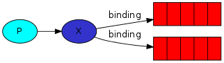

# RabbitMQ - self study

## Table of Contents

- [Introduction](#introduction)
- [Downloading and Installing](#downloading-and-installing)
- [Coding in Java](#coding-in-java)
  * [Gradle Dependencies](#gradle-dependencies)
  * [Hello World](#hello-world)
    + [Sending](#sending)
    + [Receiving](#receiving)
- [Work Queues (a.k.a Task Queues)](#work-queues--aka-task-queues-)
  * [Sending New Tasks](#sending-new-tasks)
  * [The Worker](#the-worker)
  * [ACKnowledgment](#acknowledgment)
  * [Durability](#durability)
- [Publish / Subscribe](#publish---subscribe)
  * [Exchanges](#exchanges)
  * [Temporary Queues](#temporary-queues)
- [Routing](#routing)
- [Topics](#topics)
- [RPC](#rpc)
  * [RPC Client](#rpc-client)
  * [RPC Server](#rpc-server)
  * [Execution Logs](#execution-logs)
- [Publisher Confirms](#publisher-confirms)
  * [Strategy 1: Publishing Messages Individually](#strategy-1--publishing-messages-individually)
  * [Strategy 2: Publishing Messages in Batches](#strategy-2--publishing-messages-in-batches)
  * [Strategy 3: Handling Publisher Confirms Asynchronously](#strategy-3--handling-publisher-confirms-asynchronously)
- [! TODO !](#--todo--)
- [RabbitMQ CLI commands](#rabbitmq-cli-commands)
- [References](#references)

<small><i><a href='http://ecotrust-canada.github.io/markdown-toc/'>Table of contents generated with markdown-toc</a></i></small>


## Introduction
RabbitMQ is an open-source message broker.

It acts like a post office.

*Producers* send messages, i.e., they add messages to the queue.
  
*Consumers* receive messages from the queue.


Many producers can send messages that go to one message buffer &ndash; the queue &ndash; and many consumers can try to receive data from one queue.

The producer, consumer and queue usually don’t reside on the same host.

## Downloading and Installing

RabbitMQ can be run by using the official [Docker Image](https://registry.hub.docker.com/_/rabbitmq/):

```
docker run -it --rm --name rabbitmq -p 5672:5672 -p 15672:15672 rabbitmq:3-management
```
  
The command above exposes the `5672` and `15672` container ports, and the following logs are shown on execution:

```
[...]
2019-12-16 13:15:48.242 [info] <0.619.0> started TCP listener on [::]:5672
2019-12-16 13:15:48.242 [info] <0.277.0> Running boot step cluster_name defined by app rabbit
2019-12-16 13:15:48.242 [info] <0.277.0> Running boot step direct_client defined by app rabbit
2019-12-16 13:15:48.264 [info] <0.669.0> Management plugin: HTTP (non-TLS) listener started on port 15672
2019-12-16 13:15:48.264 [info] <0.775.0> Statistics database started.
2019-12-16 13:15:48.264 [info] <0.774.0> Starting worker pool 'management_worker_pool' with 3 processes in it
2019-12-16 13:15:48.353 [info] <0.8.0> Server startup complete; 3 plugins started.
* rabbitmq_management
* rabbitmq_management_agent
* rabbitmq_web_dispatch
completed with 3 plugins.
```

## Coding in Java

### Gradle Dependencies

The following snippet shows the needed libraries &ndash; the RabbitMQ Java Client and SLF4J logging. In production, a logging library such as [Logback](http://logback.qos.ch/) should be used.

```gradle
dependencies {
    compile     group: 'org.slf4j',    name: 'slf4j-api',    version: '1.7.29'
    compile     group: 'org.slf4j',    name: 'slf4j-simple', version: '1.7.29'
    compile     group: 'com.rabbitmq', name: 'amqp-client',  version: '5.8.0'  

    testCompile group: 'junit',        name: 'junit',        version: '4.12'
}
```

The task below can be added to the `build.gradle` script to generate a “fat” jar containing all the dependencies:

```gradle
jar {
    manifest {
        attributes "Main-Class": "com.example.Application"
    }
    from {
        configurations.compile.collect { it.isDirectory() ? it : zipTree(it) }
    }
}
```

### Hello World

#### Sending


```java
import com.rabbitmq.client.Channel;
import com.rabbitmq.client.Connection;
import com.rabbitmq.client.ConnectionFactory;

public class Sender {

    // ===== Queue name =====
    private static final String QUEUE_NAME = "hello";

    public static void main(String[] args) throws Exception {
        // ===== RabbitMQ Connection Factory =====
        ConnectionFactory connectionFactory = new ConnectionFactory();

        // ===== The host for connections =====
        connectionFactory.setHost("localhost");

        try (
            // ===== Broker connection =====
            Connection connection = connectionFactory.newConnection();
            // ===== New channel =====
            Channel channel       = connection.createChannel()
        )
        {
            // ===== Declaring the queue to send messages to            =====
            // ===== The queue will be created if it does not exist yet =====
            channel.queueDeclare(QUEUE_NAME, false, false, false, null);

            String message = "Hello World!";

            // ===== Publishing to the queue =====
            channel.basicPublish("", QUEUE_NAME, null, message.getBytes());
            System.out.println(" [x] Sent '" + message + "'");
        }
    }

}
```

#### Receiving


```java
import com.rabbitmq.client.Channel;
import com.rabbitmq.client.Connection;
import com.rabbitmq.client.ConnectionFactory;
import com.rabbitmq.client.DeliverCallback;

public class Receiver {

    // ===== Queue name =====
    private static final String QUEUE_NAME = "hello";

    public static void main(String[] args) throws Exception {
        // ===== RabbitMQ Connection Factory =====
        ConnectionFactory connectionFactory = new ConnectionFactory();

        // ===== The host for connections =====
        connectionFactory.setHost("localhost");

        // ===== Broker connection =====
        Connection connection = connectionFactory.newConnection();

        // ===== New channel =====
        Channel channel       = connection.createChannel();

        // ===== Declaring the queue again, to make sure it exists before trying to =====
        // ===== consume messages (the consumer may be started before the producer) =====
        channel.queueDeclare(QUEUE_NAME, false, false, false, null);
        System.out.println(" [*] Waiting for messages. To exit press CTRL+C");

        // ===== A callback to handle received messages =====
        DeliverCallback deliverCallback = (consumerTag, delivery) -> {
            // ===== Receive message =====
            String message = new String(delivery.getBody(), "UTF-8");
            System.out.println(" [x] Received '" + message + "'");
        };

        channel.basicConsume(QUEUE_NAME, true, deliverCallback, consumerTag -> { });
    }

}
```

The `Receiver` code runs indefinitely, and for each execution of the `Sender` class, it logs the received message:

```
 [*] Waiting for messages. To exit press CTRL+C
 [x] Received 'Hello World!'
 [x] Received 'Hello World!'
```

If we access the `15672` port exposed by the container, we can visualize the *RabbitMQ dashboard* (there’s a pre-created used called `guest`, and the password is also `guest`):


## Work Queues (a.k.a Task Queues)

A work queue can be used to distribute time-consuming tasks among multiple workers.

Tasks are encapsulated as messages and sent to a queue.

Workers pop the tasks and execute them.


### Sending New Tasks

The code below is a modified version of the `Sender` class, that reads the input from the CLI and sends messages to the queue:

```java
import com.rabbitmq.client.Channel;
import com.rabbitmq.client.Connection;
import com.rabbitmq.client.ConnectionFactory;

public class NewTask {

    private static final String QUEUE_NAME = "hello";                   // Queue name

    public static void main(String[] args) throws Exception {
        ConnectionFactory connectionFactory = new ConnectionFactory();  // RabbitMQ Connection Factory
        connectionFactory.setHost("localhost");                         // The host for connections

        try (
            Connection connection = connectionFactory.newConnection();  // Broker connection
            Channel channel       = connection.createChannel()          // New channel
        )
        {
            // Declaring the queue
            channel.queueDeclare(QUEUE_NAME, false, false, false, null);

            // ===== Reading message to be sent from the CLI =====
            String message = String.join(" ", args);

            // Publishing to the queue
            channel.basicPublish("", QUEUE_NAME, null, message.getBytes());
            System.out.println(" [x] Sent '" + message + "'");
        }
    }

}
```

### The Worker

The code below is a modified version of the `Receiver` class. For every message received, it simulates some work by using a delay.

```java
import com.rabbitmq.client.Channel;
import com.rabbitmq.client.Connection;
import com.rabbitmq.client.ConnectionFactory;
import com.rabbitmq.client.DeliverCallback;

public class Worker {

    private static final String QUEUE_NAME = "hello";                   // Queue name

    public static void main(String[] args) throws Exception {
        ConnectionFactory connectionFactory = new ConnectionFactory();  // RabbitMQ Connection Factory
        connectionFactory.setHost("localhost");                         // The host for connections

        Connection connection = connectionFactory.newConnection();      // Broker connection
        Channel channel       = connection.createChannel();             // New channel

        // Declaring the queue
        channel.queueDeclare(QUEUE_NAME, false, false, false, null);

        System.out.println(" [*] Waiting for messages. To exit press CTRL+C");

        // A callback to handle received messages
        DeliverCallback deliverCallback = (consumerTag, delivery) -> {
            String message = new String(delivery.getBody(), "UTF-8");  // Receive message

            System.out.println(" [x] Received '" + message + "'");

            try {
                doWork();
                System.out.println(" [x] Done");
            }
            catch (InterruptedException e) {
                e.printStackTrace();
            }
        };

        channel.basicConsume(QUEUE_NAME, true, deliverCallback, consumerTag -> { });
    }

    private static void doWork() throws InterruptedException {
        Thread.sleep(1000);  // ===== Simulate 1 second of work =====
    }

}
```

If we open two shells and execute *two workers*, we will see that the messages (*tasks*) are delivered to the workers in a *round-robin* fashion, enabling thus the parallelization of work:

***New Tasks Being Sent***
```
 [x] Sent 'First message'
 [x] Sent 'Second message'
 [x] Sent 'Third message'
 [x] Sent 'Fourth message'
 [x] Sent 'Fifth message'
```

***Worker 1 Logs***
```
 [*] Waiting for messages. To exit press CTRL+C
 [x] Received 'First message'
 [x] Done
 [x] Received 'Third message'
 [x] Done
 [x] Received 'Fifth message'
 [x] Done
```

***Worker 2 Logs***
```
 [*] Waiting for messages. To exit press CTRL+C
 [x] Received 'Second message'
 [x] Done
 [x] Received 'Fourth message'
 [x] Done
```

### ACKnowledgment

The code written so far does not guarantee that all tasks will be properly executed. If a consumer dies, the task it was executing should be *re-queued* so that it can be properly executed by another consumer.

This can be achieved by the ACKnowledgments, which are *sent back by the consumer* to inform RabbitMQ that the message has been received and processed correctly.

If a consumer's connection drops without sending an ACK, the task will be *redelivered* to another worker.

The code below modifies the `Worker` class to send the ACKnowledgments (which must be sent on the same channel that received the delivery):

```java
import com.rabbitmq.client.Channel;
import com.rabbitmq.client.Connection;
import com.rabbitmq.client.ConnectionFactory;
import com.rabbitmq.client.DeliverCallback;

public class Worker {

    private static final String QUEUE_NAME = "hello";                   // Queue name

    public static void main(String[] args) throws Exception {
        ConnectionFactory connectionFactory = new ConnectionFactory();  // RabbitMQ Connection Factory
        connectionFactory.setHost("localhost");                         // The host for connections

        Connection connection = connectionFactory.newConnection();      // Broker connection
        Channel channel       = connection.createChannel();             // New channel

        // Declaring the queue
        channel.queueDeclare(QUEUE_NAME, false, false, false, null);

        // ===== Accept only one unACKed message at a time                               =====
        // ===== The worker will only receive a message after it has processed and ACKed =====
        // ===== the previous one; This distributes the workload among all workers       =====
        int prefetchCount = 1;
        channel.basicQos(prefetchCount);

        System.out.println(" [*] Waiting for messages. To exit press CTRL+C");

        // A callback to handle received messages
        DeliverCallback deliverCallback = (consumerTag, delivery) -> {
            String message = new String(delivery.getBody(), "UTF-8");  // Receive message

            System.out.println(" [x] Received '" + message + "'");

            try {
                doWork();

                // ===== ACKnowledge the received message =====
                channel.basicAck(delivery.getEnvelope().getDeliveryTag(), false);

                System.out.println(" [x] Done");
            }
            catch (InterruptedException e) {
                e.printStackTrace();
            }
        };

        // ===== Forcing manual ACKnowledgment =====
        boolean autoAck = false;
        channel.basicConsume(QUEUE_NAME, autoAck, deliverCallback, consumerTag -> { });
    }

    private static void doWork() throws InterruptedException {
        Thread.sleep(1000);  // Simulate 1 second of work
    }

}
```

### Durability

The code above makes sure all messages are properly processed even if a consumer dies.

However, if the RabbitMQ server crashes, the queue and messages will be lost.

The code below addresses this by declaring the queue as *durable* (this makes sure the queue is not lost on RabbitMQ restarts).

It also marks the messages as *persistent*, so that they get written to the disk.

```java
import com.rabbitmq.client.Channel;
import com.rabbitmq.client.Connection;
import com.rabbitmq.client.ConnectionFactory;
import com.rabbitmq.client.MessageProperties;

public class NewTask {

    private static final String QUEUE_NAME = "hello";                   // Queue name

    public static void main(String[] args) throws Exception {
        ConnectionFactory connectionFactory = new ConnectionFactory();  // RabbitMQ Connection Factory
        connectionFactory.setHost("localhost");                         // The host for connections

        try (
            Connection connection = connectionFactory.newConnection();  // Broker connection
            Channel channel       = connection.createChannel()          // New channel
        )
        {
            // ===== Declaring the queue as DURABLE =====
            boolean durable = true;
            channel.queueDeclare(QUEUE_NAME, durable, false, false, null);

            // Reading message to be sent from the CLI
            String message = String.join(" ", args);

            // ===== Publishing PERSISTENT messages to the queue =====
            channel.basicPublish(
                "", QUEUE_NAME, MessageProperties.PERSISTENT_TEXT_PLAIN, message.getBytes()
            );
            System.out.println(" [x] Sent '" + message + "'");
        }
    }

}
```

The persistence guarantees are not very strong, i.e., some messages could still be lost. A stronger guarantee can be achieved by using *publisher confirms*.

&rarr; The queue must be declared as *durable* in the `Worker` code too.

## Publish / Subscribe

### Exchanges

In RabbitMQ, messages are never delivered directly to queues, but to *exchanges*:


Exchanges receive messages from the producers and push them to queues.

The exchange must know if a message it received should be appended to a particular queue, appended to many queues or discarded. 

These rules are defined by the *exchange type*. There are a few types of them available:

- Direct
- Topic
- Headers
- Fanout

The *fanout* type is very simple: *it broadcasts all messages it receives to all queues it knows.*

If the exchange is not specified, the default (or *nameless*) exchange is used and messages are routed to the specified queue:

```java
String exchange   = "";       // Default (nameless) exchange  
String routingKey = "hello";  // Queue name
  
channel.basicPublish(exchange, routingKey, null, message.getBytes());
```

Instead, we can publish to a named exchange:

```java
String exchange = "logs";

channel.basicPublish(exchange, "", null, message.getBytes());
```

### Temporary Queues

By calling the `queueDeclare()` method with no parameters, we can create a *non-durable* queue that is *exclusive* to the connection (and is deleted when the connection closes). 

The queue will also be *auto-delete*, which means that the queue will be deleted *once the last consumer unsubscribes*.

```java
String queueName = channel.queueDeclare().getQueue();
```

Having the exchange and the queue created, we now need to tell the exchange to send messages to the queue. This is accomplished by *binding*:



```java
channel.queueBind(queueName, exchangeName, "");
```

The following code shows the implementation of a simple logging system, in which every instance of the `ReceiveLogs` class (an updated version of the previous `Worker` class) will get the messages emitted by the `EmitLog` class (an updated version of the previous `NewTask` class):

```java
import com.rabbitmq.client.BuiltinExchangeType;
import com.rabbitmq.client.Channel;
import com.rabbitmq.client.Connection;
import com.rabbitmq.client.ConnectionFactory;

public class EmitLog {

    // ===== Exchange name =====
    private static final String EXCHANGE_NAME = "logs";

    public static void main(String[] args) throws Exception {
        ConnectionFactory connectionFactory = new ConnectionFactory();  // RabbitMQ Connection Factory
        connectionFactory.setHost("localhost");                         // The host for connections

        try (
            Connection connection = connectionFactory.newConnection();  // Broker connection
            Channel channel       = connection.createChannel()          // New channel
        )
        {
            // ===== Declaring a fanout exchange =====
            channel.exchangeDeclare(EXCHANGE_NAME, BuiltinExchangeType.FANOUT);

            // ===== Reading message to be sent from the CLI =====
            String message = args.length < 1 ? "info: Hello world!" : String.join(" ", args);

            channel.basicPublish(EXCHANGE_NAME, "", null, message.getBytes());
            System.out.println(" [x] Sent '" + message + "'");
        }
    }

}
```

```java
import com.rabbitmq.client.*;

public class ReceiveLogs {

    // ===== Exchange name =====
    private static final String EXCHANGE_NAME = "logs";

    public static void main(String[] args) throws Exception {
        ConnectionFactory connectionFactory = new ConnectionFactory();  // RabbitMQ Connection Factory
        connectionFactory.setHost("localhost");                         // The host for connections

        Connection connection = connectionFactory.newConnection();      // Broker connection
        Channel channel       = connection.createChannel();             // New channel

        // ===== Declaring the exchange =====
        channel.exchangeDeclare(EXCHANGE_NAME, BuiltinExchangeType.FANOUT);

        // ===== Declaring a non-durable, exclusive, autodelete fresh empty queue =====
        String queueName = channel.queueDeclare().getQueue();

        // ===== Binding the queue to the exchange =====
        channel.queueBind(queueName, EXCHANGE_NAME, "");

        System.out.println(" [*] Waiting for messages. To exit press CTRL+C");

        // A callback to handle received messages
        DeliverCallback deliverCallback = (consumerTag, delivery) -> {
            String message = new String(delivery.getBody(), "UTF-8");  // Receive message
            System.out.println(" [x] Received '" + message + "'");
        };

        boolean autoAck = true;
        channel.basicConsume(queueName, autoAck, deliverCallback, consumerTag -> { });
    }

}
```

If we run two (or more) instances of the *subscriber* (the `ReceiveLogs` class) and then run the *publisher* (the `EmitLogs` class), we will see that every running copy of the subscriber will receive the emitted log messages:

```
 [*] Waiting for messages. To exit press CTRL+C
 [x] Received 'info: Hello world!'
```

## Routing

In the previous example, all messages would be delivered to all queues.

If we want to filter the messages, making it possible to subscribe to a subset of the messages only, we can use the `binding keys`:

```java
String bindingKey = "black";
channel.queueBind(queueName, EXCHANGE_NAME, bindingKey);
```

The *fanout* exchange cannot be used for this purpose, though, as it is only capable of broadcasting and *ignores the binding key*.

The picture below shows two queues bound to a *direct* exchange using different keys &ndash; *orange*, *black* and *green*:


In this setup, all messages published with the key *orange* will be routed to *Q1*, and messages with the *black* and *green* keys will be routed to *Q2*.

*All other messages will be discarded.*

The picture below shows a *direct* exchange that will behave like a *fanout* exchange, due to the use of the same *black* binding key:


The binding keys can be used to increment the logging system of the previous example and add a severity-based log message filtering:


The following code shows the Java implementation:

```java
import com.rabbitmq.client.BuiltinExchangeType;
import com.rabbitmq.client.Channel;
import com.rabbitmq.client.Connection;
import com.rabbitmq.client.ConnectionFactory;

public class EmitLogDirect {

    private static final String EXCHANGE_NAME = "logs";                 // Exchange name

    public static void main(String[] args) throws Exception {
        ConnectionFactory connectionFactory = new ConnectionFactory();  // RabbitMQ Connection Factory
        connectionFactory.setHost("localhost");                         // The host for connections

        try (
            Connection connection = connectionFactory.newConnection();  // Broker connection
            Channel channel       = connection.createChannel()          // New channel
        )
        {
            // ===== Declaring a direct exchange =====
            channel.exchangeDeclare(EXCHANGE_NAME, BuiltinExchangeType.DIRECT);

            if (args.length < 2)
                System.err.println("Usage: EmitLogDirect <severity> <message>");

            else {
                // ===== Reading the message severity from the CLI =====
                String severity = args[0];

                // ===== Reading the message to be sent from the CLI =====
                String message  = args[1];

                // ===== Publishing the message with the 'severity' binding key =====
                channel.basicPublish(EXCHANGE_NAME, severity, null, message.getBytes());
                System.out.println(" [x] Sent '" + severity + "':' " + message + "'");
            }
        }
    }

}
```

```java
import com.rabbitmq.client.*;

public class ReceiveLogsDirect {

    private static final String EXCHANGE_NAME = "logs";                 // Exchange name

    public static void main(String[] args) throws Exception {
        ConnectionFactory connectionFactory = new ConnectionFactory();  // RabbitMQ Connection Factory
        connectionFactory.setHost("localhost");                         // The host for connections

        Connection connection = connectionFactory.newConnection();      // Broker connection
        Channel channel       = connection.createChannel();             // New channel

        // ===== Declaring the direct exchange =====
        channel.exchangeDeclare(EXCHANGE_NAME, BuiltinExchangeType.DIRECT);

        String queueName = channel.queueDeclare().getQueue();  // Declaring a queue

        if (args.length < 1) {
            System.err.println("Usage: ReceiveLogsDirect [info] [warning] [error]");
            System.exit(1);
        }

        // ===== For each severity in args, create a new binding =====
        for (String severity: args)
            channel.queueBind(queueName, EXCHANGE_NAME, severity);

        System.out.println(" [*] Waiting for messages. To exit press CTRL+C");

        // A callback to handle received messages
        DeliverCallback deliverCallback = (consumerTag, delivery) -> {
            // ===== Print the received message in the format '<severity>: <message>' =====
            System.out.println(
                String.format(
                    " [x] Received '%s: %s'",
                    delivery.getEnvelope().getRoutingKey(),  // ===== severity =====
                    new String(delivery.getBody(), "UTF-8")  // ===== message  =====
                )
            );
        };

        channel.basicConsume(queueName, true, deliverCallback, consumerTag -> { });
    }

}
```

If we run two instances of the `ReceiveLogsDirect` class, each of which subscribing to receive different severities, we will be able to see the routing in action:

***Messages being sent***

```
$ java -jar EmitLogDirect.jar info "Hello"
 [x] Sent 'info':' Hello'
$ java -jar EmitLogDirect.jar warning "Hello"
 [x] Sent 'warning':' Hello'
$ java -jar EmitLogDirect.jar error "Hello"
 [x] Sent 'error':' Hello'
```

***Receiver 1 logs***

```
$ java -jar ReceiveLogsDirect.jar info warning error
 [*] Waiting for messages. To exit press CTRL+C
 [x] Received 'info: Hello'
 [x] Received 'warning: Hello'
 [x] Received 'error: Hello'
```

***Receiver 2 logs***

```
$ java -jar ReceiveLogsDirect.jar error
 [*] Waiting for messages. To exit press CTRL+C
 [x] Received 'error: Hello'
```

## Topics

A `topic` exchange is an exchange to which messages are sent using routing keys composed of *words separated by dots*.

When subscribing to a subset of the messages, queues can use binding keys with special characters:

- `*` matches exaclty *one* word;
- `#` matches *zero or more* words;

The picture below brings some example binding keys, and the table explains how the routing works:


|The routing key...        |...will be dilevered to:                         |
|-------------------------:|:------------------------------------------------|
|`quick.orange.rabbit`     |`Q1` and `Q2`                                    |
|`lazy.orange.elephant`    |`Q1` and `Q2`                                    |
|`quick.orange.fox`        |`Q1`                                             |
|`lazy.brown.fox`          |`Q2`                                             |
|`lazy.pink.rabbit`        |`Q2` only once, even though it matches 2 bindings|
|`quick.brown.fox`         |None of them                                     |
|`quick.orange.male.rabbit`|None of them                                     |
|`lazy.orange.male.rabbit` |`Q2`                                             |

&rarr; When a queue is bound with the `#` binding key, the *topic* exchange behaves like a *fanout* one;

&rarr; When `#` and `*` are not used, the *topic* exchange behaves like a *direct* one;

The following code demonstrates the *topic* exchanges:

```java
import com.rabbitmq.client.BuiltinExchangeType;
import com.rabbitmq.client.Channel;
import com.rabbitmq.client.Connection;
import com.rabbitmq.client.ConnectionFactory;

public class EmitLogTopic {

    private static final String EXCHANGE_NAME = "logs";                 // Exchange name

    public static void main(String[] args) throws Exception {
        ConnectionFactory connectionFactory = new ConnectionFactory();  // RabbitMQ Connection Factory
        connectionFactory.setHost("localhost");                         // The host for connections

        try (
            Connection connection = connectionFactory.newConnection();  // Broker connection
            Channel channel       = connection.createChannel()          // New channel
        )
        {
            // ===== Declaring a topic exchange =====
            channel.exchangeDeclare(EXCHANGE_NAME, BuiltinExchangeType.TOPIC);

            if (args.length < 2)
                System.err.println("Usage: EmitLogTopic <key> <message>");

            else {
                // ===== Reading the routing key from the CLI =====
                String key     = args[0];
                String message = args[1];  // Reading the message to be sent

                channel.basicPublish(EXCHANGE_NAME, key, null, message.getBytes());  // Publishing
                System.out.println(" [x] Sent '" + key + "':' " + message + "'");
            }
        }
    }

}
```

```java
import com.rabbitmq.client.*;

public class ReceiveLogsTopic {

    private static final String EXCHANGE_NAME = "logs";                 // Exchange name

    public static void main(String[] args) throws Exception {
        ConnectionFactory connectionFactory = new ConnectionFactory();  // RabbitMQ Connection Factory
        connectionFactory.setHost("localhost");                         // The host for connections

        Connection connection = connectionFactory.newConnection();      // Broker connection
        Channel channel       = connection.createChannel();             // New channel

        // ===== Declaring the topic exchange =====
        channel.exchangeDeclare(EXCHANGE_NAME, BuiltinExchangeType.TOPIC);

        if (args.length < 1) {
            System.err.println("Usage: ReceiveLogsTopic <key>");
            System.exit(1);
        }

        String queueName = channel.queueDeclare().getQueue();  // Declaring a queue

        // ===== For each key in args, create a new binding =====
        for (String key: args)
            channel.queueBind(queueName, EXCHANGE_NAME, key);

        System.out.println(" [*] Waiting for messages. To exit press CTRL+C");

        // A callback to handle received messages
        DeliverCallback deliverCallback = (consumerTag, delivery) -> {
            // ===== Print the received message in the format '<key>: <message>' =====
            System.out.println(
                String.format(
                    " [x] Received '%s: %s'",
                    delivery.getEnvelope().getRoutingKey(),  // ===== key =====
                    new String(delivery.getBody(), "UTF-8")  // message
                )
            );
        };

         channel.basicConsume(queueName, true, deliverCallback, consumerTag -> { });
    }

}
```

By running several instances of the `ReceiveLogsTopic` class and sending some messages with different routing keys, we can see the *topic* exchanges in action:

***Messages being sent***

```
$ java -jar EmitLogTopic.jar "kern.critical" "A critical kernel error"
 [x] Sent 'kern.critical':' A critical kernel error'
$ java -jar EmitLogTopic.jar "kern.info" "An info kernel message"
 [x] Sent 'kern.info':' An info kernel message'
```

***Receivers***

```
$ java -jar ReceiveLogsTopic.jar "#"
 [*] Waiting for messages. To exit press CTRL+C
 [x] Received 'kern.critical: A critical kernel error'
 [x] Received 'kern.info: An info kernel message'
```

```
$ java -jar ReceiveLogsTopic.jar "kern.*"
 [*] Waiting for messages. To exit press CTRL+C
 [x] Received 'kern.critical: A critical kernel error'
 [x] Received 'kern.info: An info kernel message'
```

```
$ java -jar ReceiveLogsTopic.jar "*.critical"
 [*] Waiting for messages. To exit press CTRL+C
 [x] Received 'kern.critical: A critical kernel error'
```

```
$ java -jar ReceiveLogsTopic.jar "kern.*" "*.critical"
 [*] Waiting for messages. To exit press CTRL+C
 [x] Received 'kern.critical: A critical kernel error'
 [x] Received 'kern.info: An info kernel message'
```

## RPC

RabbitMQ can be used to perform Remote Procedure Calls (RPC), in which a client sends a request message and a server replies with a response.

To receive a response we need to send a "callback" queue address to the server. This can be accomplished by using the AMQP (Advanced Message Queuing Protocol) message properties:

```java
callbackQueue              = channel.queueDeclare().getQueue();

BasicProperties properties = new BasicProperties.Builder()
                                                .replyTo(callbackQueue)
                                                .build();

channel.basicPublish("", "rpc_queue", properties, message.getBytes());
```

In the method presented above, one callback queue is created for every RPC request. We can instead create a single callback queue per client and use the `correlationId` property to match an incoming response to the corresponding request:


The code below shows an RPC implementation using RabbitMQ.

### RPC Client

```java
import com.rabbitmq.client.AMQP.BasicProperties;
import com.rabbitmq.client.Channel;
import com.rabbitmq.client.Connection;
import com.rabbitmq.client.ConnectionFactory;

import java.io.IOException;
import java.util.UUID;
import java.util.concurrent.ArrayBlockingQueue;
import java.util.concurrent.BlockingQueue;
import java.util.concurrent.TimeoutException;

import static java.nio.charset.StandardCharsets.UTF_8;

public class RPCClient implements AutoCloseable {

    private static final String REQUEST_QUEUE_NAME = "rpcQueue";

    private Connection connection;
    private Channel channel;

    public RPCClient() throws IOException, TimeoutException {
        ConnectionFactory connectionFactory = new ConnectionFactory();
        connectionFactory.setHost("localhost");

        connection = connectionFactory.newConnection();
        channel    = connection.createChannel();
    }

    @Override
    public void close() throws IOException {
        connection.close();
    }

    public String call(String message) throws IOException, InterruptedException {
        // ===== Creating the correlation ID =====
        String correlationId = UUID.randomUUID().toString();

        // ===== Creating the callback queue =====
        String replyQueueName = channel.queueDeclare().getQueue();

        // ===== Creating the properties object with the correlation ID and the callback queue =====
        BasicProperties properties = new BasicProperties.Builder()
                                                        .correlationId(correlationId)
                                                        .replyTo(replyQueueName)
                                                        .build();

        // ===== Sending the request =====
        channel.basicPublish("", REQUEST_QUEUE_NAME, properties, message.getBytes(UTF_8));

        // ===== A BlockingQueue to receive the response from the server =====
        BlockingQueue<String> responseHolder = new ArrayBlockingQueue<>(1);

        // ===== Handle the server response =====
        String consumerIdentifier = channel.basicConsume(
            replyQueueName,
            true,  // autoAck
            (consumerTag, delivery) -> {
                // ===== If the correlation ID of the response matches 'correlationId'
                if (delivery.getProperties().getCorrelationId().equals(correlationId))
                    // ===== Add the received Fibonacci number to the response holder =====
                    responseHolder.offer(new String(delivery.getBody(), UTF_8));
            },
            consumerTag -> { }
        );

        // ===== Wait for an element to become available in the response holder =====
        String result = responseHolder.take();

        // ===== Unsubscribe consumer (no more deliveries will be dispatched to it) =====
        channel.basicCancel(consumerIdentifier);

        // ===== Return the received Fibonacci number =====
        return result;
    }  // end call()

    public static void main(String[] args) {
        try (RPCClient fibonacciRpc = new RPCClient()) {
            for (int i = 0; i < 10; i++) {
                System.out.println(" [x] Requesting fibonacci(" + i + ")");
                System.out.println(" [.] Got'" + fibonacciRpc.call("" + i) + "'");
            }
        }
        catch (TimeoutException | IOException | InterruptedException e) {
            e.printStackTrace();
        }
    }

}
```

### RPC Server

```java
import com.rabbitmq.client.AMQP.BasicProperties;
import com.rabbitmq.client.Channel;
import com.rabbitmq.client.ConnectionFactory;
import com.rabbitmq.client.DeliverCallback;

import static java.nio.charset.StandardCharsets.UTF_8;

public class RPCServer {

    private static final String RPC_QUEUE_NAME = "rpcQueue";  // Queue name

    // ===== A method to generate Fibonacci numbers =====
    private static int fibonacci(int n) {
        return (n == 0 || n == 1) ? n : fibonacci(n - 1) + fibonacci(n - 2);
    }

    public static void main(String[] args) throws Exception {
        // ===== A monitor object to be used by the 'wait' and 'notify' synchronization methods =====
        Object monitor = new Object();

        ConnectionFactory connectionFactory = new ConnectionFactory();  // RabbitMQ Connection Factory
        connectionFactory.setHost("localhost");                         // The host for connections

        try (
            Channel channel = connectionFactory.newConnection().createChannel()
        )
        {
            // ===== Declaring the RPC queue =====
            channel.queueDeclare(RPC_QUEUE_NAME, false, false, false, null);

            // ===== Making sure the queue is empty =====
            channel.queuePurge(RPC_QUEUE_NAME);

            // ===== In case of multiple servers, distribute the workload among them =====
            channel.basicQos(1);

            System.out.println(" [x] Awaiting RPC requests");

            DeliverCallback deliverCallback = (consumerTag, delivery) -> {
                // ===== Adding the received correlation ID to the response =====
                String correlationId               = delivery.getProperties().getCorrelationId();
                BasicProperties responseProperties = new BasicProperties.Builder()
                                                                        .correlationId(correlationId)
                                                                        .build();
                String response                    = "";

                try {
                    int n = Integer.parseInt( new String(delivery.getBody(), UTF_8) );

                    System.out.println(" [.] fibonacci(" + n + ")");

                    response += fibonacci(n);
                }
                catch (RuntimeException e) {
                    System.out.println(" [.] " + e);
                }
                finally {
                    // ===== Send the response to the client =====
                    channel.basicPublish(
                        "",
                        delivery.getProperties().getReplyTo(),  // ===== Callback queue          =====
                        responseProperties,                     // ===== Props w/ correlation ID =====
                        response.getBytes(UTF_8)
                    );
                    channel.basicAck(delivery.getEnvelope().getDeliveryTag(), false);

                    // ===== Wake up the main RPCServer waiting thread =====
                    synchronized (monitor) { monitor.notify(); }
                }
            };  // end deliverCallback

            // ===== Receive client request =====
            boolean autoAck = false;
            channel.basicConsume(RPC_QUEUE_NAME, autoAck, deliverCallback, consumerTag -> {});

            // ===== Run forever =====
            while (true)
                synchronized (monitor) {
                    // ===== Release the lock on 'monitor' and wait    =====
                    // ===== until the deliver callback calls 'notify' =====
                    try                            { monitor.wait(); }
                    catch (InterruptedException e) { e.printStackTrace(); }
                }
        }  // end try with resources
    }

}
```

### Execution Logs

The logs below show two instances of the server running, with the workload generated by the client being distributed between them. The client is started after the two servers are running.

**RPC Client Logs**
```
$ java -jar RPCClient.jar 
 [x] Requesting fibonacci(0)
 [.] Got'0'
 [x] Requesting fibonacci(1)
 [.] Got'1'
 [x] Requesting fibonacci(2)
 [.] Got'1'
 [x] Requesting fibonacci(3)
 [.] Got'2'
 [x] Requesting fibonacci(4)
 [.] Got'3'
 [x] Requesting fibonacci(5)
 [.] Got'5'
 [x] Requesting fibonacci(6)
 [.] Got'8'
 [x] Requesting fibonacci(7)
 [.] Got'13'
 [x] Requesting fibonacci(8)
 [.] Got'21'
 [x] Requesting fibonacci(9)
 [.] Got'34'
```

**RPC Server 1 Logs**
```
$ java -jar RPCServer.jar 
 [x] Awaiting RPC requests
 [.] fibonacci(0)
 [.] fibonacci(2)
 [.] fibonacci(4)
 [.] fibonacci(6)
 [.] fibonacci(8)
```

**RPC Server 2 Logs**
```
$ java -jar RPCServer.jar
 [x] Awaiting RPC requests
 [.] fibonacci(1)
 [.] fibonacci(3)
 [.] fibonacci(5)
 [.] fibonacci(7)
 [.] fibonacci(9)
```

## Publisher Confirms
 Publisher confirms are an extension RabbitMQ adds to the default AMQP protocol.
 
With publisher confirms enabled, the messages published by the client are confirmed by the broker, meaning they have been taken care of on the server side.

Publisher confirms are enabled in the channel level:

```java
Channel channel = connection.createChannel();
channel.confirmSelect();
```

### Strategy 1: Publishing Messages Individually

The simplest approach to publishing with confirms is publishing a message and waiting synchronously until the confirmation arrives.

This can be accomplished by using the following method of the Channel object:

```java
void waitForConfirmsOrDie(long timeout)
```

This method blocks until the confirmation arrives. If for some reason the message sent is NACKed (not taken care of for some reason) or the timeout expires, the method throws an exception.

This technique may not be good enough for some applications, as it *slows down* publishing.

### Strategy 2: Publishing Messages in Batches

A faster approach (although still synchronous) is calling the `waitForConfirmsOrDie` method after a certain number of messages has been sent.

If all sent messages have been successfully taken care of we are fine. However, if an error occurs, we don't know exactly what messages could not make it to the broker.

### Strategy 3: Handling Publisher Confirms Asynchronously

Two callbacks can be registered on the client to handle the confirms asynchronously &ndash; one for confirmed messages and one for NACKed messages:

```java
Channel channel = connection.createChannel();
channel.confirmSelect();
channel.addConfirmListener(
	(sequenceNumber, multiple) -> {
            // code when message is confirmed
	},
	(sequenceNumber, multiple) -> {
            // code when message is NACKed
	}
);
```

The `sequenceNumber` identifies the confirmed or NACKed message.

`multiple` is a boolean that is `false` if only one message is confirmed/NACKed and `true` if all messages with a lower or equal sequence number are confirmed/NACKed.

The `sequenceNumber` can be correlated with the published messages by calling the `getNextPublishSeqNo()` method on the channel before publishing.

By storing these sequence numbers we can keep track of which messages have already been confirmed/NACKed or not.

&rarr; *It is not a good practive to republish a NACKed message form the corresponding callback. A better solution would be enqueuing the message in an in-memory queue (e.g. a `ConcurrentLinkedQueue`) that is polled by another thread.*

The following code covers all of the strategies described above. The execution logs can be found below the code.

```java
import com.rabbitmq.client.Channel;
import com.rabbitmq.client.ConfirmCallback;
import com.rabbitmq.client.Connection;
import com.rabbitmq.client.ConnectionFactory;

import java.io.IOException;
import java.time.Duration;
import java.util.UUID;
import java.util.concurrent.ConcurrentNavigableMap;
import java.util.concurrent.ConcurrentSkipListMap;
import java.util.concurrent.TimeoutException;
import java.util.function.BooleanSupplier;

public class PublisherConfirms {

    private static final int MESSAGE_COUNT = 50 * 1000;

    private static Connection createConnection() throws Exception {
        ConnectionFactory connectionFactory = new ConnectionFactory();
        connectionFactory.setHost("localhost");
        connectionFactory.setUsername("guest");
        connectionFactory.setPassword("guest");

        return connectionFactory.newConnection();
    }

    private static void publishMessagesIndividually() throws Exception {
        try (Connection connection = createConnection()) {
            Channel channel = connection.createChannel();

            // ===== Creating a non-durable, non-exclusive, auto-delete queue =====
            String queue = UUID.randomUUID().toString();
            channel.queueDeclare(queue, false, false, true, null);

            // ===== Enabling publisher confirms =====
            channel.confirmSelect();

            long startTime = System.nanoTime();

            for (int i = 0; i < MESSAGE_COUNT; i++) {
                // ===== Publish an individual message =====
                channel.basicPublish("", queue, null, ("" + i).getBytes());
                // ===== Wait form the confirmation =====
                channel.waitForConfirmsOrDie(5 * 1000);
            }

            long endTime = System.nanoTime();

            System.out.format(
                "Published %,d messages individually in %,d ms%n",
                MESSAGE_COUNT, Duration.ofNanos(endTime - startTime).toMillis()
            );
        }  // end try
    }

    private static void publishMessagesInBatch() throws Exception {
        try (Connection connection = createConnection()) {
            Channel channel = connection.createChannel();

            // ===== Creating a non-durable, non-exclusive, auto-delete queue =====
            String queue = UUID.randomUUID().toString();
            channel.queueDeclare(queue, false, false, true, null);

            // ===== Enabling publisher confirms =====
            channel.confirmSelect();

            int batchSize              = 100;  // Publish batches of 100 messages
            int outstadingMessageCount = 0;    // Messages not confirmed yet

            long startTime = System.nanoTime();

            for (int i = 0; i < MESSAGE_COUNT; i++) {
                // ===== Publish message =====
                channel.basicPublish("", queue, null, ("" + i).getBytes());
                // ===== Increment the outstanding message count =====
                outstadingMessageCount++;

                // ===== Wait for the confirmation after a batch of messages is sent =====
                if (outstadingMessageCount >= batchSize) {
                    channel.waitForConfirmsOrDie(5 * 1000);
                    outstadingMessageCount = 0;
                }
            }

            // ===== Wait for confirmations related to the leftover =====
            // ===== messages after the last fo iteration           =====
            if (outstadingMessageCount > 0)  channel.waitForConfirmsOrDie(5 * 1000);

            long endTime = System.nanoTime();

            System.out.format(
                "Published %,d messages in batch in %,d ms%n",
                MESSAGE_COUNT, Duration.ofNanos(endTime - startTime).toMillis()
            );
        }  // end try
    }

    private static void handlePublishConfirmsAsynchronously() throws Exception {
        try (Connection connection = createConnection()) {
            Channel channel = connection.createChannel();

            // ===== Creating a non-durable, non-exclusive, auto-delete queue =====
            String queue = UUID.randomUUID().toString();
            channel.queueDeclare(queue, false, false, true, null);

            // ===== Enabling publisher confirms =====
            channel.confirmSelect();

            // ===== A <sequence number> x <message body map> to keep =====
            // ===== track of the messages not confirmed yet          =====
            ConcurrentNavigableMap<Long, String> outstandingConfirms = new ConcurrentSkipListMap<>();

            // ===== A callback for the ACKed messages =====
            ConfirmCallback ackCallback = (sequenceNumber, multiple) -> {
                if (multiple)
                    // ===== Clear outstanding messages with sequence numbers =====
                    // ===== up to 'sequenceNumber'                           =====
                    outstandingConfirms.headMap(sequenceNumber, true).clear();
                else
                    // ===== Clear single outstanding message =====
                    outstandingConfirms.remove(sequenceNumber);
            };

            // ===== A callback for the NACKed messages =====
            ConfirmCallback nackCallback = (sequenceNumber, multiple) -> {
                System.err.format(
                    "Message with body %s has been NACKed. Sequence number: %d, multiple: %b%n",
                    outstandingConfirms.get(sequenceNumber), sequenceNumber, multiple
                );
                // ===== Remove entries from the outstanding messages map =====
                ackCallback.handle(sequenceNumber, multiple);
            };

            // ===== Registering callbacks =====
            channel.addConfirmListener(ackCallback, nackCallback);

            long startTime = System.nanoTime();

            for (int i = 0; i < MESSAGE_COUNT; i++) {
                String messageBody = "" + i;

                // ===== Add sequence number and message body to the outstanding messages map =====
                outstandingConfirms.put(channel.getNextPublishSeqNo(), messageBody);

                // ===== Publish message =====
                channel.basicPublish("", queue, null, messageBody.getBytes());
            }

            if (!waitUntil(Duration.ofSeconds(60), outstandingConfirms::isEmpty))
                throw new IllegalStateException("Messages could not be confirmed in 60 seconds");

            long endTime = System.nanoTime();

            System.out.format(
                "Published %,d messages and handled confirms asynchronously in %,d ms%n",
                MESSAGE_COUNT, Duration.ofNanos(endTime - startTime).toMillis()
            );
        }
    }

    // ===== An auxiliary wait method =====
    private static boolean waitUntil(
        Duration timeout, BooleanSupplier condition
    )
    throws InterruptedException
    {
        int millisWaited = 0;

        while (!condition.getAsBoolean() && millisWaited < timeout.toMillis()) {
            Thread.sleep(100);
            millisWaited += 100;
        }

        return condition.getAsBoolean();
    }

    public static void main(String[] args) throws Exception {
        publishMessagesIndividually();
        publishMessagesInBatch();
        handlePublishConfirmsAsynchronously();
    }

}
```
```
Published 50,000 messages individually in 7,273 ms
Published 50,000 messages in batch in 1,954 ms
Published 50,000 messages and handled confirms asynchronously in 1,154 ms
```

## ! TODO !

https://www.rabbitmq.com/confirms.html

https://www.rabbitmq.com/production-checklist.html

https://www.rabbitmq.com/monitoring.html

https://www.rabbitmq.com/queues.html

## RabbitMQ CLI commands

|    Action    |           Command          |
|--------------|----------------------------|
|List bindings |`rabbitmqctl list_bindings` |
|List exchanges|`rabbitmqctl list_exchanges`|
|List queues   |`rabbitmqctl list_queues`|


## References

[RabbitMQ Tutorials](https://www.rabbitmq.com/getstarted.html)

[RabbitMQ Docs: Consumers](https://www.rabbitmq.com/consumers.html)
