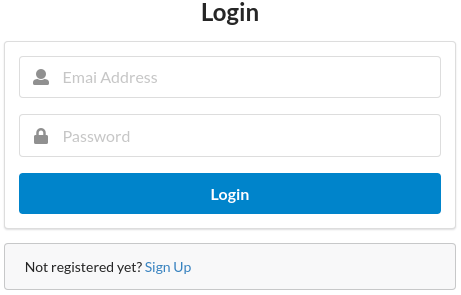

# React + Redux: self-study

## Table of contents


- [React](#react)
  * [A commented code example](#a-commented-code-example)
  * [Main concepts](#main-concepts)
    + [JSX](#jsx)
    + [Rendering elements into the DOM (Document Object Model)](#rendering-elements-into-the-dom--document-object-model-)
    + [Components](#components)
      - [Function Components](#function-components)
      - [Class Components](#class-components)
    + [State and Lifecycle](#state-and-lifecycle)
    + [Handling Events](#handling-events)
    + [Conditional Rendering](#conditional-rendering)
    + [Lists and Keys](#lists-and-keys)
    + [Forms](#forms)
      - [Alternatives to controlled components](#alternatives-to-controlled-components)
    + [Lifting State Up](#lifting-state-up)
    + [Composition vs Inheritance](#composition-vs-inheritance)
    + [Building process of a React app](#building-process-of-a-react-app)
      - [1. Breaking the UI into a component hierarchy](#1-breaking-the-ui-into-a-component-hierarchy)
      - [2. Building  a static version in React](#2-building--a-static-version-in-react)
      - [3. Identifying the mininal (but complete) representation of the UI state](#3-identifying-the-mininal--but-complete--representation-of-the-ui-state)
      - [4. Identifying where the state should live](#4-identifying-where-the-state-should-live)
      - [5. Adding inverse data flow](#5-adding-inverse-data-flow)
- [React + Redux](#react---redux)
  * [A commented code example](#a-commented-code-example-1)
    + [Actions](#actions)
    + [Reducers](#reducers)
    + [Container components](#container-components)
    + [Presentational components](#presentational-components)
    + [Store](#store)
  * [Redux middleware](#redux-middleware)
  * [Async actions](#async-actions)
  * [Routing with React + Redux](#routing-with-react---redux)
- [Semantic UI React](#semantic-ui-react)
  * [A code example](#a-code-example)
- [References](#references)

<small><i><a href='http://ecotrust-canada.github.io/markdown-toc/'>Table of contents generated with markdown-toc</a></i></small>

## React

### A commented code example

Following code brings an implementation of a tic-tac-toe game like the one in this picture:


```jsx
// ----- A React component: function with capital letter and 'props' arg -----
function Square(props) {
    // A JSX button tag.
    // The 'onClick' attribute and the value in the {expressions} are received as props
    return <button className="square" onClick={props.onClick}>{props.value}</button>;
}

// ----- A React component: class that extends React.Component -----
class Board extends React.Component {
    constructor(props) {  // The constructor has the 'props' arg
        super(props);     // 'super' should always be called, with the 'props' arg

        // The application's 'state': the "source of truth"
        this.state = {
            squares: Array(9).fill(null),  // The positions in the tic-tac-toe board
            xIsNext: true,                 // To store which player ('X' or 'O') is next
        };
    }

    // To be passed as prop ('onClick' attribute of a JSX tag)
    handleClick(i) {
        // Copying the squares array instead of mutating the original (immutability is important)
        const squares = this.state.squares.slice();

        if (calculateWinner(squares) || squares[i])  return;

        // Modifying the copy instead of the original
        squares[i] = this.state.xIsNext ? 'X' : 'O';

        // Replacing the data with the new copy
        // 'setState()' will trigger re-rendering of the UI
        this.setState({
            squares: squares,
            xIsNext: !this.state.xIsNext,
        });
    }

    renderSquare(i) {
        // Creating a 'Square' component and passing the 'handleClick' method as a prop
        return <Square value={this.state.squares[i]} onClick={() => this.handleClick(i)} />;
    }

    // Returns the content to be rendered
    render() {
        const winner = calculateWinner(this.state.squares);
        let status;

        if (winner)  status = 'Winner: ' + winner;
        else         status = 'Next player: ' + (this.state.xIsNext ? 'X' : 'O');

        return (  // Build the tic-tac-toe board
            <div>
                <div className="status">{status}</div>
                <div className="board-row">  // First row of 3 squares
                    {this.renderSquare(0)}   // 'renderSquare' returns a 'Square' component
                    {this.renderSquare(1)}
                    {this.renderSquare(2)}
                </div>
                <div className="board-row">  // Second row of 3 squares
                    {this.renderSquare(3)}
                    {this.renderSquare(4)}
                    {this.renderSquare(5)}
                </div>
                <div className="board-row">  // Third row of 3 squares
                    {this.renderSquare(6)}
                    {this.renderSquare(7)}
                    {this.renderSquare(8)}
                </div>
            </div>
        );
    }
}  // end class Board

class Game extends React.Component {
    render() {
        return (
            <div className="game">
                <div className="game-board"> <Board /> </div>
            </div>
        );
    }
}

// ========================================

// Render the 'Game' component in the 'root' HTML div
ReactDOM.render(<Game />, document.getElementById('root'));

function calculateWinner(squares) {
    const lines = [  // The possible sets of winning positions
        [0, 1, 2],
        [3, 4, 5],
        [6, 7, 8],
        [0, 3, 6],
        [1, 4, 7],
        [2, 5, 8],
        [0, 4, 8],
        [2, 4, 6],
    ];

    for (let i = 0; i < lines.length; i++) {
        const [a, b, c] = lines[i];

        // If square not empty and 'X X X' or 'O O O'
        if (squares[a] && squares[a] === squares[b] && squares[a] === squares[c])
        return squares[a];
    }
    return null;
}
```

### Main concepts

#### JSX

The following code is neither a string nor HTML. It's a JavaScript extension, and describes a React *element*:

```jsx
const element = <h1>Hello, world!</h1>;
```

JavaScript expressions can be embedded by using `{ }`:

```jsx
const element = <h1>Hello, {formatUserName(user)}!</h1>;
```

When splitting over multiple lines, it is good to use parentheses to avoid problems with the *automatic semicolon insertion*:

```jsx
const element = (
    <h1>
        Hello, {formatUserName(user)}!
    </h1>
);
```

#### Rendering elements into the DOM (Document Object Model)

Following HTML code shows a div that can be used as a *root DOM node*:

```html
<div id="root"></div>
```

Rendering a React element inside of it:

```jsx
const element = <h1>Hello, world!</h1>;
ReactDOM.render(element, document.getElementById('root'));
```

#### Components

Components accept a *props* object argument and *return React elements*.

##### Function Components

```jsx
function Welcome(props) {  // Capital-letter name, "props" argument
    return <h1>Hello, {props.name}</h1>;  // Read from props and return element
}
```

##### Class Components

```jsx
class Welcome extends React.Component {
    render() {
        return <h1>Hello, {this.props.name}</h1>;  // Using "this" to read props
    }
}
```

Components can be nested inside outer components and can be used with *tags* as shown in the React element below:

```jsx
const element = <Welcome name="Sara" />  // Welcome props: {name: 'Sara'}
```

Props are *read-only*. Components (function or class ones) should not modify their own props.

#### State and Lifecycle

Following code illustrates the concepts:

```jsx
class Clock extends React.Component {
    constructor(props) {
        super(props);                     // This call to super(props) is necessary
        this.state = {date: new Date()};  // Assigning the initial state
    }

    componentDidMount() {            // Runs after the component is rendered to the DOM
        this.timerID = setInterval(  // Adding "timerID" field to the class
            () => this.tick(),       // "this" in this arrow function refers to Clock
            1000
        );
    }

    componentWillUnmount() {  // Runs when the DOM produced by Clock is removed (unmounting)
        clearInterval(this.timerID);
    }

    tick() {
        this.setState(  // Schedule an update to the component's state --> triggers render()
            {date: new Date()}
        );
    }

    render() {
        return (
            <div>
                <h1>Hello, world!</h1>
                <h2>It is {this.state.date.toLocaleTimeString()}.</h2>
            </div>
        );
    }
}

ReactDOM.render(<Clock />, document.getElementById('root'));
```

&rarr; Modifying the state directly *does not re-render* the component. The `setState()` method needs to be called;

&rarr; State updates may run asynchronously and the following code may fail:

```jsx
this.setState(
    { counter: this.state.counter + this.props.increment, }
);
```

&rarr; If we need to rely on previous values to calculate the next state, the following form of `setState()` should be used:

```jsx
this.setState(
    (state, props) => (
        { counter: state.counter + props.increment }
    )
);
```

&rarr; The state is *encapsulated* and belongs to the component that owns and sets it. But it can be *passed down to child* components:

```jsx
<FormattedDate date={this.state.date} />
```

#### Handling Events

The following code shows a React event handler example:

```jsx
class Toggle extends React.Component {
    constructor(props) {
        super(props);
        this.state = {isToggleOn: true,};

        // Making "this" work inside the callback (bind() returns a new function)
        this.handleClick = this.handleClick.bind(this);
    }

    handleClick() {
        this.setState(
            state => ( {isToggleOn: !state.isToggleOn} )
        );
    }

    render() {
        return (
            // "onClick" is camel case, and a function is passed as the event handler
            // "this" would be undefined without the binding in the constructor
            <button onClick={this.handleClick}>
                {this.state.isToggleOn ? 'ON' : 'OFF'}
            </button>
        );
    }
}

ReactDOM.render(<Toggle />, document.getElementById('root'));
```

&rarr; [Function.prototype.bind()](https://developer.mozilla.org/en-US/docs/Web/JavaScript/Reference/Global_objects/Function/bind) creates a new function and sets its `this` keyword to the provided value;

&rarr; If `this.handleClick` is passed to `onClick` without binding, `this` would be `undefined`, because class methods in JavaScript are *not bound*;

Arguments can be passed to event handlers, as shown below:

```jsx
<button onClick={this.deleteRow.bind(this, rowId)}>Delete Row</button>
```

#### Conditional Rendering

The `<h2>` in the code below is only rendered if the condition `unreadMessages.length > 0` is met:

```jsx
function Mailbox(props) {
    const unreadMessages = props.unreadMessages;
    return (
        <div>
            <h1>Hello!</h1>
            {
                unreadMessages.length > 0 &&
                <h2>You have {unreadMessages.length} unread messages.</h2>
            }
        </div>
    );
}

const messages = ['Message1', 'Re: Message1'];
ReactDOM.render(<Mailbox unreadMessages={messages} />, document.getElementById('root'));
```

The following component hides itself depending on the props:

```jsx
function WarningBanner(props) {
    if (!props.warn) {
        return null;  // The component hides itself by returning null
    }
    return <div className="warning">Warning!</div>;  // else
}
```

&rarr; Returning `null` from a component's `render()` method won't affect the firing of the lifecycle methods. `componentDidUpdate` will still be called, for example.

#### Lists and Keys

Keys are special attributes that *should be provided* for *list items*.

They help React identify which items change, are added or removed. They should uniquely identify list items *among their siblings*.

The following code shows a list item with keys:

```jsx
function ListItem(props) {
    return <li>{props.value}</li>;
}

function NumbersList(props) {
    const numbers = props.numbers;
    return (
        <ul>
            {numbers.map(
                 (number) => <ListItem key={number.toString()} value={number} />
            )}
        </ul>
    );
}

const numbers = [1, 2, 3, 4, 5];
ReactDOM.render(<NumbersList numbers={numbers} />, document.getElementById('root'));
```

Item indexes should be used as keys only as a last resort, as this may impact performance and cause issues with component state. This way, the following code should be avoided:

```jsx
const todoItems = todos.map( (todo, index) => <li key={index}>{todo.text}</li> );
```

#### Forms

HTML form elements such as `<input>`, `<textarea>` and `<select>` usually have their on state, which gets updated based on user input.

If we want React to control the value of an input form, we create a *controlled component*. The same React component that renders the form will also control what happens to it when the user inputs data.

The code below shows such a controlled component:

```jsx
class FlavorForm extends React.Component {
    constructor(props) {
        super(props);
        this.state = {value: 'coconut'};

        this.handleChange = this.handleChange.bind(this);
        this.handleSubmit = this.handleSubmit.bind(this);
    }

    handleChange(event) {
        this.setState({value: event.target.value});
    }

    handleSubmit(event) {
        alert('Your favorite flavor is: ' + this.state.value);
        event.preventDefault();
    }

    render() {
        return (
            <form onSubmit={this.handleSubmit}>
                <label>
                    Pick your favorite flavor:
                    <select value={this.state.value} onChange={this.handleChange}>
                        <option value="grapefruit">Grapefruit</option>
                        <option value="lime">Lime</option>
                        <option value="coconut">Coconut</option>
                        <option value="mango">Mango</option>
                    </select>
                </label>
                <input type="submit" value="Submit" />
            </form>
        );
    }
}
```

##### Alternatives to controlled components

 - [Uncontrolled Components](https://reactjs.org/docs/uncontrolled-components.html)
 - [Formik](https://jaredpalmer.com/formik/)

#### Lifting State Up

&rarr; When multiple components need to reflect the same changing data, it is recommended to *lift the shared state up* to the closest *common ancestor*.

The following code shows a temperature calculator that calculates if the water should boil or not. It has two inputs (Celsius and Fahrenheit), which are kept in sync.

The current temperature is kept in the state of the `Calculator` component, which is a common ancestor to the two `TemperaureInput` components and acts as the "source of truth" for the temperature in both of them.

```jsx
const scaleNames = {
    c: 'Celsius',
    f: 'Fahrenheit'
};

// ----- Conversion functions -----
function toCelsius(fahrenheit) {
    return (fahrenheit - 32) * 5 / 9;
}

function toFahrenheit(celsius) {
    return (celsius * 9 / 5) + 32;
}

function tryConvert(temperature, convert) {  // "convert" is a function
    const input = parseFloat(temperature);

    if (Number.isNaN(input))  return '';

    const output  = convert(input);
    const rounded = Math.round(output * 1000) / 1000;

    return rounded.toString();
}

// ----- BoilingVerdict component -----
function BoilingVerdict(props) {
    if (props.celsius >= 100)
        return <p>The water would boil.</p>;

    return <p>The water would not boil.</p>;
}

// ----- TemperatureInput component -----
class TemperatureInput extends React.Component {
    constructor(props) {
        super(props);
        this.handleChange = this.handleChange.bind(this);
    }

    handleChange(e) {
        this.props.onTemperatureChange(e.target.value);  // Method received from ancestor
    }

    render() {
        const temperature = this.props.temperature;
        const scale       = this.props.scale;

        return(
            <fieldset>
                <legend>Enter temperature in {scaleNames[scale]}:</legend>
                <input value={temperature} onChange={this.handleChange} />
            </fieldset>
        );
    }
}

// ----- Calculator component -----
class Calculator extends React.Component {
    constructor(props) {
        super(props);
        this.handleCelsiusChange    = this.handleCelsiusChange.bind(this);
        this.handleFahrenheitChange = this.handleFahrenheitChange.bind(this);
        this.state                  = {temperature: '', scale: 'c'};  // Source of truth
    }

    handleCelsiusChange(temperature) {
        this.setState({scale: 'c', temperature})
    }

    handleFahrenheitChange(temperature) {
        this.setState({scale: 'f', temperature})
    }

    render() {
        const scale       = this.state.scale;
        const temperature = this.state.temperature;
        const celsius     = scale === 'f' ? tryConvert(temperature, toCelsius) : temperature;
        const fahrenheit  = scale === 'c' ? tryConvert(temperature, toFahrenheit) : temperature;

        return(
            <div>
                <TemperatureInput
                    scale="c"
                    temperature={celsius}
                    onTemperatureChange={this.handleCelsiusChange} />
                <TemperatureInput
                    scale="f"
                    temperature={fahrenheit}
                    onTemperatureChange={this.handleFahrenheitChange} />
                <BoilingVerdict celsius={parseFloat(celsius)} />
            </div>
        );
    }
}

ReactDOM.render(<Calculator />, document.getElementById('root'));
```

#### Composition vs Inheritance

React has a powerful composition model and it is recommended to use composition instead of inheritance to reuse code between components.

The code below shows an example of composition:

```jsx
function Dialog(props) {
    return (
        <FancyBorder color="blue">
            <h1 className="Dialog-title">{props.title}</h1>
            <p className="Dialog-message">{props.message}</p>
            {props.children}  // A sepcial prop to pass child elements
        </FancyBorder>
    );
}

class SignUpDialog extends React.Component {  // A specialization of the "Dialog" component
    constructor(props) {
        super(props);
        this.handleChange = this.handleChange.bind(this);
        this.handleSignUp = this.handleSignUp.bind(this);
        this.state = {login: ''};
    }

    handleChange(e) {
        this.setState({login: e.target.value});
    }

    handleSignUp() {
        alert(`Welcome aboard, ${this.state.login}!`);  // Template string + embedded expression
    }

    render() {
        return (
            <Dialog title="Mars Exploration Program" message="How should we refer to you?">
                <input value={this.state.login} onChange={this.handleChange}>
                <button onClick={this.handleSignUp}>Sign me up!</button>
            </Dialog>
        );
    }
}
```

#### Building process of a React app

Following steps show a way of building an app having a mock such as the one shown below as the starting point:


##### 1. Breaking the UI into a component hierarchy

&rarr; Every component should do only one thing (single responsibility principle).
&rarr; After identifying the components, they should be arranged in a hierarchy, as shown below:


##### 2. Building  a static version in React

&rarr; Start by building a version that takes the data model and renders the UI, *without interactivity*.
&rarr; Build components the reuse other ones and pass data using *props*.
&rarr; Do not use *state* in this version. *State* should be reserved for *interactivity*;

##### 3. Identifying the mininal (but complete) representation of the UI state

We should think of the *minimal set* of mutable state the app needs.

After thinking of the pieces of data in the application, the following questions help to figure out which one is state:

 - Is it passed from a parent via props? If so, it probably isn't state;
 - Does it remain unchanged over time? If so, it probably isn't state;
 - Can it be computed based on other state or props in the component? If so, it isn't state;

##### 4. Identifying where the state should live

We now need to identify which component mutates (or *owns*) the state.

For each piece of the state, the following steps can help:

 - Identify every component that renders something based on the state;
 - Find a common owner component &ndash; a single component above above all the ones that need the state;
 - Either the common owner or another component higher up in the hierarchy should own the state;
 - If you can't find a component where it makes sense for the state to be, a state-holding component can be created in the hierarchy, above the common owner;

##### 5. Adding inverse data flow

Since components should only change their own state, when components deep in the hierarchy need to update the state of a parent, the should do so by calling *callbacks received from the parent*. These callbacks passed by the parent will call the `setState()` method.

## React + Redux

*Redux* is a state container.

 - Instead of living inside owner components, the state of the app is stored in a single *store*;
 - The only way to change the state is by emitting *actions* &ndash; objects that describe what happened;
 - To specify how the actions transform the state, functions called *reducers* are used;

The following picture illustrates this state changing process:


The commented code in the next section demonstrates a simple counter implemented with React+Redux. The counter's current value is stored in the Redux store, and can be incremented or decremented.

### A commented code example

#### Actions

The following code defines three actions, to increment, decrement and reset the counter:

```jsx
// src/actions/actionTypes.js

export const DECREMENT = 'DECREMENT';
export const INCREMENT = 'INCREMENT';
export const RESET     = 'RESET';
```

```jsx
// src/actions/index.js

import { DECREMENT, INCREMENT, RESET } from './actionTypes';

/*
 * Actions are payloads of information that send data to the store.
 * They are sent to the store using store.dispatch().
 *
 * The functions below are "Action Creators": functions that create actions.
 */

export function increment() {
    /*
     * Returning an action object.
     * The structure of these objects is customizable,
     * but the 'type' key must always be present.
     */
    return {
        type: INCREMENT
    };
}

export function decrement() {
    return {
        type: DECREMENT
    };
}

export function reset() {
    return {
        type: RESET
    };
}
```

#### Reducers

Following is a reducer, a function that tells how the state will change for each action:

```jsx
// src/reducers/countReducer.js

import { DECREMENT, INCREMENT, RESET } from '../actions/actionTypes';

/*
 * Reducers specify how the application's state will change
 * in response to the actions sent to the store.
 *
 * They are functions that receive the current state and the action,
 * and return the next state: (currentState, action) => nextState
 */

/**
 * In the app's state, the state below will be mapped to the 'countState' key.
 * See the 'combineReducers' method in './reducers.js'
 */
const initialState = {
    currentCount: 0
};

// Using a default arg to set the initial state
const countReducer = (state=initialState, action) => {
    switch (action.type) {
        case INCREMENT:
            // Reducers should never modifiy the state.
            // Instead, they should create a new version.
            return {...state, currentCount: state.currentCount + 1};

        case DECREMENT:
            return {...state, currentCount: state.currentCount - 1};

        case RESET:
            return {...state, currentCount: 0};

        default:
            return state;
    }
}

export default countReducer;
```

Multiple reducers can be combined with the `combineReducers()` function:

```jsx
import countReducer from './countReducer';
import { combineReducers } from 'redux';

/**
 * 'countReducer' will be responsible for the 'countState' part of the
 * app's state, illustrated below:
 *
 * app state --> {
 *                   countState: {
 *                      currentCount: 0
 *                   },
 *                   ...
 *                }
 *
 */
export const reducers = combineReducers(
    {
        countState: countReducer,
    }
);
```

#### Container components

Container components connect to Redux and can access the store's current state and the store's `dispatch()` function, used to dispatch actions.

```jsx
// src/containers/Counter.js

import React from 'react';
import { connect } from 'react-redux';
import { decrement, increment, reset } from '../actions';

// Container component (will connect to Redux)
class Counter extends React.Component {
    render() {
        // Reading received props
        const { count, increment, decrement, reset } = this.props;

        return (
            <div className="App">
                <div>{count}</div>
                <div><button onClick={increment}>INCREMENT BY 1</button></div>
                <div><button onClick={decrement}>DECREMENT BY 1</button></div>
                <button onClick={reset}>RESET</button>
            </div>
        );
    }
}

// A function to transform the Redux state into props to pass to the component
const mapStateToProps = (state) => {
    // The 'count' prop will receive the state's currentCount
    return { count: state.countState.currentCount };
};

// Receives the store's 'dispatch()' method and returns callback to be injected
// in the component
const mapDispatchToProps = (dispatch) => {
    return {
        increment: () => dispatch(increment()),  // 'increment' prop: increment() action creator
        decrement: () => dispatch(decrement()),  // 'decrement' prop: decrement() action creator
        reset:     () => dispatch(reset())       // 'reset' prop:     reset() action creator
    };
};

// Injecting state and callbacks into 'Counter' via props.
const CounterContainer = connect(mapStateToProps, mapDispatchToProps)(Counter);

export default CounterContainer;
```

#### Presentational components

Presentational components don't connect to Redux, but receive data as props. Below is an example of such a component:

```jsx
// src/components/App.js

import React from 'react';
import '../App.css';
import Counter from '../containers/Counter';

// A presentational component (not aware of Redux).
class App extends React.Component {
    render() {
        return (
            <div className="App">
                <header className="App-header">
                    <Counter />
                </header>
            </div>
        );
    }
}

export default App;
```

#### Store

The code below show the app's entry point and the Redux store creation:

```jsx
// src/index.js

import React from 'react';
import ReactDOM from 'react-dom';
import { Provider } from 'react-redux';
import { createStore } from 'redux';
import App from './components/App';
import './index.css';
import { reducers } from './reducers/reducers';

// Creating the Redux store (reducers are passed as arguments)
const store = createStore(reducers);

ReactDOM.render(
    // React-Redux 'Provider' wrapping the main component (receives the store as prop).
    <Provider store={store}> <App /> </Provider>,
    document.getElementById('root')
);
```

### Redux middleware

A Redux middleware is a function that can intercept an action before it reaches the reducer. We can than perform extra actions, or even prevent the action from executing.

Inside middleware we can access the store's `dispatch` and `getState` functions.

The code below shows the structure of a Redux middleware:

```jsx
function middleware() {
    return function(next) {
        return function(action) {
            // Execute what we want
            return next(action);
       }
    }
}
```

The example below shows a middleware function that logs the store's state after an action is dispatched:

```jsx
// src/middleware/logger.js

const logger = (store) => (next) => (action) => {
    console.group(action.type);
    console.info('Dispatching', action);

    const result = next(action);

    console.log('Next state', store.getState());  // Logging the state
    console.groupEnd();

    return result;
}

export default logger;
```

To make a middleware function work, we need to pass it as an argument to the `applyMiddlware` function from the `redux` module. The result of `applyMiddleware` is than passed as an argument to the `createStore` function:

```jsx
const store = createStore(reducers, applyMiddleware(myMiddleware));
```

### Async actions

The `thunk` middleware allows us to create action creators like the one below:

```jsx
(dispatch) => {
    dispatch({type: 'EVENT_START'});
    // Do something async
    dispatch({type: 'EVENT_END'});
}
```

Instead of returning an object with the `type` key, it returns a function to be called in the future. This function receives the store's `disptach` function as an argument, and can this way emit other actions.

The code below shows such an action creator, which triggers an HTTP request:

```jsx
import { applyMiddleware, createStore } from 'redux';
import logger from 'redux-logger';  // A logging middleware
import thunk from 'redux-thunk';    // The thunk middleware
import axios from 'axios';          // For HTTP requests

// An initial state, to be passed to the reducer
const initialState = {
    fetching: false,
    fetched:  false,
    users:    [],
    error:    null,
};

// Reducer
const reducer = (state=initialState, action) => {
    switch (action.type) {
        case 'FETCH_USERS_PENDING': {
            return {...state, fetching: true};
            break;
        }
        case 'FETCH_USERS_REJECTED': {
            return {...state, fetching: false, error: action.payload};
            break;
        }
        case 'FETCH_USERS_FULFILLED': {
            return {...state, fetching: false, fetched: true, users = action.payload};
            break;
        }
    }
    return state;
};

const middleware = applyMiddleware(thunk, logger);
const store      = createStore(reducer, middleware);

// A thunk is a function to be run in the future that is returned by another function;
// With the 'thunk' middleware it is possible to have action creators like this;
store.dispatch((dispatch) => {
    dispatch({type: 'FETCH_USERS_PENDING'});  // Disptach an initial action

    axios.get(  // trigger HTTP request
             'http://rest.learncode.academy/api/wstern/users'
          )
          .then(  // When the request completes
              (response) => {
                  dispatch({type: 'FETCH_USERS_FULFILLED', payload: response.data});
              }
          )
          .catch(  // When an error occurs
              (err) => {
                 dispatch({type: 'FETCH_USERS_REJECTED', payload: err});
              }
          );
});
```

As the request is a *promise*, we could apply the `promise` middleware too (module `redux-promise-middleware`) and simplify the action creator to the following code:

```jsx
store.dispatch({
    type: 'FETCH_USERS',
    payload: axios.get('http://rest.learncode.academy/api/wstern/users')
})
```

As we are now applying the `promise` middleware and the payload of the action creator is a promise, the actions `FETCH_USERS_PENDING`,  `FETCH_USERS_FULFILLED` and `FETCH_USERS_REJECTED` (in case of errors) would be *automatically* emitted.

### Routing with React + Redux

Routing different URLs to different components is made simple by the `connected-react-router` module.

The following code shows an `App` component with *links* to other URLs in the `header` section.

The component to be rendered inside the `main` section (`Home` or `About`) will depend on the URL.

```jsx
import React from 'react';
import { Route, Link, Switch } from 'react-router-dom';  // Importing routing compoents from module
import Home from 'src/components/Home';                  // Importing 'Home' component
import About from 'src/components/About';                // Importing 'About' component

function App() {
    return (
        <div>
            <header>
                <Link to="/">Home</Link>
                <Link to="/about">About</Link>
            </header>
            <main>
                <Switch>
                    <Route exact path="/" component={Home} />
                    <Route path="/about" component={About} />
                </Switch>
            </main>
        </div>
    );
}

export default App;
```

The `exact` flag inside the `Route` component disabled partial matching. 

Without this flag, the `/` path would partially match `/about`, and `/about` would lead to the `Home` component.

The following code (`Home` component) shows the disptaching of a *history method*.

When the button gets clicked, `/about` will be pushed to the *browser's history*, making the `About` component render. The previous component (`Home`) will be re-rendered by pressing the browser's *back* button.

```jsx
import { push } from 'connected-react-router';  // Importing the 'push' history action
import React from 'react';
import { connect } from 'react-redux';

function Home(props) {
    return (
        <div>
            <h1>Home</h1>
            <button onclick={props.changePage}>Go to About page via Redux</button>
        </div>
    );
}

const matchDispatchToProps = (dispatch) => {
    return {
        changePage: () => dispatch(push('/about'))  // Dispathing the 'push' history action
    };
}

export default connect(null, matchDispatchToProps)(Home);  // matchStateToProps = null
```

To make the routing work, we have to modify the creation of the store as follows:

```jsx
// Importing from 'history' and 'connected-react-router' modules;
import { createBrowserHistory } from 'history';
import { connectRouter, routerMiddleware } from 'connected-react-router';

import { applyMiddleware, combineReducers, createStore } from 'redux';

// Exporting the history so that it can be used later by the 'ConnectedRouter' component
export const history = createBrowserHistory();

// Combining all the reducers into a root reducer
const rootReducer = combineReducers({
    router: connectRouter(history)
    /* reducers */
});

// Create the store by using the 'connectRouter' method and applying the 'routerMiddleware'
export default createStore(
    rootReducer,        // Passing 'history' and the root reducer
    applyMiddleware(routerMiddleware(history))  // Passing 'history'
);
```

Then we have to wrap our main component with the `ConnectedRouter` component, like this:

```jsx
// 'store' and 'history' were both exported in the previous code snippet
render(
    <Provider store={store}>
        <ConnectedRouter history={history}>
            <div><App /></div>
        </ConnectedRouter>
    </Provider>,
    document.getElementById('root')
);
```

## Semantic UI React

[Semantic UI](https://semantic-ui.com/) is a framework that helps create beautiful, responsive layouts. 
It brings predefined CSS classes to style HTML components.

The code snippet below is an example with a row of tree buttons, one of them being the active one:

```html
<div class="ui three buttons">
    <button class="ui active button">One</button>
    <button class="ui button">Two</button>
    <button class="ui button">Three</button>
</div>
```

The [Semantic UI React](https://react.semantic-ui.com/) integration brings lots of ready-to-use React components, making it easy to build beautiful web content.

The code below shows an example.

### A code example

```jsx
import React from 'react';
import { Button, Form, Grid, Header, Message, Segment } from 'semantic-ui-react';
import Auth from './Auth';

class Login extends React.Component {

    constructor(props) {
        super(props);
        this.state = { userEmail: "", password: "" };
    }

    handleChange = (event, { name, value }) => {
        this.setState({ [name]: value });  // 'name' can be "userEmail" or "password"
    }

    handleSubmit = () => {
        // Auth: an external class that handles the login process
        Auth.login(this.state.userEmail, this.state.password);
    }

    render() {
        return(
            <Grid centered columns={2}>
                <Grid.Column>
                    <Header as="h2" textAlign="center">Login</Header>
                    <Segment>
                        <Form size="large">
                            <Form.Input 
                                fluid 
                                icon         = "user"
                                iconPosition = "left"
                                placeholder  = "Email Address"
                                name         = "userEmail"
                                value        = { this.state.userEmail }
                                onChange     = { this.handleChange.bind(this) }
                            />
                            <Form.Input 
                                fluid 
                                icon         = "lock"
                                iconPosition = "left"
                                placeholder  = "Password"
                                type         = "password"
                                name         = "password"
                                value        = { this.state.password }
                                onChange     = { this.handleChange.bind(this) }
                            />
                            <Button
                                color="blue"
                                fluid size="large"
                                onClick={ this.handleSubmit.bind(this) }
                            > Login </Button>
                        </Form>
                    </Segment>
                    <Message>Not registered yet? <a href="#">Sign Up</a></Message>
                </Grid.Column>
            </Grid>
        );
    }
};

export default Login;
```

The `Login` component created above generates the following:



The tables below summarize the Components used and their props:

**&rarr; Grid**

Used to harmonize space.

|prop|description|
|--|--|
|`centered`|To make the columns centered in the grid|
|`columns`|The column count per row in the grid|

**&rarr; Grid.Column**

A sub-component for `Grid`.

**&rarr; Header**

A summary of content.

|prop|description|
|--|--|
|`as`|An element type to render the header as|
|`textAlign`|To align the header content|

**&rarr; Segment**

Used to group related content.

**&rarr; Form**

A set of user input fields.

**&rarr; Form.Input**

A form input field, equivalent to `<Form.Field control={Input} />`.

|prop|description|
|--|--|
|`fluid`|To take the width of its container|
|`icon`|The name of the icon to use|
|`iconPosition`|The icon position|
|`placeholder`|A placeholder text|
|`type`|The HTML input type|

**&rarr; Button**

Indicates a user action.

|prop|description|
|--|--|
|`color`|The color of the button|
|`fluid`|To take the width of its container|
|`size`|The size of the button|

**&rarr; Message**

To explain nearby content.
<br>

The [documentation](https://react.semantic-ui.com/) brings a full list of the available components with their props.

## References

 - [https://reactjs.org/tutorial/tutorial.html](https://reactjs.org/tutorial/tutorial.html)
 - [https://reactjs.org/docs](https://reactjs.org/docs)
 - [https://medium.com/reactbrasil/iniciando-com-redux-c14ca7b7dcf](https://medium.com/reactbrasil/iniciando-com-redux-c14ca7b7dcf)
 - [https://www.tutorialspoint.com/redux/redux_react_example.htm](https://www.tutorialspoint.com/redux/redux_react_example.htm)
 - [https://redux.js.org/introduction/getting-started](https://redux.js.org/introduction/getting-started)
 - [https://www.valentinog.com/blog/redux/](https://www.valentinog.com/blog/redux/)
 - [https://www.youtube.com/playlist?list=PLoYCgNOIyGADILc3iUJzygCqC8Tt3bRXt](https://www.youtube.com/playlist?list=PLoYCgNOIyGADILc3iUJzygCqC8Tt3bRXt)
 - [https://github.com/notrab/create-react-app-redux](https://github.com/notrab/create-react-app-redux)
 - [https://www.robinwieruch.de/react-semantic-ui-tutorial/](https://www.robinwieruch.de/react-semantic-ui-tutorial/)
