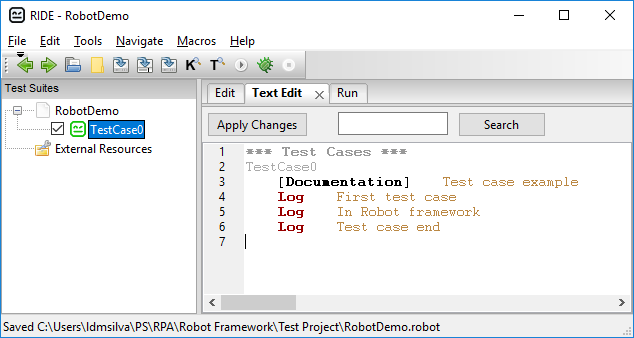
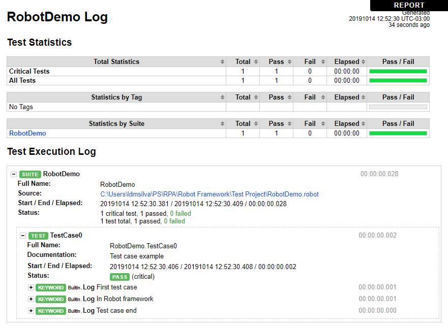
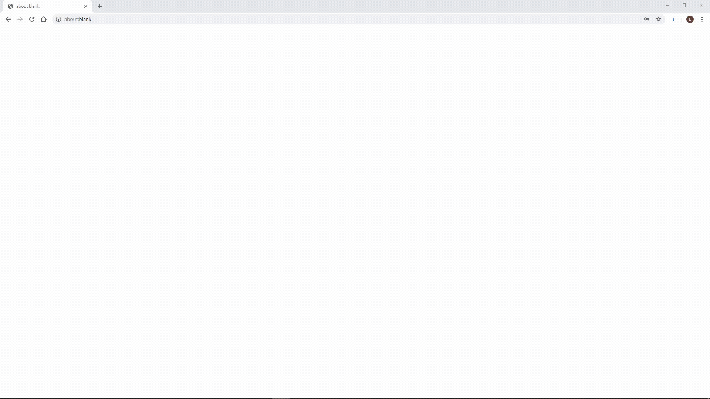

# RPA (Robotic Process Automation)

## Table of Contents
- [RPA (Robotic Process Automation)](#rpa--robotic-process-automation-)
  * [Robot Framework](#robot-framework)
    + [Summary table](#summary-table)
    + [Installation](#installation)
    + [A bare-minimum example](#a-bare-minimum-example)
    + [Operating a web browser](#operating-a-web-browser)
  * [Taskt](#taskt)
    + [Summary table](#summary-table-1)
    + [Installation](#installation-1)
    + [Operating a web browser](#operating-a-web-browser-1)
    + [Recording mode](#recording-mode)
  * [TagUI](#tagui)
    + [Summary table](#summary-table-2)
    + [Installation](#installation-2)
    + [Operating a web browser](#operating-a-web-browser-2)
    + [Recording mode](#recording-mode-1)
  * [Java + Selenium](#java---selenium)
  * [References](#references)

<small><i><a href='http://ecotrust-canada.github.io/markdown-toc/'>Table of contents generated with markdown-toc</a></i></small>


## Robot Framework

### Summary table

|             Website             | Source code |   License  |    Demo video   |
|:-------------------------------:|:-----------:|:----------:|:---------------:|
| https://robotframework.org/rpa/ | [Github](https://github.com/robotframework/robotframework) | Apache 2.0 | [Robot framework](https://www.youtube.com/watch?v=qO7OHoH59VQ) |


### Installation
Having Python installed, the Robot Framework can be installed with PIP:

```
pip install robotframework
```

There's an IDE for the Robot Framework called *RIDE*, whose GUI is based on the *wxPython* toolkit.
RIDE can be installed and started with the following commands:

```
pip install --upgrade wxPython
pip install robotframework-ride
ride.py
```

### A bare-minimum example

Inside RIDE, we can create a *NewProject* (e.g. `RobotDemo`), add a *New est Case* to it (e.g. `TestCase0`) and write the test case using *keywords*.

The picture below shows this example with a test case that only logs information:



After running this test case,  a report and logs are generated:



In the example above, only one keyword is used: `Log`.

### Operating a web browser

The following command installs the *Selenium* library, which can be used to interact with web browsers:

```
pip install --upgrade robotframework-seleniumlibrary
```

[This page](https://robotframework.org/SeleniumLibrary/SeleniumLibrary.html) brings the library documentation, containing the keywords it supports, such as `Open Browser`, `Title Should Be` and `Press Key`.

A *browser driver* should also be installed. This can be easily achieved with the [WebdriverManager]([https://github.com/rasjani/webdrivermanager](https://github.com/rasjani/webdrivermanager)) tool.
The command below shows the installation of the Chrome driver:

```
pip install webdrivermanager
webdrivermanager chrome
```
 The following file shows an example test case that tries to log in to a web page:

```properties
*** Settings ***
Documentation     An example Robot Framework demo
Library           SeleniumLibrary

*** Variables ***
${LOGIN_URL}      https://github.com/login    # A variable with the login page URL
${BROWSER}        Chrome    # The browser (driver) to use

*** Test Cases ***
Login Attempt
    [Documentation]    Attempts to login to Github with invalid credentials
    Open Browser in Login Page
    Input Username    example@mail.com
    Input Password    wrongpass
    Click Login Button
    Invalid Credentials Message Should Appear
    [Teardown]    Close Browser

*** Keywords ***
Open Browser in Login Page
    # This section defines custom keywords to be used by test cases
    Open Browser    ${LOGIN_URL}    ${BROWSER}    # Using variables defined above
    Title Should Be    Sign in to GitHub · GitHub

Input Username
    [Arguments]    ${username}    # User name as an argument
    Input Text    login_field    ${username}

Input Password
    [Arguments]    ${password}
    Input Text    password    ${password}

Click Login Button
    Click Button    Sign in

Invalid Credentials Message Should Appear
    Page Should Contain    Incorrect username or password.
```


## Taskt

### Summary table

|        Website        | Source code |   License  | Demo video |
|:---------------------:|:-----------:|:----------:|:----------:|
| http://www.taskt.net/ |    [Github](https://github.com/saucepleez/taskt/)   | Apache 2.0 |    [Taskt](https://camo.githubusercontent.com/0ea87c6f9cb812722662e4812aa9dffdc1da5b3b/68747470733a2f2f692e696d6775722e636f6d2f744854793665682e676966)   |

### Installation
The latest release can be downloaded from the Taskt Github, on [releases](https://github.com/saucepleez/taskt/releases) page.
The release zip contains a Windows executable file (`.exe`) to run the tool.

### Operating a web browser

Taskt brings a GUI with a palette of commands...

```
 > API Commands
 > Data Commands
 > Database Commands
 > Engine Commands
 > Error Handling Commands
 > Excel Commands
 > File Operation Commands
 > IE Browser Commands
 > If Commands
 > Image Commands
 > Input Commands
 > Loop Commands
 > Misc Commands
 > NLG Commands
 > Programs/Process Commands
 > System Commands
 > Task Commands
 > Text File Commands
 > Variable Commands
   Web Browser Commands
      Close Browser
      Create Browser
      ELement Action
      Execute Script
      Get Browser Info
      Navigate Back
      Navigate Forward
      Navigate to URL
      Refresh
      Switch Browser Window
 > Window Commands
```

...that can be chosen to build an automation script as shown below:


The automation created above is the same one created with the Robot framework, and attempts to log in to Github with invalid credentials.

Here is a portion of the logs generated by Taskt that correspond to this execution:

```c
2019-10-15 08:57:12.653 -03:00 [INF] Engine Class has been initialized
2019-10-15 08:57:12.678 -03:00 [INF] Client requesting to execute script using frmEngine
2019-10-15 08:57:12.690 -03:00 [INF] Bot Engine Started: 10/15/2019 8:57:12 AM
2019-10-15 08:57:12.717 -03:00 [INF] Deserializing File
2019-10-15 08:57:12.719 -03:00 [INF] Script Path: C:\Users\ldmsilva\Documents\taskt\My Scripts\Demo.xml
2019-10-15 08:57:12.808 -03:00 [INF] Creating Variable List
2019-10-15 08:57:12.810 -03:00 [INF] Creating App Instance Tracking List
2019-10-15 08:57:12.813 -03:00 [INF] Running Line 1: Create Chrome Browser - [Instance Name: 'default', Instance Tracking: ]
2019-10-15 08:57:16.346 -03:00 [INF] Running Line 2: Navigate to URL [URL: 'https://github.com/login', Instance Name: 'default']
2019-10-15 08:57:17.352 -03:00 [INF] Running Line 3: Element Action [Find Element By ID and Set Text, Instance Name: 'default']
2019-10-15 08:57:17.996 -03:00 [INF] Running Line 4: Element Action [Find Element By ID and Set Text, Instance Name: 'default']
2019-10-15 08:57:18.324 -03:00 [INF] Running Line 5: Element Action [Find Element By Name and Left Click, Instance Name: 'default']
2019-10-15 08:57:19.701 -03:00 [INF] Running Line 6: Element Action [Find Element By Class Name and Wait For Element To Exist, Instance Name: 'default']
2019-10-15 08:57:20.069 -03:00 [INF] Running Line 7: Close Browser [Instance Name: 'default']
2019-10-15 08:57:24.684 -03:00 [INF] Result Code: Successful
2019-10-15 08:57:24.684 -03:00 [INF] Error: None
```


Here's a excerpt of the Taskt automation file generated (an `.xml` file):

```xml
<?xml version="1.0" encoding="utf-8"?>
<Script xmlns:xsi="http://www.w3.org/2001/XMLSchema-instance" xmlns:xsd="http://www.w3.org/2001/XMLSchema">
    <Commands>
        <ScriptAction>
            <ScriptCommand
                xsi:type="SeleniumBrowserCreateCommand"
                CommandID="9cb4cc90-a007-4077-a65c-70b6a57884d5"
                CommandName="SeleniumBrowserCreateCommand"
                IsCommented="false"
                SelectionName="Create Browser"
                DefaultPause="0"
                LineNumber="1"
                PauseBeforeExeucution="false"
                CommandEnabled="true"
                v_InstanceName="default"
                v_EngineType="Chrome"
            />
        </ScriptAction>
        <ScriptAction>
            <ScriptCommand
                xsi:type="SeleniumBrowserNavigateURLCommand"
                CommandID="ffc243c2-a4ea-47ae-a254-550a82400540"
                CommandName="SeleniumBrowserNavigateURLCommand"
                IsCommented="false"
                SelectionName="Navigate to URL"
                DefaultPause="0"
                LineNumber="2"
                PauseBeforeExeucution="false"
                CommandEnabled="true"
                v_InstanceName="default"
                v_URL="https://github.com/login"
            />
        </ScriptAction>
        <ScriptAction>
            <ScriptCommand
                xsi:type="SeleniumBrowserElementActionCommand"
                CommandID="8e608c99-96c1-470a-ab16-a29ef5eeb053"
                CommandName="SeleniumBrowserElementActionCommand"
                IsCommented="false"
                SelectionName="Element Action"
                DefaultPause="0"
                LineNumber="3"
                PauseBeforeExeucution="false"
                CommandEnabled="true"
                v_InstanceName="default"
                v_SeleniumSearchType="Find Element By ID"
                v_SeleniumSearchParameter="login_field"
            >
                <v_SeleniumElementAction>Set Text</v_SeleniumElementAction>
                
                [...]

            <ScriptCommand
                xsi:type="SeleniumBrowserCloseCommand"
                CommandID="399077b4-3d1c-4782-be08-90a5d1eee7c9"
                CommandName="SeleniumBrowserCloseCommand"
                IsCommented="false"
                SelectionName="Close Browser"
                DefaultPause="0"
                LineNumber="7"
                PauseBeforeExeucution="false"
                CommandEnabled="true"
                v_InstanceName="default"
            />
        </ScriptAction>
    </Commands>
    <Variables />
</Script>
```

### Recording mode

Taskt also brings a *recording* mode:


## TagUI

### Summary table

|                    Website                   | Source code |   License  | Demo video |
|:--------------------------------------------:|:-----------:|:----------:|:----------:|
| https://www.aisingapore.org/resources/tagui/ |    [Github](https://github.com/kelaberetiv/TagUI)   | Apache 2.0 |    [TagUI](https://www.youtube.com/watch?v=bFvsc4a8hWQ)   |


### Installation
The latest release can be downloaded from the TagUI [Github](https://github.com/kelaberetiv/TagUI).

The release zip contains a the executable `tagui` file.


### Operating a web browser

The automation scripts can be written by using a combination of *steps*:

| Basic Step | Parameters (separator in bold) | Purpose |
|:-----------|:-------------------------------|:--------|
| http(s):// | just enter full url of webpage (`variable` for variable) | go to specified webpage |
| click | element to click | click on an element |
| rclick | element to right-click | right-click on an element |
| dclick | element to double-click | double-click on an element |
| hover | element to hover | move cursor to element |
| type | element ***as*** text ([enter] = enter, [clear] = clear field) | enter element as text |
| select | element to select ***as*** option value ([clear] = clear selection) | choose dropdown option |
| read | element to read (page = webpage) ***to*** variable name | fetch element text to variable |
| show | element to read (page = webpage, ie raw html) | print element text to output |
| save | element (page = webpage) ***to*** optional filename | save element text to file |
| snap | element (page = webpage) ***to*** optional filename | save screenshot to file |
| snap (pdf) | page ***to*** filename.pdf (headless Chrome / PhantomJS) | save webpage to basic pdf |
| load | filename ***to*** variable name | load file content to variable |
| echo | text (in quotation marks) and variables | print text/variables to output |
| dump | text (in quotation marks) and variables ***to*** optional filename | save text/variables to file |
| write | text (in quotation marks) and variables ***to*** optional filename | append text/variables to file |
| variable_name | = value (for text, put in quotes, use + to concat) | define variable variable_name |
| // (on new line) | user comments (ignored during execution) | add user comments |
| ask | question or instruction for user (reply stored in ask_result) | ask user for input |
| live | try steps or code interactively for Chrome / visual automation | enter live mode ([Firefox not yet](https://github.com/laurentj/slimerjs/issues/639)) |

The following TagUI script performs the same action of the other sections, trying to log in to Github with wrong credentials:

```c
// Open URL
echo 'Opening Github login page'
https://www.github.com/login

// Set login field text (element ID: login_field)
type login_field as mail@example.com

// Set password field text (element ID: password)
type password as wrongpass

// Click "Sign in" button (element name: commit)
click commit

// Read error message and print its text (element class: flash-error)
show flash-error

echo 'End of automation'
```

Assuming the script file name is `Script`, it can be executed by the following command line:

```
tagui Script chrome
```

If the `chrome` option is not specified, the script will run on the *headless* PhantomJS browser.

After the execution completes, a `Script.log` is generated in the folder:

```
START - automation started - Tue Oct 15 2019 13:47:42 GMT-0300 (E. South America Standard Time)

Opening Github login page
https://www.github.com/login - Sign in to GitHub · GitHub
type login_field as mail@example.com
type password as wrongpass
click commit
show flash-error
Incorrect username or password.
End of automation

https://github.com/session - Sign in to GitHub · GitHub
FINISH - automation finished - 12.1s
```


### Recording mode

TagUI provides a [Chrome extension](https://chrome.google.com/webstore/detail/tagui-web-automation/egdllmehgfgjebhlkjmcnhiocfcidnjk/) that allows automatic script generation by recording actions:



## Java + Selenium

The following Java code performs the same login attempt on Github with invalid credentials:

```java
import org.apache.logging.log4j.LogManager;
import org.apache.logging.log4j.Logger;
import org.openqa.selenium.By;
import org.openqa.selenium.WebDriver;
import org.openqa.selenium.chrome.ChromeDriver;
import org.openqa.selenium.support.ui.ExpectedConditions;
import org.openqa.selenium.support.ui.WebDriverWait;

/**
 * @author Lucas Duarte
 */
public class GithubLogin {

    private static final Logger LOGGER                = LogManager.getLogger(GithubLogin.class);

    private static final String CHROME_DRIVER_KEY     = "webdriver.chrome.driver";
    private static final String CHROME_DRIVER_PATH    = "C:\\chromedriver.exe";
    private static final String GITHUB_LOGIN_PAGE_URL = "https://www.github.com/login";

    private WebDriver     webDriver;
    private WebDriverWait webDriverWait;

    private String        userEmail;
    private String        userPassword;

    public GithubLogin(String userEmail, String userPassword) {
        System.getProperty(CHROME_DRIVER_KEY, CHROME_DRIVER_PATH);
        this.webDriver     = new ChromeDriver();
        this.webDriverWait = new WebDriverWait(webDriver, 20);
        this.userEmail     = userEmail;
        this.userPassword  = userPassword;
    }

    public GithubLogin openGithubLoginPage() {
        LOGGER.info("Opening Github");

        webDriver.get(GITHUB_LOGIN_PAGE_URL);
        webDriverWait.until(ExpectedConditions.presenceOfElementLocated(By.className("auth-form-header")));
        LOGGER.info(" > " + webDriver.findElement(By.className("auth-form-header")).getText());  // "Sign in to GitHub"

        return this;
    }

    public GithubLogin inputUserEmail() {
        LOGGER.info("Email input");
        webDriver.findElement(By.id("login_field")).sendKeys(userEmail);
        return this;
    }

    public GithubLogin inputUserPassword() {
        LOGGER.info("Password input");
        webDriver.findElement(By.id("password")).sendKeys(userPassword);
        return this;
    }

    public GithubLogin clickSignInButton() {
        LOGGER.info("Sign in button click");

        webDriver.findElement(By.name("commit")).click();
        webDriverWait.until(ExpectedConditions.presenceOfElementLocated(By.className("flash-error")));
        LOGGER.info(" > " + webDriver.findElement(By.className("flash-error")).getText());  // Incorrect username

        return this;
    }

    public GithubLogin closeBrowser() {
        LOGGER.info("Closing browser");
        webDriver.quit();
        return this;
    }

    public static void main(String[] args) {
        new GithubLogin("mail@example.com", "wrongpass").openGithubLoginPage()
                                                        .inputUserEmail()
                                                        .inputUserPassword()
                                                        .clickSignInButton()
                                                        .closeBrowser();
    }

}
```

The code above relies on the following Gradle dependencies...

```groovy
compile group: 'org.apache.logging.log4j' , name: 'log4j-core'             , version: '2.12.1'  
compile group: 'org.seleniumhq.selenium'  , name: 'selenium-java'          , version: '3.141.59'  
compile group: 'org.seleniumhq.selenium'  , name: 'selenium-chrome-driver' , version: '3.141.59'
```

... and outputs the following logs:

```
Starting ChromeDriver 77.0.3865.40 (f484704e052e0b556f8030b65b953dce96503217-refs/branch-heads/3865@{#442}) on port 21150
Only local connections are allowed.
Please protect ports used by ChromeDriver and related test frameworks to prevent access by malicious code.
Oct 15, 2019 4:57:01 PM org.openqa.selenium.remote.ProtocolHandshake createSession
INFO: Detected dialect: W3C
16:57:01.117 [main] INFO  GithubLogin - Opening Github
16:57:02.339 [main] INFO  GithubLogin -  > Sign in to GitHub
16:57:02.339 [main] INFO  GithubLogin - Email input
16:57:02.416 [main] INFO  GithubLogin - Password input
16:57:02.494 [main] INFO  GithubLogin - Sign in button click
16:57:02.877 [main] INFO  GithubLogin -  > Incorrect username or password.
16:57:02.877 [main] INFO  GithubLogin - Closing browser
```

*Important:* The appropriate web driver executable should be present (`chromedriver.exe` in the case above, whose path is held by the `CHROME_DRIVER_PATH` variable).

## References

[https://www.tutorialspoint.com/robot_framework](https://www.tutorialspoint.com/robot_framework)

[https://github.com/robotframework/SeleniumLibrary](https://github.com/robotframework/SeleniumLibrary)

[http://www.taskt.net](http://www.taskt.net/)

[https://github.com/kelaberetiv/TagUI](https://github.com/kelaberetiv/TagUI)

[https://www.guru99.com/first-webdriver-script.html](https://www.guru99.com/first-webdriver-script.html)

[https://intellipaat.com/community/7967/selenium-wait-for-element-how-to-wait-until-an-element-is-present-in-selenium](https://intellipaat.com/community/7967/selenium-wait-for-element-how-to-wait-until-an-element-is-present-in-selenium)
